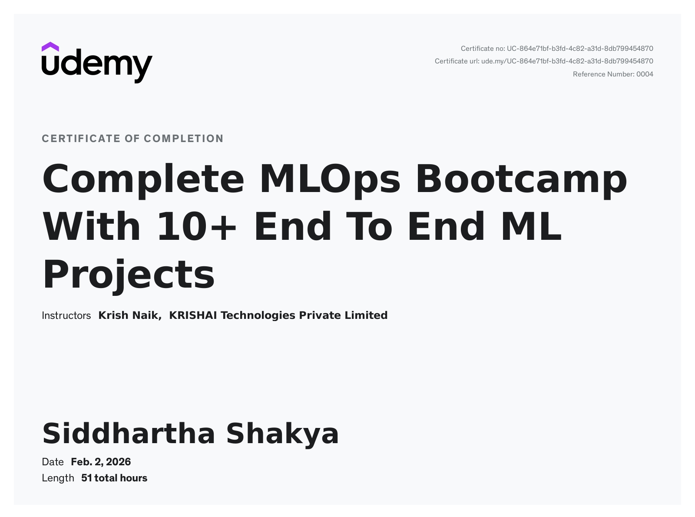

# Machine Learning Operations (MLOps) 🚀

A comprehensive repository dedicated to mastering the end-to-end lifecycle of machine learning models. This space contains structured learning materials, conceptual notes, practical code implementations, and automation workflows for modern MLOps practices.

> [!NOTE]
> This repository is a collection of learning materials and projects from the Udemy course: **[Complete MLOps Bootcamp with 10 End-to-End ML Projects](https://www.udemy.com/course/complete-mlops-bootcamp-with-10-end-to-end-ml-projects/)** by **Krish Naik**.

## 🏆 Certificate of Completion


---

## 📂 Repository Structure

```bash
.
├── 💻 codes/           # Practical implementations & experiments
├── 📄 docs/            # Detailed documentation & guides
│   ├── Airflow/        # Apache Airflow setup & ETL projects
│   ├── CI-CD/          # Automated testing & DockerHub workflows
│   ├── DVC/            # Data Version Control & DagsHub integration
│   ├── Docker/         # Containerization & Compose guides
│   └── MLflow/         # ML/DL tracking with MLflow
│   └── Projects/       # Porject Documentations
├── 📓 notes/           # Conceptual PDF guides and cheat sheets
└── 📊 data/            # Sample datasets for experimentation
```

## 🛠️ Core MLOps Pillars

### 1. Experiment Tracking ([MLflow](docs/MLflow))
- Track parameters, metrics, and artifacts for ML/DL models.
- Model Versioning and Deployment strategies.
- Check [MLflow Documentation](docs/MLflow/MLflow.md).

### 2. Data & Pipeline Versioning ([DVC](docs/DVC))
- Manage large datasets with Git-like versioning.
- Integration with DagsHub for remote storage.
- Check [DVC Documentation](docs/DVC/Data-Version-Control.md).

### 3. Workflow Orchestration ([Airflow](docs/Airflow))
- Building robust ETL pipelines.
- Scheduling and monitoring ML workflows.
- Check [Airflow Project Guide](docs/Airflow/ETL-With-Airflow-Project.md).

### 4. Containerization & CI/CD ([Docker](docs/Docker) & [GitHub Actions](docs/CI-CD))
- Standardizing environments using Docker & Docker Compose.
- Automated testing and CI/CD pipelines via GitHub Actions.
- Check [Docker Guide](docs/Docker/Docker.md).

---

## 📝 Learning Resources
Explore the `notes/` directory for high-quality PDF resources on:
- [Data Science Life Cycle](notes/Data-Science-Life-Cycle.pdf)
- [Docker & Containerization](notes/Docker.pdf)
- [GitHub Actions & CI/CD](notes/GitHub-Actions-CICD.pdf)
- [MLflow Experimentation](notes/MLFlow.pdf)

---

*Maintained by Siddhartha Shakya*
