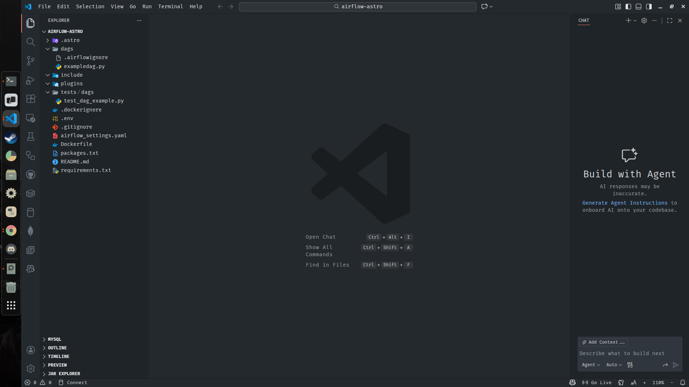
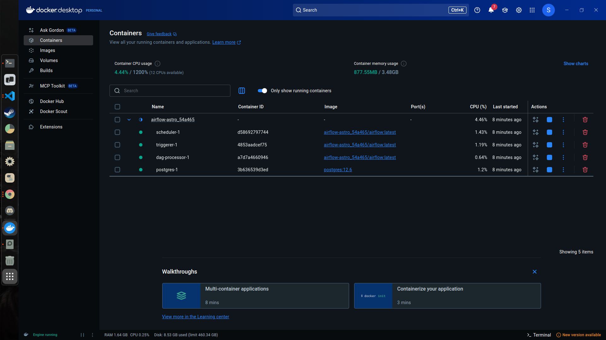
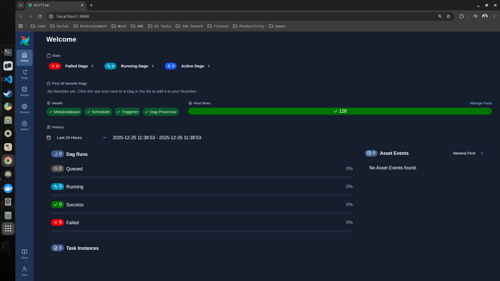
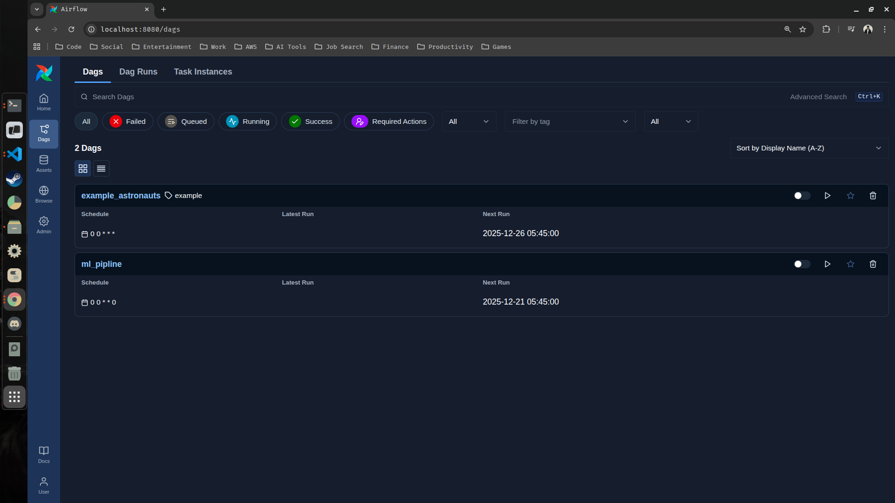
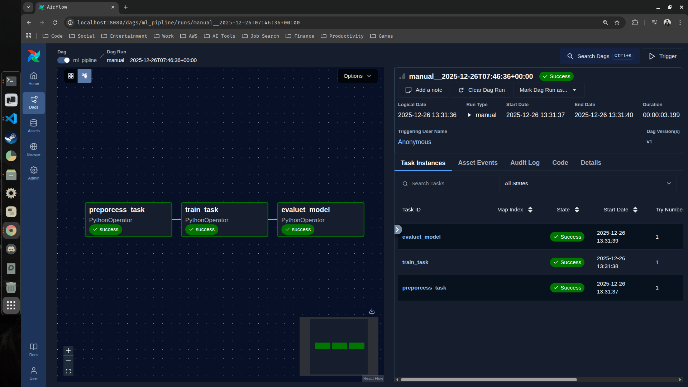
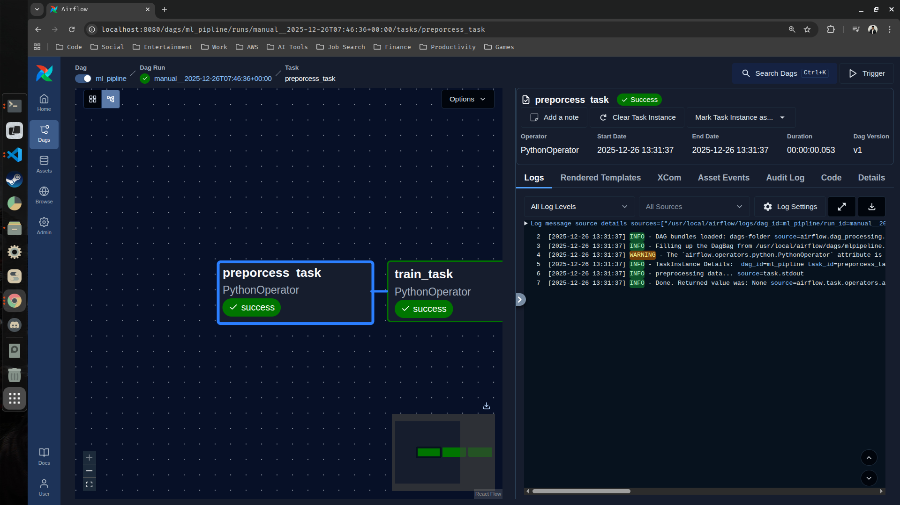

## Apache Airflow

Apache  Airflow  is  an  open-source  platform  used  to  programmatically  author, 
schedule, and monitor workflows. It allows you to define complex workflows as code 
and manage their execution. Airflow is commonly used for data pipelines, where tasks 
like  data  extraction,  transformation,  and  loading  (ETL)  are  orchestrated  across 
multiple systems

---

### Setting Up Airflow With Astronomer (Astro)

Astronomer is a managed platform for Apache Airflow that simplifies running and scaling airflow while providing additional enterprises features like monitoring, security and automation. The best thing about this platform is that it will be running your airflow within a docker container.

- Website Link : [astronomer.io](https://www.astronomer.io/)
- Dcoumentation Link : [Astronomer Docs](https://www.astronomer.io/docs/home/astronomer-documentation)

> Before setting up make sure you have astro CLI installed in your local machine.

- Run the following command to install the latest version of the Astro CLI directly to PATH:
```bash
siddhu@ubuntu:~/Desktop$ curl -sSL install.astronomer.io | sudo bash -s
```
- To install a specific version of the CLI, specify the version number as a flag at the end of the command. For example, to install the most recent release of the CLI, you would run:
```bash
siddhu@ubuntu:~/Desktop$ curl -sSL install.astronomer.io | sudo bash -s -- v1.36.0
```
> After installing astro CLI to your local machine, you may start setting up your airflow by following the below instructions : 

1. Create a new directory (airflow-astro)

```bash
siddhu@ubuntu:~/Desktop$ mkdir airflow-astro
```

2. Go inside the newly created directory and initialize an astro project

```bash
siddhu@ubuntu:~/Desktop$ cd airflow-astro/
siddhu@ubuntu:~/Desktop/airflow-astro$ astro dev init
Initialized empty Astro project in /home/siddhu/Desktop/airflow-astro
```

3. Open your VS-Code

```bash
siddhu@ubuntu:~/Desktop/airflow-astro$ code .
```



> You should see that automatically the astro project template has been initialized and it has pulled the airflow development files.

Astro Airflow Project Structure (Tree View)

```text
.
├── 📄 airflow_settings.yaml        # Airflow config overrides
├── 📁 .astro/                      # Astronomer internal configuration
│   ├── 📄 config.yaml              # Astro CLI project config
│   ├── 📄 dag_integrity_exceptions.txt  # DAGs excluded from integrity checks
│   └── 📄 test_dag_integrity_default.py # Default DAG integrity test
├── 📁 dags/                        # Airflow DAG definitions
│   ├── 📄 .airflowignore           # Files Airflow should ignore
│   └── 📄 exampledag.py            # Sample DAG
├── 📄 Dockerfile                   # Docker image definition
├── 📄 .dockerignore                # Docker ignore rules
├── 📄 .env                         # Environment variables
├── 📄 .gitignore                   # Git ignore rules
├── 📁 include/                     # Shared helpers, SQL, utilities
├── 📄 packages.txt                 # OS-level dependencies
├── 📁 plugins/                     # Custom Airflow plugins
├── 📄 README.md                    # Project documentation
├── 📄 requirements.txt             # Python dependencies
└── 📁 tests/                       # Tests and validations
    └── 📁 dags/                    # DAG-related tests
        └── 📄 test_dag_example.py  # Example DAG test
```

4. Run the project

```bash
siddhu@ubuntu:~/Desktop/airflow-astro$ astro dev start
```

> The above command will start building the Dockefile and after building it will run the airflow. You can see this if you have docker desktop in your machine.



5. Open Airflow UI

```bash
http://localhost:8080/
```

> Once the airflow has been started you can now access the airflow ui from the above link which is completely managed by the astro. This ui is entirely running in the docker container.



> Below are some of the things you can do with airflow ui : 

- You can view the dags you have created (by default they are disabled).
- You can see the tasks that are inside your dag.
- You can view the tasks in the form of graphs.
- You can manually run/trigger your dag.
- You can see the schedule and the exact time when it basically has to run.
- You can also see the event logs and the code.
- Similarly, you can also view gantt, run duration, task duration, calendar and Xcom.

Note : Xcom tells you what information is being passed from one task to another task.

6. Stopping the Project/Airflow UI 

```bash
siddhu@ubuntu:~/Desktop/airflow-astro$ sudo astro dev stop
[sudo] password for siddhu: 
✔ Project stopped
```

---

### Building your first DAG with Airflow

In here, we will be creating a basic ML pipeline, we won't be defining what kind of functionality it is basically going to do. Instead we will be discussing the basic skeleton of how we can create our DAG, define our tasks and also how we ran run it.

1. Create a new file (mlpipeline.py) inside the dags folder of your astro project directory

```text
.
├── 📄 airflow_settings.yaml       
├── 📁 .astro/                      
│   ├── 📄 config.yaml              
│   ├── 📄 dag_integrity_exceptions.txt  
│   └── 📄 test_dag_integrity_default.py 
├── 📁 dags/                        
│   ├── 📄 .airflowignore           
│   └── 📄 exampledag.py    
|   └── 📄 mlpipeline.py         # Your newly created file here 
├── 📄 Dockerfile                   
├── 📄 .dockerignore                
├── 📄 .env                         
├── 📄 .gitignore                   
├── 📁 include/                     
├── 📄 packages.txt                 
├── 📁 plugins/                     
├── 📄 README.md                    
├── 📄 requirements.txt             
└── 📁 tests/                       
    └── 📁 dags/                    
        └── 📄 test_dag_example.py  
```

2. Copy and paste the below code to your newly created python file (mlpipeline.py)

```python
from airflow import DAG
from airflow.operators.python import PythonOperator
from datetime import datetime

# Define task 1
def preprocess_data():
    print('preprocessing data...')

# Define task 2
def train_model():
    print('Training model...')

# Define task 3
def evaluate_model():
    print('Evaluating model...')


## Defining the DAG

with DAG('ml_pipline', start_date=datetime(2025, 1, 1), schedule='@weekly') as dag:
    # Define the task
    preprocess = PythonOperator(task_id='preporcess_task', python_callable=preprocess_data)
    train = PythonOperator(task_id='train_task', python_callable=train_model)
    evaluate = PythonOperator(task_id='evaluet_model', python_callable=evaluate_model)

    # set dependencies (defining order)
    preprocess >> train >> evaluate

```

3. Run the project

```bash
siddhu@ubuntu:~/Desktop/airflow-astro$ astro dev start
```

Possible Error : 

```bash
siddhu@ubuntu:~/Desktop/airflow-astro$ astro dev start
✔ Project image has been updated
Error: error building, (re)creating or starting project containers: Error response from daemon: failed to set up container networking: driver failed programming external connectivity on endpoint airflow-astro_ece713-postgres-1 (1d587611fb6f13e6cb4ac783859f74aa0e9aa1c4b94354c52622f1c288b20057): Bind for 127.0.0.1:5432 failed: port is already allocated
```

> If you ran into an error similarly to the above one, run the below commands to fix it :

- Option 1 : Stop existing containers (clean start)
```bash
siddhu@ubuntu:~/Desktop/airflow-astro$ docker stop $(docker ps -q --filter "name=airflow-astro")
siddhu@ubuntu:~/Desktop/airflow-astro$ docker rm $(docker ps -aq --filter "name=airflow-astro")
```
- Option 2 : Use a different Postgres port
You can change the port mapping in your docker-compose.yaml (usually in .astro folder) for Postgres:

```bash
ports:
  - "5433:5432"
```
- Then start Astro dev again:
```bash
siddhu@ubuntu:~/Desktop/airflow-astro$ astro dev start
```

4. Open the Airflow UI

```bash
http://localhost:8080/
```

5. In the dags, you will be able to see that you have 2 dags including the one you just created (ml_pipleline)



6. Go inside your newly created dag and run/trigger it to see the running tasks and some important informations related to it.

<table>
  <tr>
    <td>
      
    </td>
    <td>
      
    </td>
  </tr>
</table>

7. Stop the Project/Airflow UI 

```bash
siddhu@ubuntu:~/Desktop/airflow-astro$ sudo astro dev stop
[sudo] password for siddhu: 
✔ Project stopped
```

> Additionally, If you want to change the code and run this again, while the container is still running, you can do this using the below command

```bash
siddhu@ubuntu:~/Desktop/airflow-astro$ astro dev restart
```


