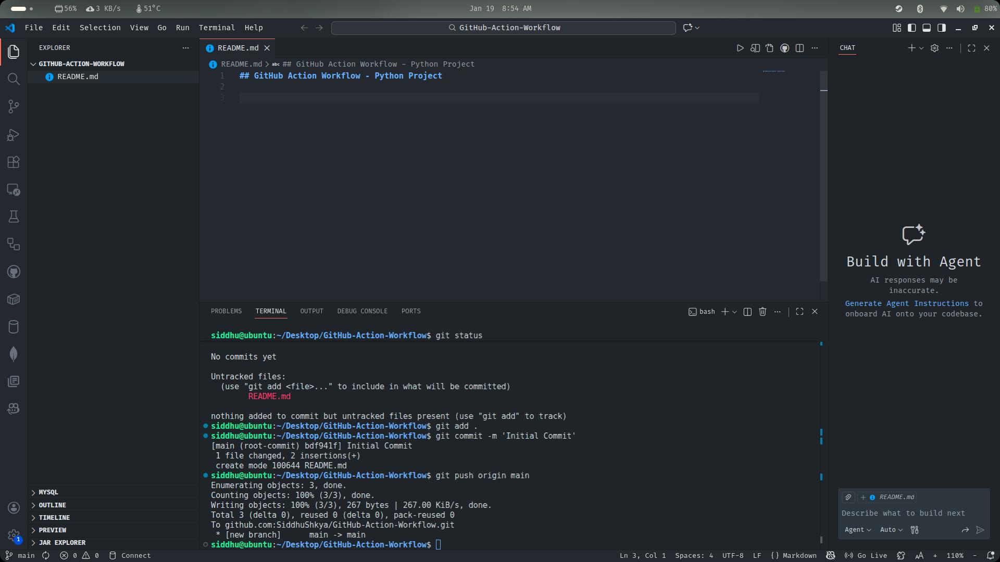
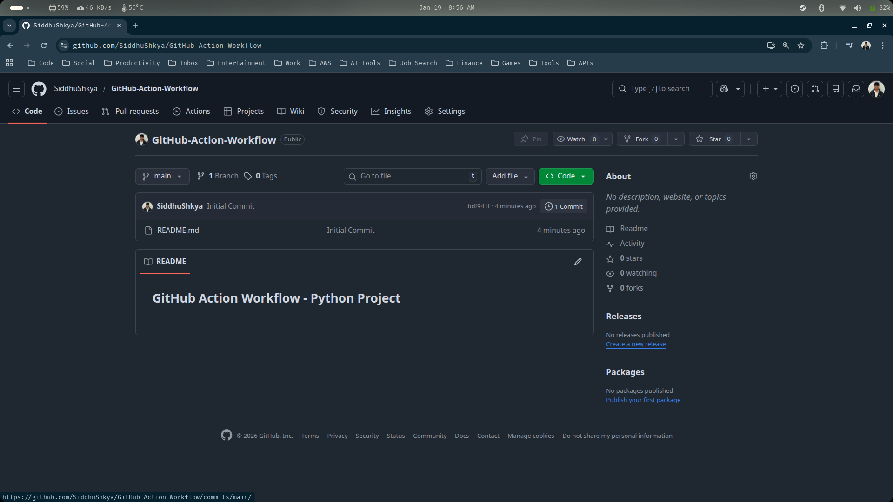
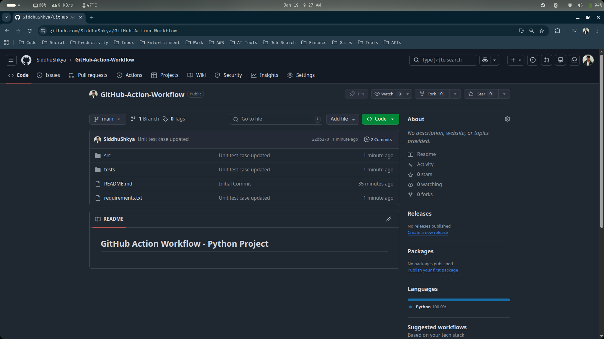
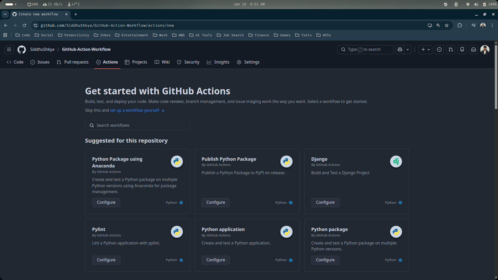
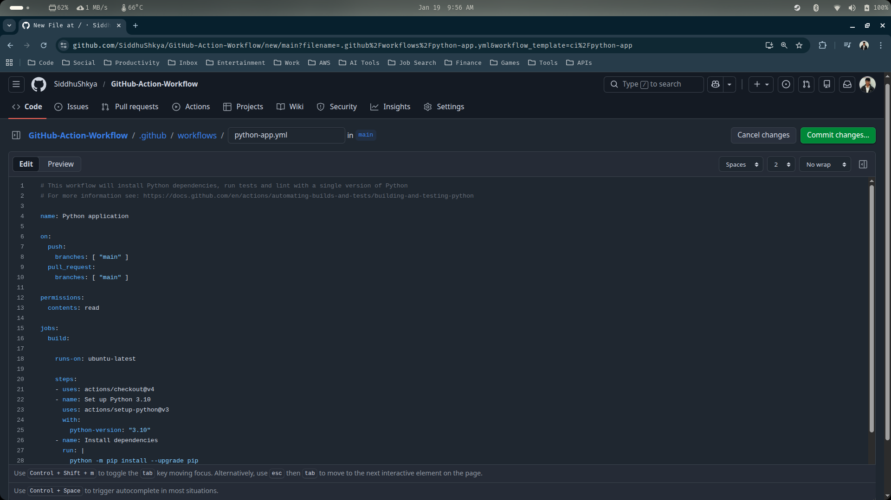
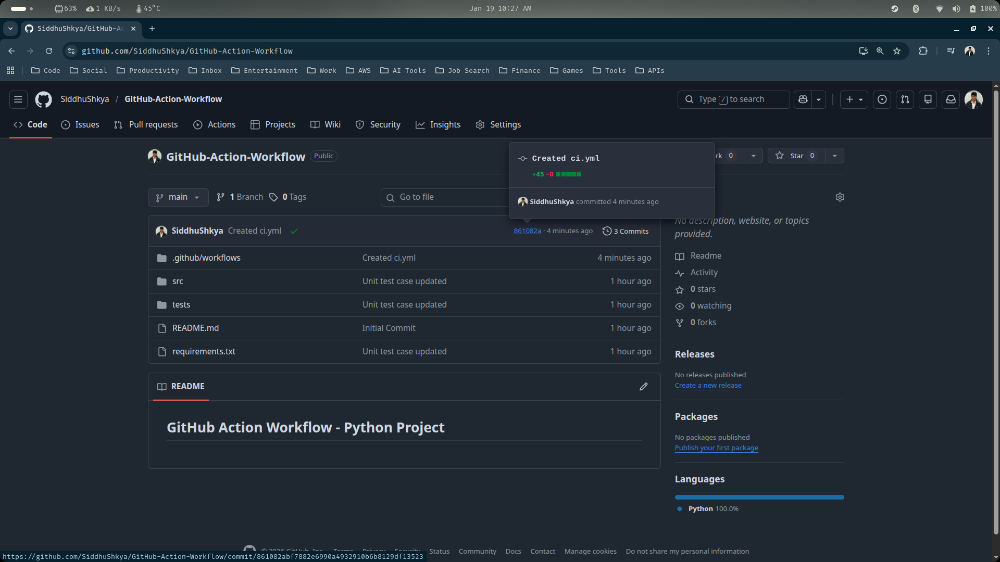
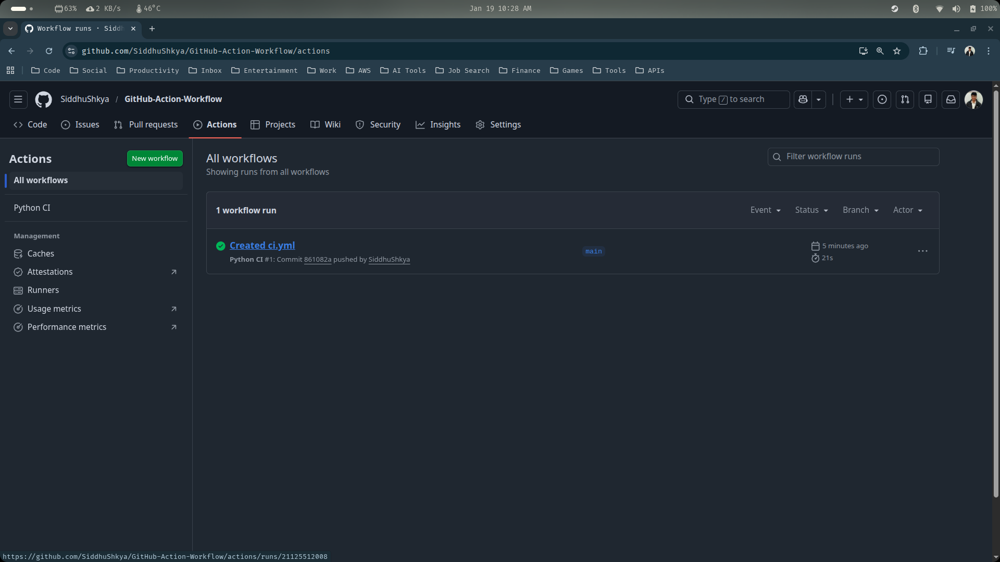
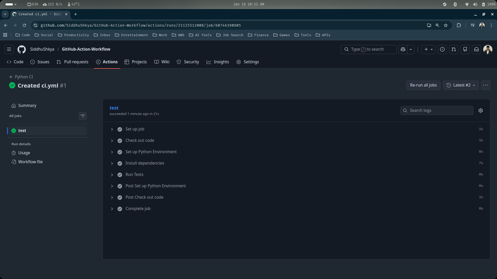

## GitHub Action Workflow

In this guide we are gonna utilize the GitHub action workflow for a python project to do some automated testing. Follow the below steps :

1. Create an empty github repository and clone it into your local machine

```sh
siddhu@ubuntu:~/Desktop$ git clone git@github.com:SiddhuShkya/GitHub-Action-Workflow.git
Cloning into 'GitHub-Action-Workflow'...
warning: You appear to have cloned an empty repository.
siddhu@ubuntu:~/Desktop$ cd GitHub-Action-Workflow/
```

> I have named the repo as 'GitHub-Action-Workflow' but you can name it whatever you want

2. Open you VS-Code from inside your cloned repo and make your first commit by creating a README.md file



```sh
siddhu@ubuntu:~/Desktop/GitHub-Action-Workflow$ git status
siddhu@ubuntu:~/Desktop/GitHub-Action-Workflow$ git add .
siddhu@ubuntu:~/Desktop/GitHub-Action-Workflow$ git commit -m 'Initial Commit'
siddhu@ubuntu:~/Desktop/GitHub-Action-Workflow$ git push origin main
```

> Additinally, verify if the push has been made to your github repository



3. Create requirements.txt file to add our below dependencies (libraries) for this project. Copy paste the below dependencies to created requirements.txt file

```python
pandas
pytest
```

> pytest is used for unit testing

4. Now, lets create 2 new folder inside our project directory: src & tests

- `src` -> Holds the actual application/production code we want to test
- `tests` -> Holds unit test files named as test_*.py or *_test.py (pytests automatically creates them)

> Inside our newly created src & tests folder, add new python script files. After adding our project structure will look something like the below:

```text
.
├── .git
├── README.md
├── requirements.txt
├── src
│   ├── __init__.py                   # New python file
│   └── math_operations.py            # New python file
└── tests
    ├── __init__.py                   # New python file
    └── test_operations.py            # New python file
```

> Copy paste the below two python scripts to math_operations.py and test_operations.py respectively

```python
## src/math_operations.py

def add(a, b):
    return a + b

def sub(a, b);
    return a - b
```

```python
## src/test_operations.py

from src.math_operations import add, sub

def test_add():
    assert add (2, 3) == 5
    assert add (-5, 5) == 0
    assert add (0, 7) == 7
    
def test_sub():
    assert sub (10, 2) == 8
    assert sub (6, 1) == 5
    assert sub (-5, 2) == -7
```

> After copy pasting the above 2 python scripts, go ahead and commit the changes to you github

```sh
siddhu@ubuntu:~/Desktop/GitHub-Action-Workflow$ git add .
siddhu@ubuntu:~/Desktop/GitHub-Action-Workflow$ git commit -m 'Unit test case updated'
siddhu@ubuntu:~/Desktop/GitHub-Action-Workflow$ git push origin main
```
> Verify the push



5. Finally, let's try automate testing this entire unit use cases using github action

> In your GitHub repository page, go to the 'Actions' tab



> In the actions tab, you can see all the available pre-built github actions that are already available. Lets Configure with 'Python application' by clicking on Configure



> After clicking on configure, you will be able to see that it automatically tries to create a new folder similar to the below given one

```text
.github/workflows/python-app.yml
```

> This python-app.yml (YAML File) file is the file we define for our GitHub Actions or configurations.

*Click on 'Cancel Changes', as we are going to manually create this yaml file from our local repository*

6. Create '.github' folder inside your local remote project directory, and inside that folder create another folder 'workflows'. Inside the workflows, create your yaml file (ci.yml) to configure your github actions

> Your final project structure will look something like this:

```text
├── .git
├── .github                 # Your new folder and yaml file
│   └── workflows
│       └── ci.yml
├── README.md
├── requirements.txt
├── src
│   ├── __init__.py
│   └── math_operations.py
└── tests
    ├── __init__.py
    └── test_operations.py
```

> You can name your yaml configuration file, anything you want.

7. Copy paste the below code to define our github action workflow.

```yaml
## .github/workflows/ci.yml

# Name of the workflow (shown in GitHub Actions UI)
name: Python CI

# Define when this workflow should run
on:
  # Run workflow on push events to the main branch
  push:
    branches: [ main ]

  # Run workflow on pull requests targeting the main branch
  pull_request:
    branches: [ main ]  

# Define jobs to be executed
jobs:
  # Job name: test
  test:
    # Use the latest Ubuntu runner
    runs-on: ubuntu-latest

    # Steps executed inside the job
    steps:
      # Step 1: Checkout the repository code
      - name: Check out code
        uses: actions/checkout@v2
        
      # Step 2: Set up Python environment
      - name: Set up Python Environment
        uses: actions/setup-python@v2
        with:
          # Specify Python version
          python-version: '3.8'

      # Step 3: Install project dependencies
      - name: Install dependencies
        run: |
          # Upgrade pip to the latest version
          python -m pip install --upgrade pip
          # Install dependencies from requirements.txt
          pip install -r requirements.txt
                
      # Step 4: Run unit tests using pytest
      - name: Run Tests
        run: |
          pytest
```

> Now lets go ahead and commit the changes to our github

```sh
siddhu@ubuntu:~/Desktop/GitHub-Action-Workflow$ git add .
siddhu@ubuntu:~/Desktop/GitHub-Action-Workflow$ git commit -m 'Created ci.yml'
siddhu@ubuntu:~/Desktop/GitHub-Action-Workflow$ git push origin main
```
> Since, what we did just now is one of our defined events (push event), it should run/trigger our github action workflow



> You can also view your recently created workflow from the 'Actions' tab



> To manually execute or trigger the workflow, you bascially have to click on the created workflow then click re-run all jobs and wait for the steps to complete.



> You can see that all the steps have been executed successfully, meaning that the push passed all the test cases

```
📌 Important Note:

This workflow is automatically created and ran, every time one of the defined events in the YAML file is triggered (such as push or pull_request). This ensures that when we are working as a team of developers, all code changes are automatically validated through a consistent CI process 🛠️.
```

---

# <div align="center">Thank You for Going Through This Guide! 🙏✨</div>
