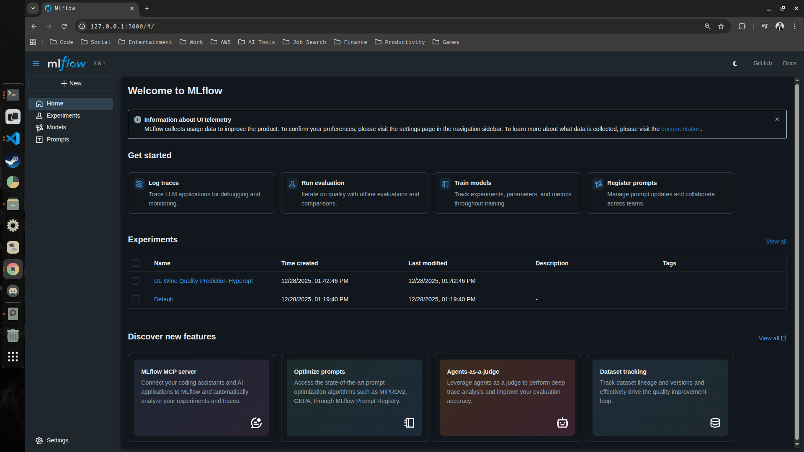
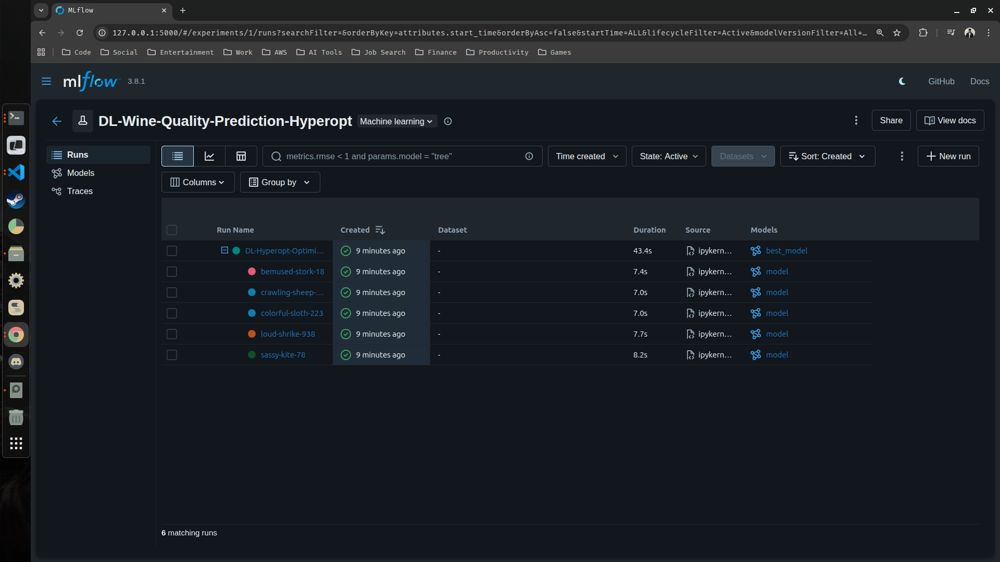
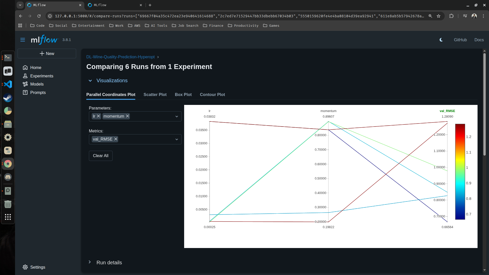
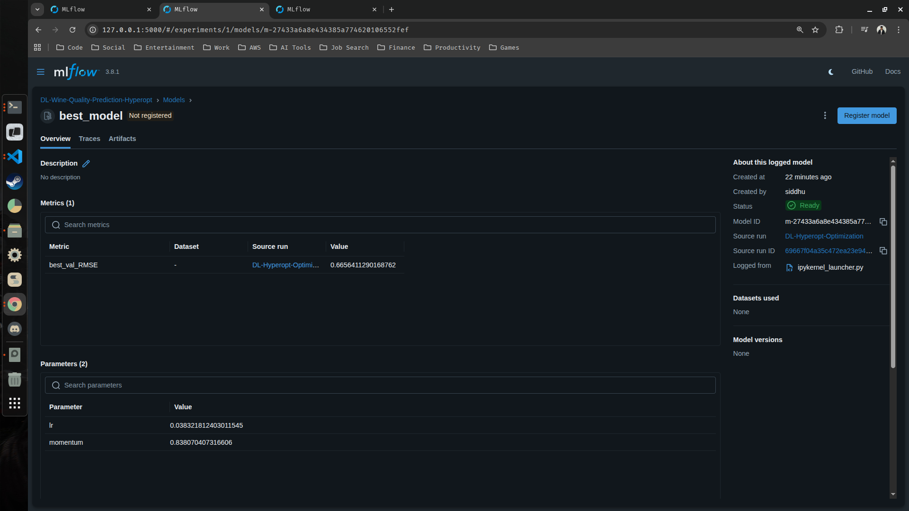
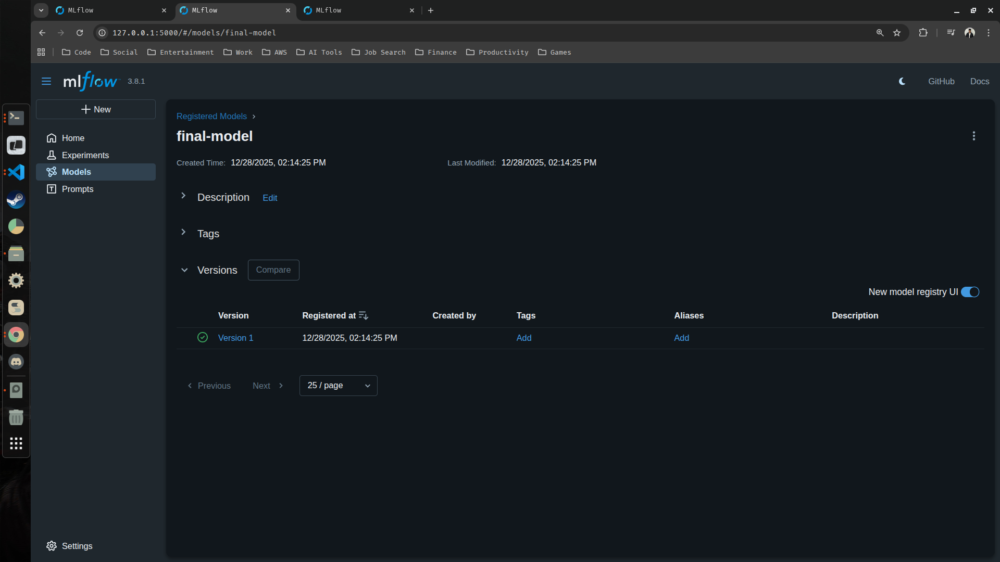

## Wine Quality Prediction With MLflow

In this guide we are goig to :

- Run a hyperparameter sweep on a training script
- Compare the results of the runs in the MLflow UI
- Choose the best run and register it as a model
- Build a container image suitable for deployment to a cloud platform

---

1. Update your requirements.txt file by adding the below two libraries 

```text
keras
tensorflow
hyperopt
```

2. Activate your conda environment (venv) and install the libraries using the updated requirements.txt

```bash
siddhu@ubuntu:~/Desktop/mlflow-starter$ conda activate /home/siddhu/Desktop/mlflow-starter/venv
(/home/siddhu/Desktop/mlflow-starter/venv) siddhu@ubuntu:~/Desktop/mlflow-starter$ pip install -r ./requirements.txt
```

> Wait for the installation to complete (Its gonna take a while)

3. Create a new project folder (DL-Project-With-MLflow) and inside it create a new jupyter notebook (starter.ipynb).

> Your project structure should look something like this :

```text
.
├── get-started.py 📄
├── mlartifacts 📁
│   └── 2 📁
├── mlflow.db 📄
├── ml-project.ipynb 📄
├── ML-Project-With-MLflow 📁
│   ├── house-price-prediction.ipynb 📄
│   ├── mlartifacts 📁
│   ├── mlflow.db 📄
│   └── mlruns 📁
├── DL-Project-With-MLflow 📁
│   └── starter.ipynb 📄 <------------------ # Your newly created notebook file
├── mlruns 📁
├── requirements.txt 📄
└── venv 📁
```

4. Go to your notebook file (starter.ipynb) and select your kernel (venv). After selecting your kernel create a new code cell and start copy pasting the below block of codes and run them cell-by-cell.

```python
import keras
import numpy as np 
import pandas as pd
from hyperopt import STATUS_OK, Trials, fmin, hp, tpe
from sklearn.model_selection import train_test_split

import mlflow
from mlflow.models import infer_signature
```

```python
# load the data
data = pd.read_csv("https://raw.githubusercontent.com/mlflow/mlflow/master/tests/datasets/winequality-red.csv", sep=";")
data.head()
```

Output : 
|  | fixed acidity | volatile acidity | citric acid | residual sugar | chlorides | free sulfur dioxide | total sulfur dioxide | density  | pH   | sulphates | alcohol | quality |
|-------|---------------|-----------------|------------|----------------|-----------|-------------------|--------------------|---------|------|-----------|---------|---------|
| 0     | 7.4           | 0.70            | 0.00       | 1.9            | 0.076     | 11.0              | 34.0               | 0.9978  | 3.51 | 0.56      | 9.4     | 5       |
| 1     | 7.8           | 0.88            | 0.00       | 2.6            | 0.098     | 25.0              | 67.0               | 0.9968  | 3.20 | 0.68      | 9.8     | 5       |
| 2     | 7.8           | 0.76            | 0.04       | 2.3            | 0.092     | 15.0              | 54.0               | 0.9970  | 3.26 | 0.65      | 9.8     | 5       |
| 3     | 11.2          | 0.28            | 0.56       | 1.9            | 0.075     | 17.0              | 60.0               | 0.9980  | 3.16 | 0.58      | 9.8     | 6       |
| 4     | 7.4           | 0.70            | 0.00       | 1.9            | 0.076     | 11.0              | 34.0               | 0.9978  | 3.51 | 0.56      | 9.4     | 5       |

> The target of our data is quality. We are going to build ANN model that predict the quality of the wine based on the above features.

5. Divide our data into features (X) and target (y) and further split them into training, validation and test set

```python
# Separate features (X) and target (y)
X = data.drop(columns=["quality"], axis=1).values  # All columns except 'quality'
y = data["quality"].values.ravel()  # Target column 'quality' as 1D array

# Split data into training and test sets
X_train, X_test, y_train, y_test = train_test_split(
    X,
    y,
    test_size=0.2,
    random_state=42,  # 20% test, 80% remaining for training/validation
)

# Split training data further into training and validation sets
X_train, X_valid, y_train, y_valid = train_test_split(
    X_train,
    y_train,
    test_size=0.25,
    random_state=42,  # 25% of 80% training → 20% of total for validation
)

# Print shapes to verify splits
print("Training set shape:", X_train.shape)  # Shape of training set
print("Validation set shape:", X_valid.shape)  # Shape of validation set
print("Test set shape:", X_test.shape)  # Shape of test set
```

6. Now that we have prepared all our data, lets go ahead and create our ANN model

```python
def train_model(params, epochs, X_train, y_train, X_valid, y_valid):
    ## Define the model architecture
    mean = np.mean(X_train, axis=0)
    var = np.var(X_train, axis=0) 
    model = keras.Sequential([
        keras.Input([X_train.shape[1]]),
        keras.layers.Normalization(mean=mean, variance=var),
        keras.layers.Dense(64, activation='relu'),
        keras.layers.Dense(32, activation='relu'),
        keras.layers.Dense(1)
    ])
    ## Compile the model
    model.compile(
        optimizer=keras.optimizers.SGD(
            learning_rate=params['lr'], 
            momentum=params['momentum']), 
        loss='mean_squared_error', 
        metrics=[keras.metrics.RootMeanSquaredError()]
    )
    ## Train the ANN model with the given parameters with MLflow tracking
    with mlflow.start_run(nested=True):
        model.fit(
            X_train, 
            y_train, 
            validation_data=(X_valid, y_valid), 
            epochs=epochs, 
            batch_size=32, 
            verbose=0
        )
        # Evaluate the model on validation data
        val_loss, val_rmse = model.evaluate(X_valid, y_valid,batch_size=32)
        # Log parameters and metrics to MLflow
        mlflow.log_params(params)
        mlflow.log_metric("val_loss", val_loss)
        mlflow.log_metric("val_RMSE", val_rmse)
        
        # Log the model
        signature = infer_signature(X_train, model.predict(X_train))
        mlflow.keras.log_model(model, name="model", signature=signature)
        
        return {'loss': val_rmse, 'status': STATUS_OK, 'model': model}
```

7. Since we are using hyperopt for automating hyperparameter optimization, we need to create an objective function 

```python
def objective(params):
    epochs = 10
    result = train_model(
        params=params, 
        epochs=epochs, 
        X_train=X_train, 
        y_train=y_train, 
        X_valid=X_valid, 
        y_valid=y_valid
    )
    return result
```

> This function takes hyperparameters as input, trains a model, evaluates it, and returns a loss/metric to minimize them.

8. Define the ranges or distributions for hyperparameters

```python
space = {
    'lr': hp.loguniform('lr', np.log(0.0001), np.log(0.1)),
    'momentum': hp.uniform('momentum', 0.0, 0.9)
}
```

> Before moving to the next step 9, lets start our mlflow server from the terminal, from inside the new project folder (DL-Project-With-MLflow)

```bash
(/home/siddhu/Desktop/mlflow-starter/venv) siddhu@ubuntu:~/Desktop/mlflow-starter$ cd ./DL-Project-With-MLflow/
(/home/siddhu/Desktop/mlflow-starter/venv) siddhu@ubuntu:~/Desktop/mlflow-starter/DL-Project-With-MLflow$ mlflow ui
```

9. Set the mlflow experiment and start the run 

```python 
## Set the MLflow experiment 
mlflow.set_experiment("DL-Wine-Quality-Prediction-Hyperopt")
## Start the MLflow run
with mlflow.start_run(run_name="DL-Hyperopt-Optimization"):
    ## Conduct hyperparameter optimization using Hyperopt
    trials = Trials()
    best_result = fmin(
        fn=objective,
        space=space,
        algo=tpe.suggest,
        max_evals=5,
        trials=trials
    )
    ## Fetch details of the best run
    best_run = sorted(trials.results, key=lambda x: x['loss'])[0]
    ## Log the best hyperparameters
    mlflow.log_params(best_result)
    ## Log the best loss and model
    mlflow.log_metric("best_val_RMSE", best_run['loss'])
    signature = infer_signature(X_train, best_run['model'].predict(X_train))
    mlflow.keras.log_model(best_run['model'], name="best_model", signature=signature)
    ## Print the best hyperparameters
    print("Best hyperparameters:", best_result)
    print("Best validation RMSE:", best_run['loss'])
```
Expected Output : 

```bash
100%|██████████| 5/5 [00:37<00:00,  7.54s/trial, best loss: 0.6656411290168762]
30/30 ━━━━━━━━━━━━━━━━━━━━ 0s 1ms/step 
Best hyperparameters: {'lr': np.float64(0.038321812403011545), 'momentum': np.float64(0.838070407316606)}
Best validation RMSE: 0.6656411290168762
```

> If you see the output something similar to the above one, then your runs have successfully been executed and now you can view your experiment, logs and artifacts from the mlflow server

- Your experiment 



- Your runs



> You can see that we have multiple runs, this is because our model was trained on different learning rates and momentums.

10. Compare all the runs and identify the best model 



> In this case the best run is the one with the run name 'DL-Hyperopt-Optimization'



11. Now that we have identified our best mdoel, lets go ahead and register it to our model registry

- Click 'Register model' button from the mlflow ui
    - Create new model : final-model (your wish)
    - Register it



> Finally, you can now inference your registered model using the code below :

```python
import mlflow.keras

model_name = (
    "final-model"  # The name you used for when you registered the model (final-model)
)
model_version = "1"  # The best version of your registered model

model_uri = f"models:/{model_name}/{model_version}"
model = mlflow.keras.load_model(model_uri)

y_pred = model.predict(X_test)
print(y_pred)
```

Expected Output : 

```python
[[5.4740524]
 [5.2378716]
 [5.728071 ]
 .....
 [6.2474947]
 [5.0946455]]
```

---

# <div align="center">Thank You for Going Through This Guide! 🙏✨</div>