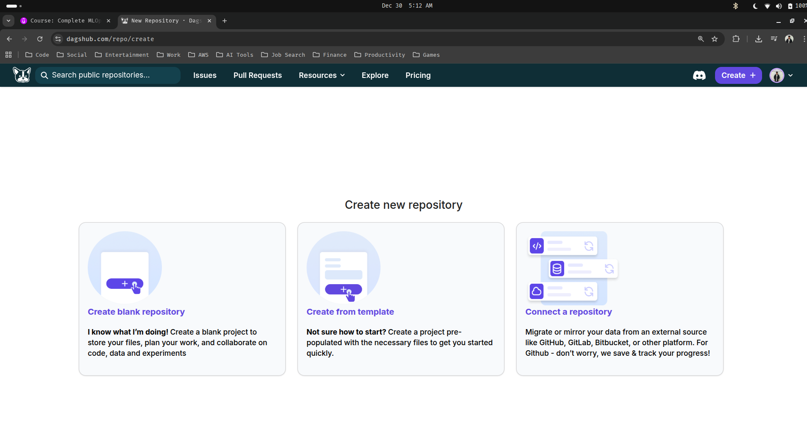
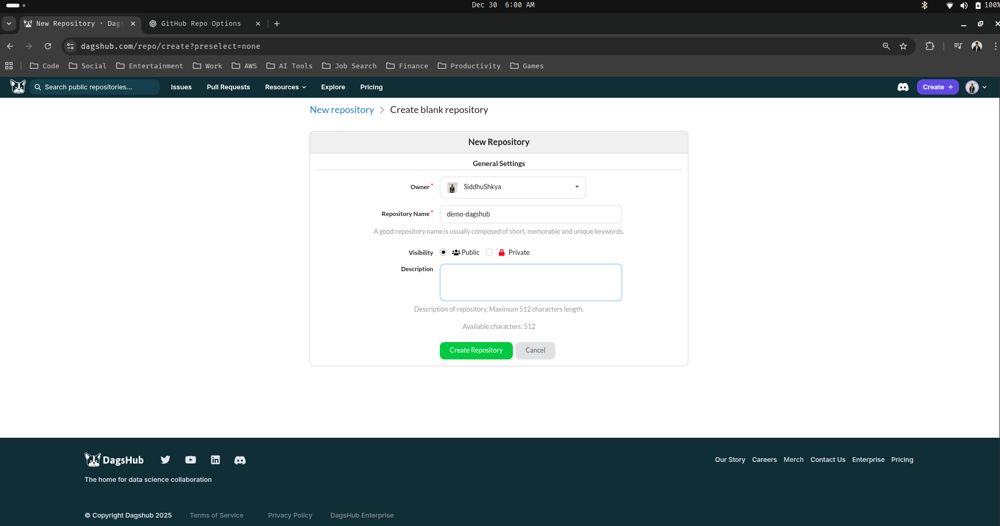
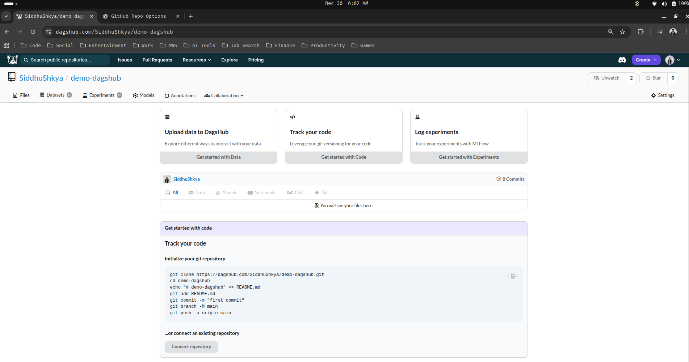
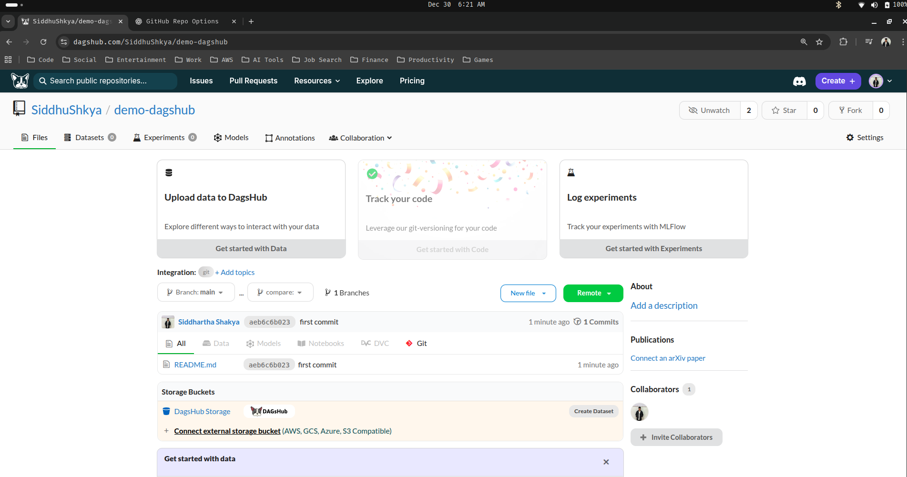
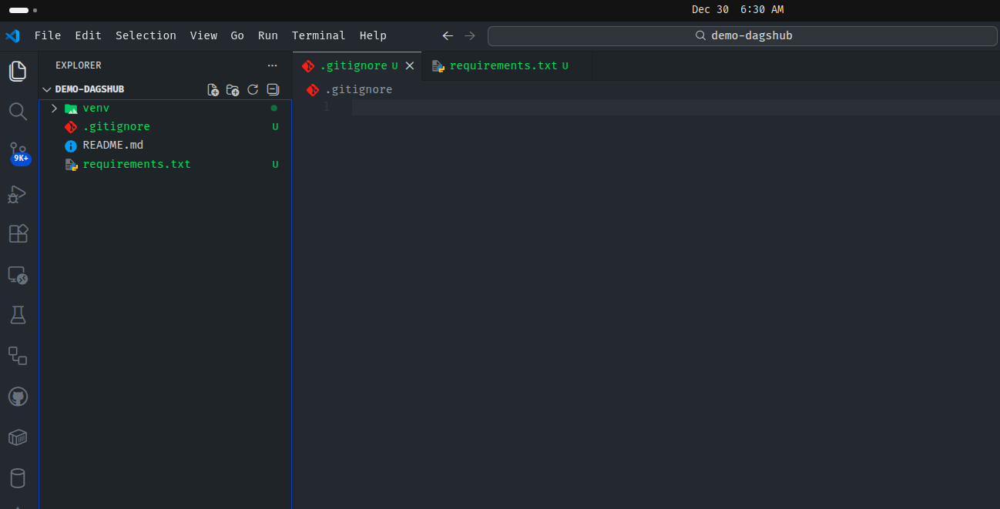
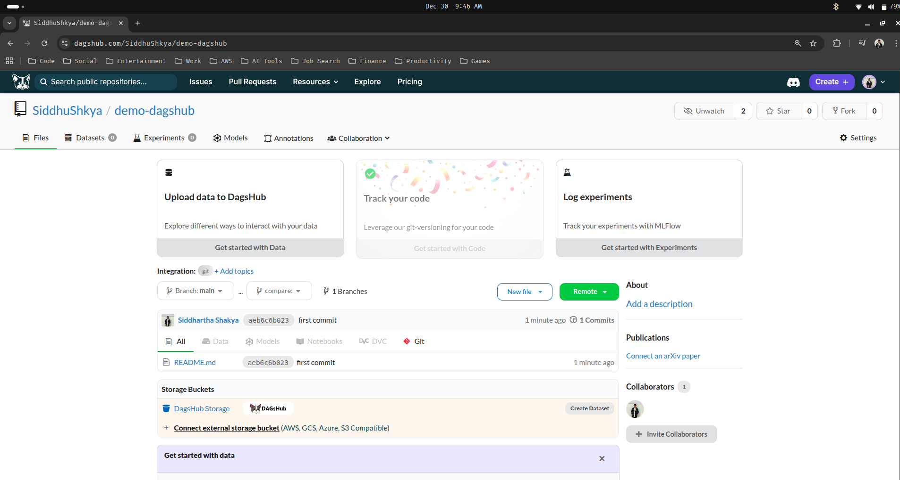
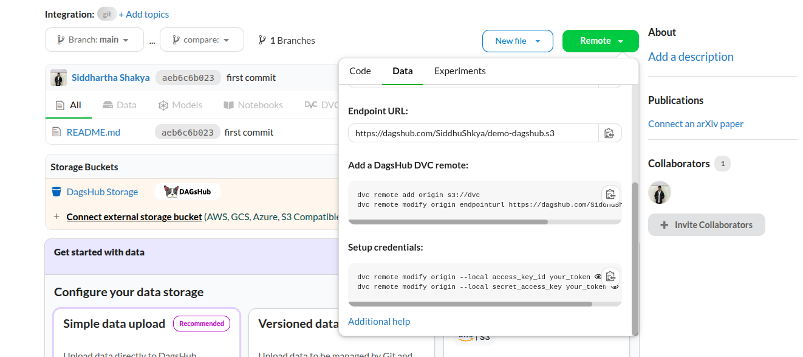
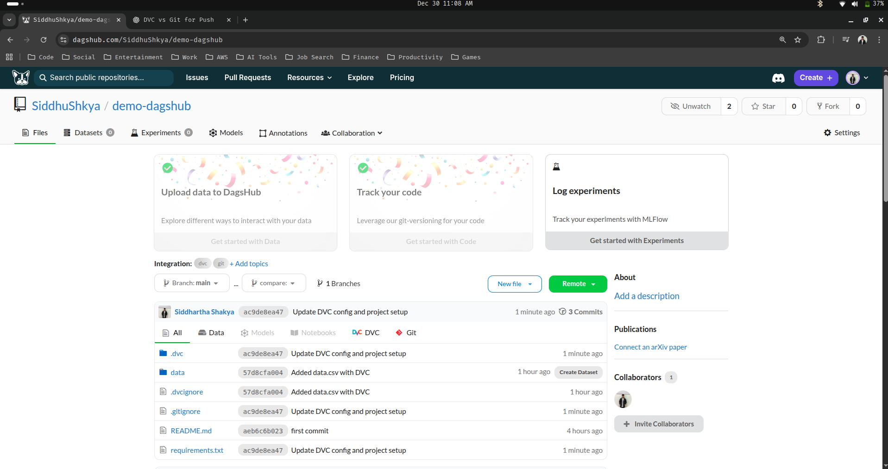
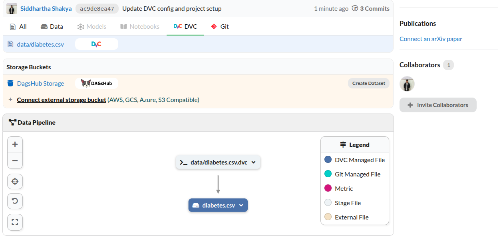

## DagsHub

DagsHub is an AI platform that helps developers and teams manage the entire lifecycle from data collection, through dataset curation and annotation, tracking data versions and experimentations (both model training and prompt engineering), to model management. DagsHub is based on open source tools and formats (such as Git, DVC, MLflow, Label Studio, and others) so it should quickly feel familiar.

---

### 1. Creating Your First Remote Repo Using DagsHub

1. Go to DagsHub official website and signup using GitHub or Google (The choice is upto you)

- DagsHub Official Website : [DagsHub](https://dagshub.com/)

2. After successfully signing up, you can log in to your dagshub dashboard

- DagsHub Dashboard : [DagsHub Dashboard](https://dagshub.com/dashboard)


3. Now lets create a new dagshub repository by clicking the create button at the top right of the dagshub dashboard page



> You can see that dagshub provides you with 3 options to create a github repo :

- Create a blank repository : Starts a new empty repository with no files, giving full control to build the project from scratch.
- Create from template : Creates a new repository pre-filled with a predefined project structure.
- Connect a repository : Links an existing GitHub repository to DagsHub for tracking and collaboration.

> For this guide, we will go ahead and create a blank repository so choose that option

4. Create your new blank repository



The repo name, visibilty and description is upto you.

> Click 'Create Repository'




> The repo will look simiar to an newly created github repo, but with additional features like: upload data to dagshub, track your code and log experiments.

---

### 2. DVC With DagsHub Remote Repository

We can use DVC alogside dagshub, which provides a more powerful way to version, manage and collaborate on data science and machine learning project. Let's see how we can implement this :

1. Clone your previously created repository to your local machine

> Note : The instructions for cloning your repo should be in the repo itself

```bash
siddhu@ubuntu:~$ git clone https://dagshub.com/SiddhuShkya/demo-dagshub.git
Cloning into 'demo-dagshub'...
warning: You appear to have cloned an empty repository.
siddhu@ubuntu:~$ cd demo-dagshub/
siddhu@ubuntu:~/demo-dagshub$ 
```

2. After changing your current directory to the cloned repo, create, add, commit and push README.md file and do your first commit to the repo

```bash
siddhu@ubuntu:~/demo-dagshub$ echo "# demo-dagshub" >> README.md
siddhu@ubuntu:~/demo-dagshub$ ls
README.md
siddhu@ubuntu:~/demo-dagshub$ git add README.md
siddhu@ubuntu:~/demo-dagshub$ git commit -m "first commit"
[main (root-commit) aeb6c6b] first commit
 1 file changed, 1 insertion(+)
 create mode 100644 README.md
siddhu@ubuntu:~/demo-dagshub$ git branch -M main
siddhu@ubuntu:~/demo-dagshub$ git push -u origin main
Enumerating objects: 3, done.
Counting objects: 100% (3/3), done.
Writing objects: 100% (3/3), 233 bytes | 233.00 KiB/s, done.
Total 3 (delta 0), reused 0 (delta 0), pack-reused 0
To https://dagshub.com/SiddhuShkya/demo-dagshub.git
 * [new branch]      main -> main
branch 'main' set up to track 'origin/main'.
```

> You can also see your commited file from the dagshub repo page




3. Now let's create a conda virtual environment, since i need to install dvc, dagshub and all

```bash
siddhu@ubuntu:~/demo-dagshub$ conda create -p venv python==3.10 -y
siddhu@ubuntu:~/demo-dagshub$ ls 
README.md  venv
```

> Open up your VS-Code editor, and create two files : .gitignore & requirements.txt

```bash
siddhu@ubuntu:~/demo-dagshub$ code .
```



> Add venv/ in .gitgnore and dvc, dagshub in requirements.txt

4. After, adding dvc and dagshub in requirements.txt, activate your conda environment and install the dependencies using the requirements.txt

```bash
siddhu@ubuntu:~/demo-dagshub$ conda activate venv/
(/home/siddhu/demo-dagshub/venv) siddhu@ubuntu:~/demo-dagshub$ pip install -r ./requirements.txt
```

> While waiting for the installation to complete, lets also create a folder (data) inside our repo and inside it lets upload our data ([diabetes.csv](https://github.com/SiddhuShkya/Machine-Learning-Operations/blob/main/data/diabetes.csv))

Your repo structure should look something like this now :

```text
.
├── data
│   └── diabetes.csv   <-----------------# Your uploaded data
├── .git
├── .gitignore
├── README.md
├── requirements.txt
└── venv
```

> Our main aim is to basically track the versioning of our this specific data (diabetes.csv) and to make sure that we push all the versioning information inside my dagshub repository.

5. Once the installation is complete, we can now go ahead and initialize our dvc to this repo to use it

```bash
(/home/siddhu/demo-dagshub/venv) siddhu@ubuntu:~/demo-dagshub$ dvc init 
Initialized DVC repository.

You can now commit the changes to git.

+---------------------------------------------------------------------+
|                                                                     |
|        DVC has enabled anonymous aggregate usage analytics.         |
|     Read the analytics documentation (and how to opt-out) here:     |
|             <https://dvc.org/doc/user-guide/analytics>              |
|                                                                     |
+---------------------------------------------------------------------+

What's next?
------------
- Check out the documentation: <https://dvc.org/doc>
- Get help and share ideas: <https://dvc.org/chat>
- Star us on GitHub: <https://github.com/treeverse/dvc>
```

> After DVC initialization our project structure will look something like this :

```text
.
├── data
│   └── diabetes.csv
├── .dvc
│   ├── config
│   ├── .gitignore
│   └── tmp
├── .dvcignore
├── .git
├── .gitignore
├── README.md
├── requirements.txt
└── venv
```

> Right now, all this files are being tracked by git, but we want our data to be tracked by dvc.

4. Let's track our data (diabetes.csv) using dvc

```bash
(/home/siddhu/demo-dagshub/venv) siddhu@ubuntu:~/demo-dagshub$ dvc add ./data/diabetes.csv
100% Adding...|███████████████████████████████████████████████████████████████████████████████████████|1/1 [00:00, 33.82file/s]
                                                                                                                               
To track the changes with git, run:

        git add data/diabetes.csv.dvc data/.gitignore

To enable auto staging, run:

        dvc config core.autostage true
```

Our data folder will now have two additional files :

```text
(/home/siddhu/demo-dagshub/venv) siddhu@ubuntu:~/demo-dagshub/data$ tree -a
.
├── diabetes.csv           # Actual data
├── diabetes.csv.dvc       # Metadata of our data with hash key 
└── .gitignore             # helps ignore actual data file by the git

1 directory, 3 files
```

> These 2 new files unlike the actual data file (diabetes.csv) needs to be tracked by the git so lets add and commit them using the git command

```bash
(/home/siddhu/demo-dagshub/venv) siddhu@ubuntu:~/demo-dagshub$ git add data/.gitignore
(/home/siddhu/demo-dagshub/venv) siddhu@ubuntu:~/demo-dagshub$ git add data/diabetes.csv.dvc
(/home/siddhu/demo-dagshub/venv) siddhu@ubuntu:~/demo-dagshub$ git commit -m 'Added data.csv with DVC'
```

5. Let's push all our files and codes to our demo-dagshub repository, but before pushing we need to do some setup

    - Go to your demo-dagshub repository page

    

    - Click on the green button that says 'Remote' and go to 'Data' tab. Again from the Data tab to to DVC tab, you should see a section that says 'Add a DagsHub DVC Remote'
   
    

    - Copy both commands and paste it to your terminal and then run it one after another

    ```bash
    (/home/siddhu/demo-dagshub/venv) siddhu@ubuntu:~/demo-dagshub$ dvc remote add origin s3://dvc
    (/home/siddhu/demo-dagshub/venv) siddhu@ubuntu:~/demo-dagshub$ dvc remote modify origin endpointurl https://dagshub.com/SiddhuShkya/demo-dagshub.s3
    ```
    We are adding this DagsHub DVC remote in order to store our data and it's multiple versions

6. After adding the dagshub DVC, we also need to go ahead and set up our security credential details

    - Right below the 'Add a DagsHub DVC Remote' section you will be able to see the commands taht we need to run to setup our credentials

    

    - Copy paste both commands and run them one after another

    ```bash
    (/home/siddhu/demo-dagshub/venv) siddhu@ubuntu:~/demo-dagshub$ dvc remote modify origin --local access_key_id 'your-private-access-key-key-id'
    (/home/siddhu/demo-dagshub/venv) siddhu@ubuntu:~/demo-dagshub$ dvc remote modify origin --local secret_access_key 'your-private-access-key-key'
    ```

    > Your security credentials has been set

7. Confirm that the security credentials has been set by seeing how many remote list are there 

```bash
(/home/siddhu/demo-dagshub/venv) siddhu@ubuntu:~/demo-dagshub$ dvc remote list
origin  s3://dvc
```

> This is the origin that we set up earlier due to which now it knows the location where it needs to save all this information. This is entirely provided by the dagshub repository

Note : Our DVC remote (origin) is using S3-compatible storage (DAGsHub), but the required S3 plugin is not installed in our virtual environment, so let's install the required plugin first

- add dvc-s3 to your requirements.txt and install the dependencies using the pip again

```text
dagshub
dvc
dvc-s3             # your newl added dependency
```

- After updating requirements.txt, reinstall all the requirements.txt

```bash
(/home/siddhu/demo-dagshub/venv) siddhu@ubuntu:~/demo-dagshub$ pip install -r ./requirements.txt
```

> Internally this plugin uses boto3 beacause this is nothing but s3-bucket itself.

8. Now that we have installed the required dvc-s3 plugin to our environment, we can freely push and pull the information. Let's pull/fetch now

```bash
(/home/siddhu/demo-dagshub/venv) siddhu@ubuntu:~/demo-dagshub$ dvc pull -r origin
Collecting                                                                                           |1.00 [00:00,  370entry/s]
Fetching
Building workspace index                                                                             |2.00 [00:00,  690entry/s]
Comparing indexes                                                                                   |3.00 [00:00, 1.45kentry/s]
Applying changes                                                                                     |0.00 [00:00,     ?file/s]
Everything is up to date.
(/home/siddhu/demo-dagshub/venv) siddhu@ubuntu:~/demo-dagshub$ 
```

9. Now that we can pull the information, we should also be able to push information

```bash
(/home/siddhu/demo-dagshub/venv) siddhu@ubuntu:~/demo-dagshub$ dvc push -r origin
Collecting                                                                                           |1.00 [00:00,  261entry/s]
Pushing
1 file pushed          
```

> Now we have tracked all our files with dvc, now we also need to track files with git

10. Add and push all the remaining files by git

```bash
(/home/siddhu/demo-dagshub/venv) siddhu@ubuntu:~/demo-dagshub$ git add . 
(/home/siddhu/demo-dagshub/venv) siddhu@ubuntu:~/demo-dagshub$ git commit -m "Update DVC config and project setup"
[main ac9de8e] Update DVC config and project setup
 3 files changed, 7 insertions(+)
 create mode 100644 .gitignore
 create mode 100644 requirements.txt
(/home/siddhu/demo-dagshub/venv) siddhu@ubuntu:~/demo-dagshub$ git push origin main
Enumerating objects: 16, done.
Counting objects: 100% (16/16), done.
Delta compression using up to 12 threads
Compressing objects: 100% (10/10), done.
Writing objects: 100% (15/15), 1.37 KiB | 1.37 MiB/s, done.
Total 15 (delta 0), reused 0 (delta 0), pack-reused 0
To https://dagshub.com/SiddhuShkya/demo-dagshub.git
   aeb6c6b..ac9de8e  main -> main
```

11. Go back to your (demo-dagshub) repository page and reload it. You should see all your commited files and alongside it you should also be able to see that both DVC and Git has been enabled




> You can also view you data pipeline from the DVC tab as well as the files that are managed by the DVC 




> Our collaborative setup for data science project using DVC and DagsHub is compele. Now let's see other new things

---

### 3. Creating And Tracking Multiple Version Of The Same Data With DVC and DagsHub

We can create and track multiple versions of the same data using DVC with DagsHub.

1. Lets update our current data (diabetes.csv), for now we are just going to remove the first 5 rows of our data


> You can also see that the dvc has notice the change in your data that is being tracked by the dvc

```bash
(/home/siddhu/demo-dagshub/venv) siddhu@ubuntu:~/demo-dagshub$ dvc status
data/diabetes.csv.dvc:                                                                                                         
        changed outs:
                modified:           data/diabetes.csv
```

2. Track your data/changes and the metadata (hash) in dagshub using dvc and git repectively

```bash
(/home/siddhu/demo-dagshub/venv) siddhu@ubuntu:~/demo-dagshub$ dvc add ./data/diabetes.csv      # creates new hash
(/home/siddhu/demo-dagshub/venv) siddhu@ubuntu:~/demo-dagshub$ git add ./data/diabetes.csv.dvc  # Adds new hash to git
```

3. Commit your changes, and before pushing your commit check if your current repo is up to date

```bash
(/home/siddhu/demo-dagshub/venv) siddhu@ubuntu:~/demo-dagshub$ git commit -m 'data version 2'
(/home/siddhu/demo-dagshub/venv) siddhu@ubuntu:~/demo-dagshub$ dvc pull -r origin
Collecting                                                                                     |1.00 [00:00,  400entry/s]
Fetching
Building workspace index                                                                       |2.00 [00:00,  706entry/s]
Comparing indexes                                                                             |3.00 [00:00, 1.47kentry/s]
Applying changes                                                                               |0.00 [00:00,     ?file/s]
Everything is up to date.
```

4. Now push the changes to both dvc and git

```bash
(/home/siddhu/demo-dagshub/venv) siddhu@ubuntu:~/demo-dagshub$ dvc push -r origin
Collecting                                                                                     |1.00 [00:00,  262entry/s]
Pushing
1 file pushed                                                                                                                  
(/home/siddhu/demo-dagshub/venv) siddhu@ubuntu:~/demo-dagshub$ git push origin main                                            
Enumerating objects: 7, done.
Counting objects: 100% (7/7), done.
Delta compression using up to 12 threads
Compressing objects: 100% (4/4), done.
Writing objects: 100% (4/4), 438 bytes | 438.00 KiB/s, done.
Total 4 (delta 1), reused 0 (delta 0), pack-reused 0
To https://dagshub.com/SiddhuShkya/demo-dagshub.git
   ac9de8e..f7e612a  main -> main
```

> Every information regarding the second version of your data has been tracked

5. You can switch between the versions using the commit-hash 

> See the previous commit-hash using git log command

```bash
(/home/siddhu/demo-dagshub/venv) siddhu@ubuntu:~/Desktop/demo-dagshub$ git log
commit f7e612ad4aec280c1a6d6177c892ea392c2380db (HEAD -> main, origin/main, origin/HEAD)
Author: Siddhartha Shakya <siddhuushakyaa@gmail.com>
Date:   Tue Dec 30 12:09:47 2025 +0545

    data version 2

commit ac9de8ea470c00632f4e319ddfa254d74dcfbed8
Author: Siddhartha Shakya <siddhuushakyaa@gmail.com>
Date:   Tue Dec 30 11:06:37 2025 +0545

    Update DVC config and project setup

commit 57d8cfa004b65f5c6715e81f8af142b6209b111a
Author: Siddhartha Shakya <siddhuushakyaa@gmail.com>
Date:   Tue Dec 30 09:43:36 2025 +0545

    Added data.csv with DVC

commit aeb6c6b023c064a1539242679cce7749e3757834
Author: Siddhartha Shakya <siddhuushakyaa@gmail.com>
Date:   Tue Dec 30 06:18:53 2025 +0545

    first commit
```

From above we can see that 

| Commit Hash | Data Version | Commit Message |
|------------|--------------|----------------|
| f7e612ad4aec280c1a6d6177c892ea392c2380db | Version 2 | data version 2 |
| 57d8cfa004b65f5c6715e81f8af142b6209b111a | Version 1 | Added data.csv with DVC |

> Let's switch to version 1

```bash
(/home/siddhu/demo-dagshub/venv) siddhu@ubuntu:~/Desktop/demo-dagshub$ git checkout 57d8cfa004b65f5c6715e81f8af142b6209b111a
(/home/siddhu/demo-dagshub/venv) siddhu@ubuntu:~/Desktop/demo-dagshub$ dvc checkout
```

> Each Git commit points to a different DVC data hash, allowing us to reproduce any dataset version by checking out the commit and running dvc checkout

---

# <div align="center">Thank You for Going Through This Guide! 🙏✨</div>


