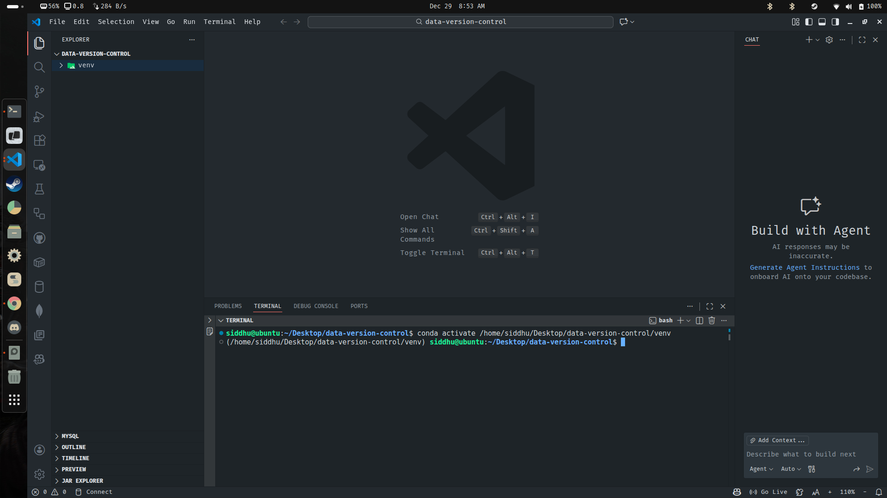
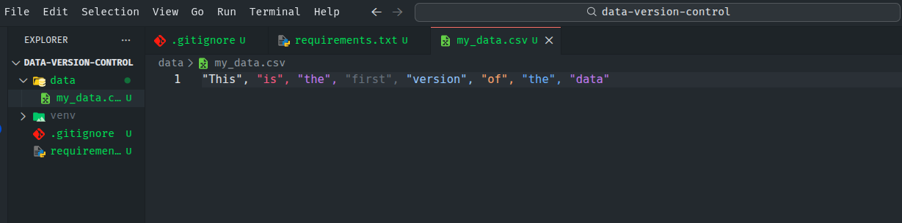
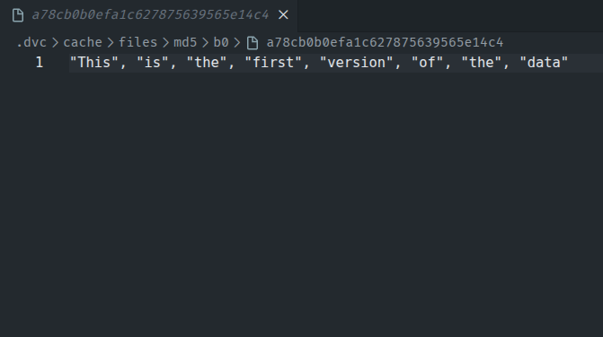
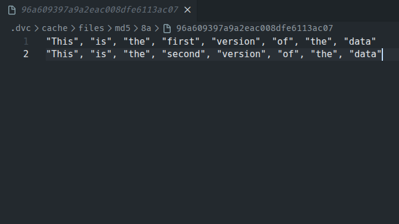

## Data Version Control (DVC)

DVC is an MLOps tools that is used to manage and version images, audio, video, and text files in storage and organize your ML modeling process into a reproducible workflow. If you store and process data files or datasets to produce other data or machine learning models, and you want to

- Track and save data and machine learning models the same way you capture code.
- Create and switch between vertsions of data and ML models easily.
- Understand how datasets and ML artifacts were built in the first place.
- Compare model metrics among experiments.
- Adopt best engineering tools and best practices in data science projects.

DVC is for you !

--- 

### DVC : Practical Implementation

For this guide we are going to see how we can implement dvc alongside our data science project

1. Create a new folder (data-version-control) and from inside that folder create a new environment (venv)

```bash
siddhu@ubuntu:~/Desktop$ mkdir data-version-control
siddhu@ubuntu:~/Desktop$ cd data-version-control/
siddhu@ubuntu:~/Desktop/data-version-control$ conda create -p venv python==3.9 -y
```

2. After creating the environment, open up your VS-Code and also activate your newly created conda environment (venv)

```bash
siddhu@ubuntu:~/Desktop/data-version-control$ code .
```

> To activate your conda environment (from VS-Code terminal) :

```bash
siddhu@ubuntu:~/Desktop/data-version-control$ conda activate /home/siddhu/Desktop/data-version-control/venv
(/home/siddhu/Desktop/data-version-control/venv) siddhu@ubuntu:~/Desktop/data-version-control$ 
```



3. Create .gitignore file inside your project directory (data-version-control) and add the data folder as to not ignore it (not tracking) that folder when initializing the project folder as git repository.

> Note : DVC works alongside git :

- dvc will be used only for tracking data files
- git will track entire other code information and configuration files taht are required by dvc.

4. Initialize your project directiory as a git repo 

```bash
(/home/siddhu/Desktop/data-version-control/venv) siddhu@ubuntu:~/Desktop/data-version-control$ git init
hint: Using 'master' as the name for the initial branch. This default branch name
hint: is subject to change. To configure the initial branch name to use in all
hint: of your new repositories, which will suppress this warning, call:
hint: 
hint:   git config --global init.defaultBranch <name>
hint: 
hint: Names commonly chosen instead of 'master' are 'main', 'trunk' and
hint: 'development'. The just-created branch can be renamed via this command:
hint: 
hint:   git branch -m <name>
Initialized empty Git repository in /home/siddhu/Desktop/data-version-control/.git/
```

5. Create requirements.txt file inside your new repo (data-version-control) and inside it add dvc library.

``` python
## requirements.txt
dvc
```

> After adding dvc to your requirements.txt, install the dvc library using it inside your conda environment (venv)

```bash
(/home/siddhu/Desktop/data-version-control/venv) siddhu@ubuntu:~/Desktop/data-version-control$ pip install -r ./requirements.txt
```

6. After installing dvc from the requirements.txt, initialize your dvc similarly to git after which we will be able to track files (in case of dvc: data) which i added to dvc. The dvc will automatically start versioning your data.

> Before initializing dvc, lets first create a data folder and inside it create a data file to track it using dvc



> The green color indicates that the data folder and its contents by default are being tracked by the git. However we want to track this data folder and its content with the help of dvc instead of git.

7. To track the data folder using dvc instead of git, initialize your dvc like you initialized the git previously using the below command

```bash
(/home/siddhu/Desktop/data-version-control/venv) siddhu@ubuntu:~/Desktop/data-version-control$ dvc init
Initialized DVC repository.

You can now commit the changes to git.

+---------------------------------------------------------------------+
|                                                                     |
|        DVC has enabled anonymous aggregate usage analytics.         |
|     Read the analytics documentation (and how to opt-out) here:     |
|             <https://dvc.org/doc/user-guide/analytics>              |
|                                                                     |
+---------------------------------------------------------------------+

What's next?
------------
- Check out the documentation: <https://dvc.org/doc>
- Get help and share ideas: <https://dvc.org/chat>
- Star us on GitHub: <https://github.com/treeverse/dvc>
```

> Some new files and folders will be created after initializing your dvc and your project direcotry structure should look something like this :

```text
.
├── data                      # Directory for datasets used in the project
│   └── my_data.csv           # CSV dataset tracked/managed by DVC
├── .dvc                      # DVC internal configuration and metadata
│   ├── config                # DVC settings (remotes, cache, etc.)
│   ├── .gitignore            # Prevents Git from tracking DVC internals
│   └── tmp                   # Temporary files created by DVC
├── .dvcignore                # Files/folders DVC should ignore
├── .git                      # Git repository metadata (history, branches)
├── .gitignore                # Files/folders Git should ignore
├── requirements.txt          # Python project dependencies
└── venv                      # Python virtual environment
```

> The dvc init command will also automatically add files to the git that needs to be tracked by the git

```bash
(/home/siddhu/Desktop/data-version-control/venv) siddhu@ubuntu:~/Desktop/data-version-control$ git status
On branch master

No commits yet

Changes to be committed:
  (use "git rm --cached <file>..." to unstage)
        new file:   .dvc/.gitignore
        new file:   .dvc/config
        new file:   .dvcignore

Untracked files:
  (use "git add <file>..." to include in what will be committed)
        .gitignore
        data/
        requirements.txt
```

> Commit the files to the git

```bash
(/home/siddhu/Desktop/data-version-control/venv) siddhu@ubuntu:~/Desktop/data-version-control$ git commit -m 'dvc init'
[master (root-commit) 9d0678b] dvc init
 3 files changed, 6 insertions(+)
 create mode 100644 .dvc/.gitignore
 create mode 100644 .dvc/config
 create mode 100644 .dvcignore
(/home/siddhu/Desktop/data-version-control/venv) siddhu@ubuntu:~/Desktop/data-version-control$ git status
On branch master
Untracked files:
  (use "git add <file>..." to include in what will be committed)
        .gitignore
        data/
        requirements.txt

nothing added to commit but untracked files present (use "git add" to track)
(/home/siddhu/Desktop/data-version-control/venv) siddhu@ubuntu:~/Desktop/data-version-control$ 
```

8. Track your data (data/my_data.csv) using dvc

```bash
(/home/siddhu/Desktop/data-version-control/venv) siddhu@ubuntu:~/Desktop/data-version-control$ dvc add data/my_data.csv
100% Adding...|████████████████████████████████████████████████████████████████████████████████████████████████|1/1 [00:00, 31.21file/s]
                                                                                                                                        
To track the changes with git, run:

        git add data/my_data.csv.dvc data/.gitignore

To enable auto staging, run:

        dvc config core.autostage true
```

> You should see that dvc will create additional files inside the data directory

``` bash
(/home/siddhu/Desktop/data-version-control/venv) siddhu@ubuntu:~/Desktop/data-version-control/data$ tree -a
.
├── .gitignore       # Prevents Git from tracking actual data files
├── my_data.csv      # Original dataset file tracked by dvc
└── my_data.csv.dvc  # DVC metadata file tracking my_data.csv (hash, size, path)

1 directory, 3 files
```

> The 2 new files (.gitignore and my_data.csv.dvc) should be added and tracked by the git

``` bash
(/home/siddhu/Desktop/data-version-control/venv) siddhu@ubuntu:~/Desktop/data-version-control$ git add data/my_data.csv.dvc data/.gitignore
```

9. Let's change/update our my_data.csv to :

```csv
"This", "is", "the", "first", "version", "of", "the", "data"
"This", "is", "the", "second", "version", "of", "the", "data"
```

> Lets add the changes to dvc

``` bash
(/home/siddhu/Desktop/data-version-control/venv) siddhu@ubuntu:~/Desktop/data-version-control$ dvc add ./data/my_data.csv
100% Adding...|████████████████████████████████████████████████████████████████████████████████████████████|1/1 [00:00, 38.79file/s]
                                                                                                                                    
To track the changes with git, run:

        git add data/my_data.csv.dvc

To enable auto staging, run:

        dvc config core.autostage true
```

> After adding the updated my_data.csv to the dvc, you will see that my_data.csv.dvc will also get updated

``` bash
(/home/siddhu/Desktop/data-version-control/venv) siddhu@ubuntu:~/Desktop/data-version-control$ git status
On branch master
Changes to be committed:
  (use "git restore --staged <file>..." to unstage)
        new file:   data/.gitignore
        new file:   data/my_data.csv.dvc

Changes not staged for commit:
  (use "git add <file>..." to update what will be committed)
  (use "git restore <file>..." to discard changes in working directory)
        modified:   data/my_data.csv.dvc                                  # ------> Notice this one

Untracked files:
  (use "git add <file>..." to include in what will be committed)
        .gitignore
        requirements.txt
```

> This file has been modified because the content of my_data.csv has changed and based on the change it has created new hash key as well as updated metadata. Similarly, the new hash key will also be added in cache, in which you will be able to see the second/updated version of your data

```bash
(/home/siddhu/Desktop/data-version-control/venv) siddhu@ubuntu:~/Desktop/data-version-control/.dvc/cache$ tree -a
.
└── files
    └── md5
        ├── 8a
        │   └── 96a609397a9a2eac008dfe6113ac07  # Second version of the data
        └── b0
            └── a78cb0b0efa1c627875639565e14c4  # First version of the data

5 directories, 2 files
```

<table>
  <tr>
    <td>
    First Version Data
      
    </td>
    <td>
    Second Version Data
      
    </td>
  </tr>
</table>

10. Lets add and commit the modified data.csv.dvc to git

```bash
(/home/siddhu/Desktop/data-version-control/venv) siddhu@ubuntu:~/Desktop/data-version-control$ git add data/my_data.csv.dvc
(/home/siddhu/Desktop/data-version-control/venv) siddhu@ubuntu:~/Desktop/data-version-control$ git commit -m 'dvc'
[master 9fce278] dvc
 2 files changed, 6 insertions(+)
 create mode 100644 data/.gitignore
 create mode 100644 data/my_data.csv.dvc
```

> You can also freely change the version of the data you want to use 

11. Update the current version of your data (my_data.csv) to version 3

```csv
"This", "is", "the", "first", "version", "of", "the", "data"
"This", "is", "the", "second", "version", "of", "the", "data"
"This", "is", "the", "third", "version", "of", "the", "data"
```

> Now follow the same steps you followed previously after you updated your previuos data to version 2

```bash
(/home/siddhu/Desktop/data-version-control/venv) siddhu@ubuntu:~/Desktop/data-version-control$ dvc add ./data/my_data.csv
(/home/siddhu/Desktop/data-version-control/venv) siddhu@ubuntu:~/Desktop/data-version-control$ git add ./data/my_data.csv.dvc
(/home/siddhu/Desktop/data-version-control/venv) siddhu@ubuntu:~/Desktop/data-version-control$ git commit -m 'This is the third version'
[master 44d04a3] This is the third version
 1 file changed, 2 insertions(+), 2 deletions(-)
```

> View the git logs 

```bash
(/home/siddhu/Desktop/data-version-control/venv) siddhu@ubuntu:~/Desktop/data-version-control$ git log
commit 44d04a3f099d81b3ba3d263afdda304044a9ca80 (HEAD -> master)
Author: Siddhartha Shakya <siddhuushakyaa@gmail.com>
Date:   Mon Dec 29 10:58:59 2025 +0545

    This is the third version

commit 9fce278b1131033bf04379dcca77810ca1e02c6d
Author: Siddhartha Shakya <siddhuushakyaa@gmail.com>
Date:   Mon Dec 29 10:34:23 2025 +0545

    dvc

commit 9d0678b62233a4032228908515f1a672eedbeace
Author: Siddhartha Shakya <siddhuushakyaa@gmail.com>
Date:   Mon Dec 29 09:36:34 2025 +0545

    dvc init
```

> We can use the above logs to basically change/switch the version of the data to use

| Commit ID                                | Version   |
| ---------------------------------------- | --------- |
| 44d04a3f099d81b3ba3d263afdda304044a9ca80 | Version 3 |
| 9fce278b1131033bf04379dcca77810ca1e02c6d | Version 2 |
| 9d0678b62233a4032228908515f1a672eedbeace | Version 1 |

12. Lets switch to the second version (Vesrion 2) using the below command

```bash
(/home/siddhu/Desktop/data-version-control/venv) siddhu@ubuntu:~/Desktop/data-version-control$ git checkout 9fce278b1131033bf04379dcca77810ca1e02c6d
```

> The above code will switch to the previous version of the data, but only the my_data.csv.dvc file will get switched. To switch to the previous actual data, you should also run the below command

```bash
(/home/siddhu/Desktop/data-version-control/venv) siddhu@ubuntu:~/Desktop/data-version-control$ dvc checkout
Building workspace index                                                                      |2.00 [00:00,  453entry/s]
Comparing indexes                                                                            |3.00 [00:00, 1.95kentry/s]
Applying changes                                                                              |1.00 [00:00,   478file/s]
M       data/my_data.csv
```

> The actual data.csv will be switched to the second version

```csv
"This", "is", "the", "first", "version", "of", "the", "data"
"This", "is", "the", "second", "version", "of", "the", "data"
```

---

# <div align="center">Thank You for Going Through This Guide! 🙏✨</div>