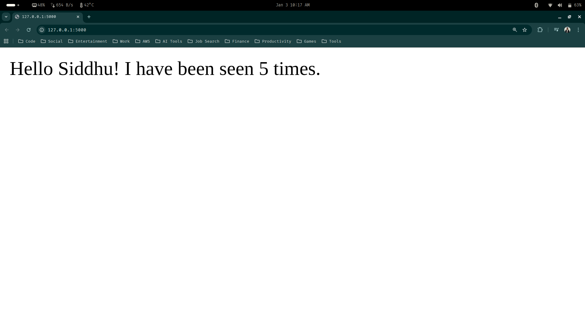
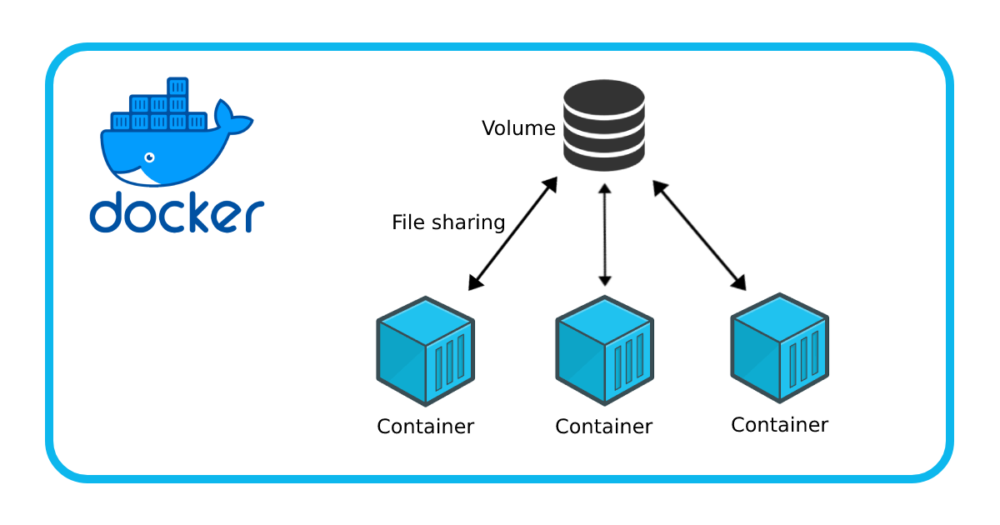
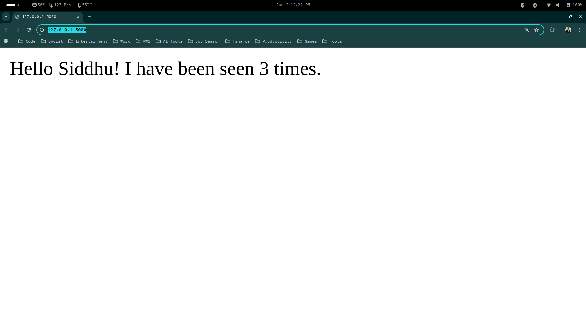
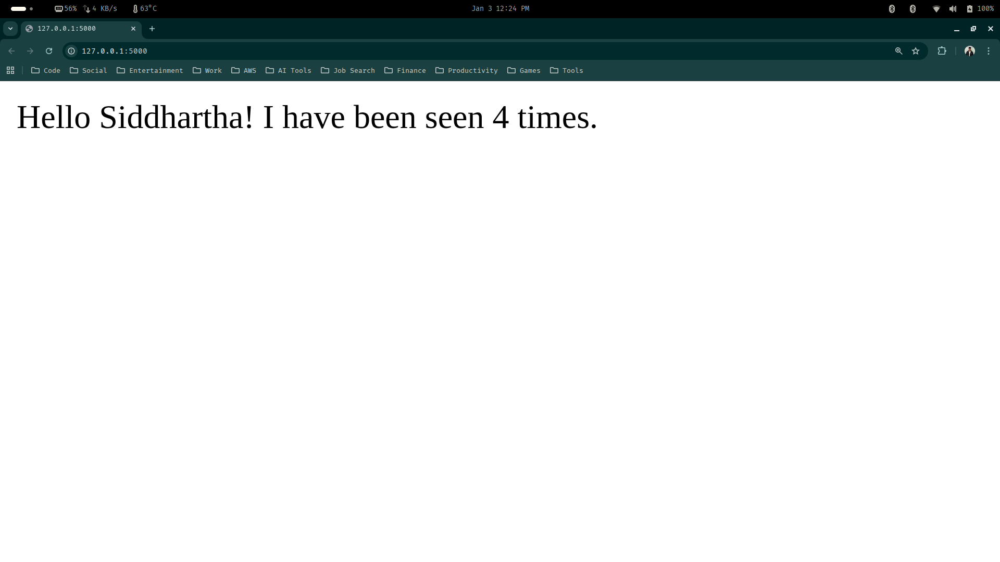

# Docker Compose

> Lets consider a scenario: 

I have my web app running as a container, so all the default configuration that is required with respect to the port and the requirements that needs to be installed before we run it as a container is present in a specific Dockerfile. 

Let's consider that this particular web app wants to use external services like MySQL, Redis or Mongodb. It is not possible to run this services inside the same container where your app is running. Therefore, we need to run this external services as a seperate container to help the web app interact with it.

> What is docker comspose ?

```text
Docker compose is a tool for defining and running multi-container docker applications.
```


---

## Practical Implementation (Example)

1. Create a new directory (docker-compose-demo) and also create a python virtual environment within it. Also open up your VS-Code

```bash
siddhu@ubuntu:~/Desktop$ mkdir docker-compose-demo
siddhu@ubuntu:~/Desktop$ cd docker-compose-demo/
siddhu@ubuntu:~/Desktop/docker-compose-demo$ python -m venv venv
siddhu@ubuntu:~/Desktop/docker-compose-demo$ code .
siddhu@ubuntu:~/Desktop/docker-compose-demo$ 
```

2. Create requirements.txt file and add the below dependencies.

```python
## docker-compose-demo/requirements.txt

flask
redis
```

> Activate your virtual environment (venv) and install the dependencies using the requirements.txt file

```bash
siddhu@ubuntu:~/Desktop/docker-compose-demo$ source ./venv/bin/activate
(venv) siddhu@ubuntu:~/Desktop/docker-compose-demo$ pip install -r ./requirements.txt
```

3. After installing all the dependencies, create a new file app.py and copy paste the below code inside the file

```python
## docker-compose-demo/app.py

import time  # Used to add delays between retry attempts
import redis  # Redis client library for Python
from flask import Flask  # Flask framework to build a web application

app = Flask(__name__)  # Create a Flask application instance
cache = redis.Redis(host="redis", port=6379)  # Connect to Redis service


def get_hit_count():
    retries = 5  # Number of times to retry if Redis is unavailable
    while True:
        try:
            return cache.incr("hits")  # Increment and return the page hit count
        except redis.exceptions.ConnectionError as ex:
            if retries == 0:  # Stop retrying when attempts are exhausted
                raise ex
            retries -= 1  # Decrease retry count
            time.sleep(0.5)  # Wait before retrying


@app.route("/")  # Define the root URL endpoint
def hello():
    count = get_hit_count()  # Get the current hit count from Redis
    return f"Hello Siddhu! I have been seen {count} times."  # Return response
```

> The program creates a simple Flask web app where, Flask handles the webpage, Redis stores the visit count, and the app safely retries if Redis is down.

4. Lets go ahead and create our Dockerfile for this particular web app. Copy pase the below intructions

```python
## docker-compose-demo/Dockerfile

# Use a lightweight Python 3.7 base image
FROM python:3.7-alpine

# Set the working directory inside the container
WORKDIR /flask_app

# Define the Flask application entry point
ENV FLASK_APP=app.py

# Allow Flask to accept external connections
ENV FLASK_RUN_HOST=0.0.0.0

# Copy project files into the container
COPY . .

# Install Python dependencies
RUN pip install -r requirements.txt

# Expose Flask's default port
EXPOSE 5000

# Start the Flask development server
CMD ["flask", "run"]
```

5. Since we are using an external service (redis), lets go ahead and create our docker-compose.yml file

> This file (docker-compose.yml) is a tool that we basically used so that we can run multiple containers, and define how they interact with one another.

```yaml
## docker-compose-demo/docker-compose.yml

version: '1.0'
services:
  web: 
    image: flask-web-app
    build: .
    ports:
      - "5000:5000"
  redis:
    image: redis
```

- The `version` field specifies the Compose file format version being used.
- The `services` section defines each container (service) that will run.
- `web` is the Flask application container:
    - `build: .` tells Docker to build the image from the Dockerfile in the current directory.
    - `image: flask-web-app` is the name of the image that will be created.
    - `ports: "5000:5000"` maps port 5000 of your machine to port 5000 inside the container, allowing browser access.
- `redis` is a Redis database container:
    - `image: redis` pulls the official Redis image from Docker Hub.

> Docker Compose automatically creates a shared network, so the Flask app can connect to Redis using the service name redis as the hostname.

6. Lets run our web app using the docker compose file

```bash
(venv) siddhu@ubuntu:~/Desktop/docker-compose-demo$ docker compose up
```

> Access your web app

```bash
http://127.0.0.1:5000
```

    
> It shows 5 times, beacause i reloaded the web app 5 times.


> If you go ahead and type docker ps in the terminal, you will be able to see that 2 containers are running

```bash
(venv) siddhu@ubuntu:~/Desktop/docker-compose-demo$ docker ps
CONTAINER ID   IMAGE           COMMAND                  CREATED         STATUS         PORTS                                         NAMES
83afc1497eea   flask-web-app   "flask run"              8 minutes ago   Up 8 minutes   0.0.0.0:5000->5000/tcp, [::]:5000->5000/tcp   docker-compose-demo-web-1
e7c0dbf2f89e   redis           "docker-entrypoint.s…"   8 minutes ago   Up 8 minutes   6379/tcp                                      docker-compose-demo-redis-1
```

> Stop the containers

```bash
(venv) siddhu@ubuntu:~/Desktop/docker-compose-demo$ docker compose down
```
---

## Docker Volumes and Bind Mounts

A Docker volume is a persistent storage mechanism used to store and share data outside a container’s lifecycle.

> Why volume exists ?

```text
Containers are temporary.
When a container stops or is deleted, its filesystem is lost. Volumes solve this by storing data outside the container so it survives restarts.
```



> What a volume does ?

    - Stores data independently of containers
    - Persists even if the container is removed
    - Can be shared between multiple containers
    - Is managed by Docker (safer than container filesystems)

---

### Difference between Bind Mount & Docker Volume

| Feature    | Bind Mount                     | Docker Volume                     |
| ---------- | ------------------------------ | --------------------------------- |
| Source     | Local folder                   | Docker-managed storage            |
| Purpose    | Live code reload / dev         | Persistent data (DB, cache)       |
| Path       | Specified on host              | Managed by Docker                 |
| Visibility | Directly edits container files | Container sees only Docker’s copy |

> Our upcoming setup is going to use bind mount so Flask sees live changes in our local code. This is exactly what lets us avoid rebuilding the image every time we change code.

---

### Practical Implementation

In our previous code example of docker compose, the code is actually copied into the docker image at build time, and that's why the container only sees the code baked into the image. Which means that any changes to thje local files do not affect the container until we :

- Rebuild the image
- Restart the container

This is a very tedious workflow, and can be addressed using bind mount.

Let's see how bind mount help to solve this problem

1. Update the docker-compose.yml and Dockerfile

> docker-compose.yml

```yaml
version: '2.0'
services:
  web:
    image: flask-web-app                 
    build: .
    ports:
      - "5000:5000"
    volumes:
      - .:/flask_app         # Bind mount: maps local folder into container
    environment:
      FLASK_ENV: development
      FLASK_DEBUG: 1

  redis:
    image: redis
```

What this does
- `.:/flask_app` → maps our local project directory into the container.
- Code edits update live
- Flask reloads automatically in debug mode

> Dockerfile

```python
FROM python:3.7-alpine

WORKDIR /flask_app

ENV FLASK_APP=app.py
ENV FLASK_RUN_HOST=0.0.0.0

# Copy only requirements first to cache dependencies
COPY requirements.txt .
RUN pip install --no-cache-dir -r requirements.txt

# Copy the rest of the code (app.py, etc.)
COPY . .

EXPOSE 5000
CMD ["flask", "run"]
```

What this does :

- Dependencies are installed in the image.
- Code files are initially copied during build, but the bind mount overrides them at runtime.
- Flask uses the local files, so live changes are reflected immediately.

2. Run once, then just edit the code

```bash
docker compose up
```

> Access the web app using the below url

```text
http://127.0.0.1:5000/
```




3. Try editing the code and reloading the whole web app

> Quick tip : Change the print statement from "Hello Siddhu!" to "Hello Siddhartha".

```python
## docker-compose-demo/app.py

import time  
import redis  
from flask import Flask  

app = Flask(__name__) 
cache = redis.Redis(host="redis", port=6379)  


def get_hit_count():
    retries = 5  
    while True:
        try:
            return cache.incr("hits") 
        except redis.exceptions.ConnectionError as ex:
            if retries == 0:  
                raise ex
            retries -= 1  
            time.sleep(0.5)  


@app.route("/")  
def hello():
    count = get_hit_count()  
    return f"Hello Siddhartha! I have been seen {count} times."  # Change here
```

> Reload your web app, the change appears immediately without rebuilding the image.



> To stop the container use the below command

```bash
docker compose down
```

---

## What the bind mount changes (Visual Comparison)

Without bind mount:
```text
Local code ── ❌ ──> Running container     
             (frozen at build time)
```

With bind mount:

```text
Local code ── ✅ ──> Running container
             (live, always in sync)
```

> Bind mounts turn Docker from a “static image runner” into a live dev environment.

---

### 📌 Important Note:

In our `docker-compose.yml` :

```yaml
volumes:
  - .:/flask_app
```

✅ This is a bind mount, not a Docker-managed volume.

> Why it’s a bind mount ?

- The left side `.` → your local folder
- The right side `/flask_app` → path inside the container
- The container directly uses our local files, so changes are immediately visible.

---

# <div align="center">Thank You for Going Through This Guide! 🙏✨</div>

