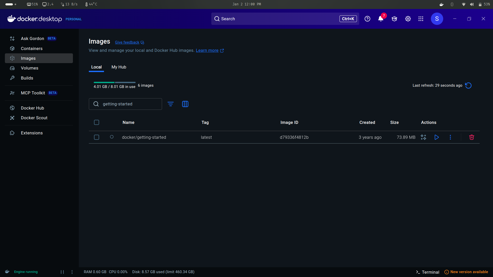
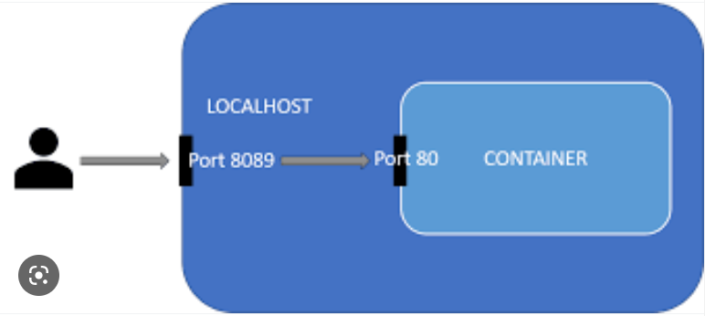
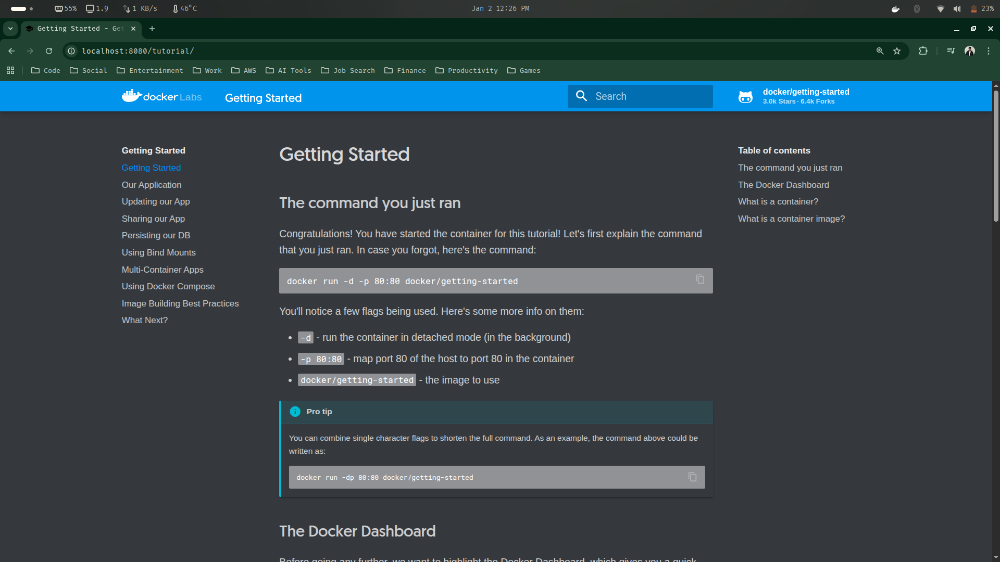
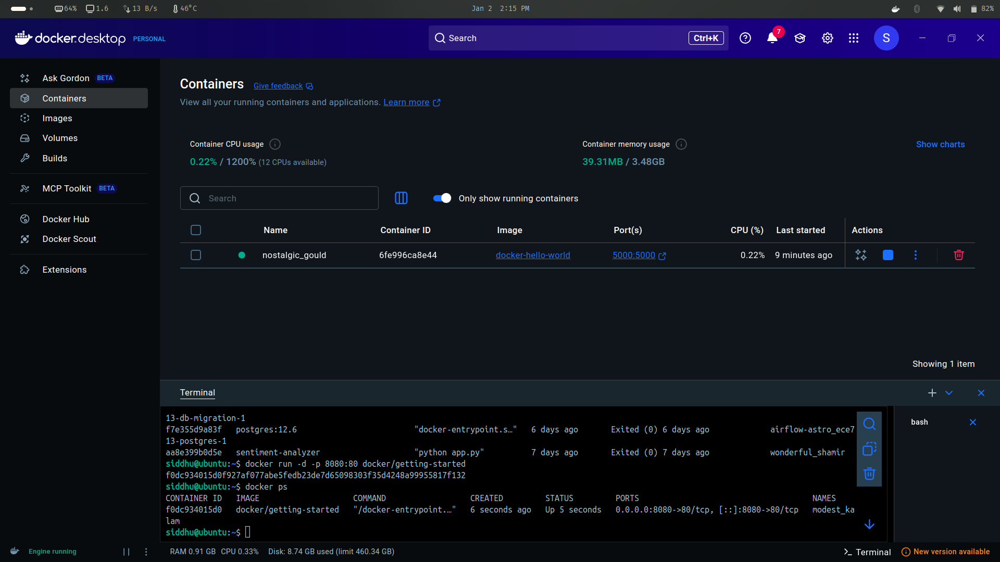
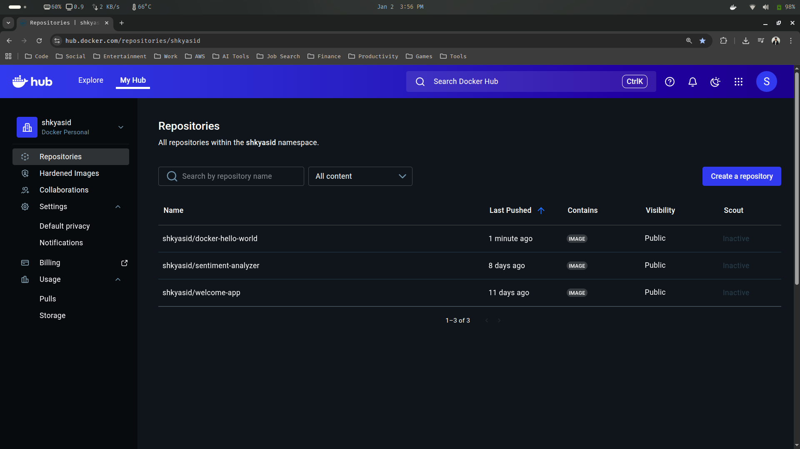

# Docker 

Docker is an open platform for packaging applications and everything they need (code, libraries, system dependencies, runtime) into lightweight, portable units called containers.

> Traditionally:

- Apps worked on one machine but failed on another 
- Different OS versions, libraries, and configs caused inconsistencies
- Setting up environments took hours or days

> With docker :

- Same environment for dev, test, and prod
- Each app runs in its own container (No conflicts)
- Easy deployment as APIs (FastAPI, Flask)
- Build once, deploy everywhere (fits perfectly into CI pipelines like GitHub Actions)

> Docker fixes this by standardizing the runtime environment.

---

## Key docker terminologies

- `Image` : Blueprint of an app (read-only)
- `Container` : Running instance of an image
- `Dockerfile` : Instructions to build an image
- `Registry` : Place to store images (e.g., Docker Hub)

--- 

## Docker vs VMs

While dockers are better for application delivery and reproducibility, VMs are better for strong isolation and infrastructure control

| Docker                  | VM                          |
| ----------------------- | --------------------------- |
| Lightweight             | Heavy                       |
| Starts in seconds       | Minutes                     |
| Shares OS kernel        | Full OS per VM              |
| Ideal for microservices | Ideal for full OS isolation |

---

### 1. Docker Installation 

Go to official docker website [docker.com](https://www.docker.com/) and go to docs install section or directly use the links below

- `Install Docker Desktop on Linux` : [Docker Linux](https://docs.docker.com/desktop/setup/install/linux/)

- `Install Docker Desktop on Windows` : [Docker Windows](https://docs.docker.com/desktop/setup/install/windows-install/)

- `Install Docker Desktop on Mac` : [Docekr Mac](https://docs.docker.com/desktop/setup/install/mac-install/)

> Go to the link based on your system, and install dockeer by following the installation documentation step-by-step

Once you have installed docker to you machine check it using the below command:

```bash
docker --version
```

---

### 2. Basic Docker Commands

2.1 Go to your docker hub website and in the website go to the explore tab


> From this explore page you will be able to see and pull lots of publicly available docker images

2.2 Let's go ahead and try to install/pull an docker image ([getting-started](https://hub.docker.com/r/docker/getting-started)) to our local machine

```bash
docker pull docker/getting-started  # Pulls the docker image from the dockerhub
```

> After running the command, check if the image exists in your machine

```bash
docker images        # checks the images that are in your machine
```        

Expected Output:

```text
IMAGE                               ID             DISK USAGE   CONTENT SIZE   EXTRA
airflow-astro_ece713/airflow:latest 274fc8ce7af8      883MB     0B        
docker/getting-started:latest       3e4394f6b72f      47MB      0B        
```

> As you can see your image (docker/getting-started:latest) has been successfully installed to your local machine.

You can also see this from Docker Desktop




2.3 Let's run our image as a container. We will also be able to access it from our local machine itself

```bash
docker run -d -p 8080:80 docker/getting-started
```

Understanding the command :

- `docker run` : used for running a specific docker image
- `-d` : runs the conatainer in a detached mode (independently)
- `-p` : used for assigning and mapping port from our localhost (host environment) to the container environment

- `8080:80` : the host port is assigned the port 8080 and is mapped to the container port which is 80.



- `docker/getting-started` : name of the docker image to run as container

> After running the image as a container, you can check if it is running by running the below command

```bash
docker ps
```

Expected output :

```bash
CONTAINER ID   IMAGE                    COMMAND                  CREATED          STATUS          PORTS                                     NAMES
f0dc934015d0   docker/getting-started   "/docker-entrypoint.…"   55 seconds ago   Up 54 seconds   0.0.0.0:8080->80/tcp, [::]:8080->80/tcp   modest_kalam
```

> If your output is similar to the above one, then your image is running as a docker container

You can access the conatiner using the host port that is

```text
http://localhost:8080/tutorial/
```


> Congratulations! You have started your first container

2.4 You can also stop the container using the below commands

```bash
docker stop 'container id'
```

> Replace the 'container id' with the actual container id of your container

Example usecase:

```bash
siddhu@ubuntu:~$ docker ps
CONTAINER ID   IMAGE                    COMMAND                  CREATED          STATUS          PORTS                                     NAMES
f0dc934015d0   docker/getting-started   "/docker-entrypoint.…"   55 seconds ago   Up 54 seconds   0.0.0.0:8080->80/tcp, [::]:8080->80/tcp   modest_kalam
siddhu@ubuntu:~$ docker stop f0dc934015d0
f0dc934015d0
siddhu@ubuntu:~$ docker ps
CONTAINER ID   IMAGE     COMMAND   CREATED   STATUS    PORTS     NAMES
```

2.5 You can also remove the images from your local machine using the below command

```bash
docker image rm -f 'image id'
```

> Replace the 'image id' with the actual image id of your docker imaage

Example usecase:

```bash
siddhu@ubuntu:~$ docker images
                                                                                                                                                                          i Info →   U  In Use
IMAGE                                 ID             DISK USAGE   CONTENT SIZE   EXTRA
airflow-astro_54a465/airflow:latest   21cdade0c727       1.27GB          284MB        
airflow-astro_ece713/airflow:latest   fd34769e0298       1.27GB          284MB    U   
docker/getting-started:latest         d79336f4812b       73.9MB         21.4MB    U   
hello-world:latest                    d4aaab6242e0       20.3kB         3.96kB        
postgres:12.6                         26ce5e265fbb        452MB          114MB    U   
sentiment-analyzer:latest             fb99b2d2931e        3.6GB          906MB    U   
shkyasid/sentiment-analyzer:latest    fb99b2d2931e        3.6GB          906MB    U   
siddhu@ubuntu:~$ docker image rm -f d79336f4812b
```


### *Summary Table*

| Command | Description |
|--------|-------------|
| `docker pull <image_name>` | Pull image from Docker Hub |
| `docker images` | List local Docker images |
| `docker run -d -p 8080:80 docker/getting-started` | Run image as a detached container with port mapping |
| `docker ps` | List running containers |
| `docker stop <container_id>` | Stop a running container |
| `docker image rm -f '<image_id>'` | Remove the image from your local machine |

> This table captures the full flow: explore → pull → run → verify → access → stop → Remove

--- 

### 📌 Important Note : 

You can run any number of containers in the same container port, but the host port should always be different.

---

### 3. Creating a docker image 

In this section we will see how we can create our own docker image and we'll also try to push it to our dockerhub so that any person can downlaod it and run it as a container.

3.1 Create a new project directory (docker-demo) and inside it create a simple flask app

```bash
siddhu@ubuntu:~/Desktop$ mkdir docker-demo
siddhu@ubuntu:~/Desktop$ cd docker-demo/
siddhu@ubuntu:~/Desktop/docker-demo$ code .
```

> Create app.py from the VS-Code inside your new directory and paste the below code

```python
# docker-demo/app.py

from flask import Flask
import os

app = Flask(__name__)

@app.route('/', methods=['GET'])
def home():
    return "Hello World"

if __name__ == "__main__":
    app.run(debug=True, host='0.0.0.0', port=5000)
```

> Create another file requirements.txt and add your dependency (flask) to it. 

```python
# docker-demo/requirements.txt

flask
```

> Also create a python virtual environment and activate it to install the dependency in it

```bash
siddhu@ubuntu:~/Desktop/docker-demo$ python -m venv venv
siddhu@ubuntu:~/Desktop/docker-demo$ source ./venv/bin/activate
(venv) siddhu@ubuntu:~/Desktop/docker-demo$ pip install -r ./requirements.txt
```

> Check if the app runs without any issues

```bash
(venv) siddhu@ubuntu:~/Desktop/docker-demo$ python app.py
```

> Go to the specified url 

```text
http://127.0.0.1:5000/
```


> Our flask app is running successfully. Stop the app using (ctrl + c) from the running terminal

3.2 Let's now create a docker image for this app

> Firstly, We need to create a Dockerfile inside our project directory (docker-demo) and paste the following instructions

```python
# docker-demo/Dockerfile

## Use a lightweight Python 3.8 image based on Alpine Linux as the base image
FROM python:3.8-alpine

## Copy all files from the current directory on the host to /app inside the container
COPY . /app

## Set /app as the working directory for all subsequent instructions
WORKDIR /app 

## Install Python dependencies listed in requirements.txt
RUN pip install -r requirements.txt

## Specify the default command to run when the container starts
CMD ["python", "app.py"]
```

> Now that our Dockerfile has been created, let's run the docker build command to build our image 

```bash
(venv) siddhu@ubuntu:~/Desktop/docker-demo$ docker build -t docker-hello-world .
```

Note : The built image will have the name 'docker-hello-world' but you can choose whatever name you want

> Check if the image has been created 

```bash
(venv) siddhu@ubuntu:~/Desktop/docker-demo$ docker images
                                                                                       i Info →   U  In Use
IMAGE                                 ID             DISK USAGE   CONTENT SIZE   EXTRA
airflow-astro_54a465/airflow:latest   21cdade0c727       1.27GB          284MB        
airflow-astro_ece713/airflow:latest   fd34769e0298       1.27GB          284MB    U   
docker-hello-world:latest             4d7e2ff6cda0        120MB         28.8MB        
```

3.3 Run our built image as a container on host port 5000 and container port 5000

```bash
(venv) siddhu@ubuntu:~/Desktop/docker-demo$ docker run -p 5000:5000 docker-hello-world
```

> You can check if your container is running or not by using another terminala and running the belo command

```bash
(venv) siddhu@ubuntu:~/Desktop/docker-demo$ docker ps
CONTAINER ID   IMAGE                COMMAND                  CREATED         STATUS         PORTS                                         NAMES
6fe996ca8e44   docker-hello-world   "/bin/sh -c 'python …"   4 minutes ago   Up 4 minutes   0.0.0.0:5000->5000/tcp, [::]:5000->5000/tcp   nostalgic_gould
```

> You can access your container using the below host port

```text
http://127.0.0.1:5000/
```

> You will also be able to see that your container is running from the docker desktop



3.4 Stop the running container using the commands similar to the below one

```bash
siddhu@ubuntu:~/Desktop/docker-demo$ docker ps
CONTAINER ID   IMAGE                COMMAND                  CREATED          STATUS          PORTS                                         NAMES
6fe996ca8e44   docker-hello-world   "/bin/sh -c 'python …"   11 minutes ago   Up 11 minutes   0.0.0.0:5000->5000/tcp, [::]:5000->5000/tcp   nostalgic_gould
siddhu@ubuntu:~/Desktop/docker-demo$ docker stop 6fe996ca8e44
6fe996ca8e44
```

> Check if the container has stopped or not

```bash
(venv) siddhu@ubuntu:~/Desktop/docker-demo$ docker ps
CONTAINER ID   IMAGE     COMMAND   CREATED   STATUS    PORTS     NAMES
```

> The container has stopped, however we still have the image we created previously (docker-hello-world) so that we can run another container for this image whenever we want

```bash
siddhu@ubuntu:~/Desktop/docker-demo$ docker images
                                                                                                                                                                          i Info →   U  In Use
IMAGE                                 ID             DISK USAGE   CONTENT SIZE   EXTRA
airflow-astro_54a465/airflow:latest   21cdade0c727       1.27GB          284MB        
airflow-astro_ece713/airflow:latest   fd34769e0298       1.27GB          284MB    U   
docker-hello-world:latest             4d7e2ff6cda0        120MB         28.8MB    U   
```

---

### 4. Push the docker image to Docker Hub

In this section we are going to push the image we created earlier (docker-hello-world) to the docker hub repository so that others can pull the image to their machine and run it as container

4.1 Go and log in to your [Docker Hub](https://hub.docker.com/explore) account

> Important Note : If you want to push an docker image to your docker hub repository, the image name should also include your docker hub username in the below format:

```text
format: dockerhub_username/image_name
example: shkyasid/docker-hello-world
```

4.2 Let's check our existing images

```bash
(venv) siddhu@ubuntu:~/Desktop/docker-demo$ docker images
                                                                             i Info →   U  In Use
IMAGE                                 ID             DISK USAGE   CONTENT SIZE   EXTRA
airflow-astro_54a465/airflow:latest   21cdade0c727       1.27GB          284MB        
airflow-astro_ece713/airflow:latest   fd34769e0298       1.27GB          284MB    U   
docker-hello-world:latest             4d7e2ff6cda0        120MB         28.8MB    U  
```

> Lets push our 'docker-hello-world' image to docker hub

4.3 Lets change the name of our image to 'shkyasid/docker-hello-world'

> Note: 'shkyasid' is my docker hub username

```bash
docker tag docker-hello-world shkyasid/docker-hello-world 
```

> Check if the new renamed image has been created or not

```bash
(venv) siddhu@ubuntu:~/Desktop/docker-demo$ docker images
                                                                             i Info →   U  In Use
IMAGE                                 ID             DISK USAGE   CONTENT SIZE   EXTRA
airflow-astro_54a465/airflow:latest   21cdade0c727       1.27GB          284MB        
airflow-astro_ece713/airflow:latest   fd34769e0298       1.27GB          284MB    U   
docker-hello-world:latest             4d7e2ff6cda0        120MB         28.8MB    U   
shkyasid/docker-hello-world:latest    4d7e2ff6cda0        120MB         28.8MB    U   
```

4.4 Let's push the newly created and renamed image 'shkyasid/docker-hello-world' to docker hub repository

```bash
docker push shkyasid/docker-hello-world:latest
```

> The :latest is the tag we provide to the image, so that we can specify it's version

4.5 Go to your docker hub account and check if your image has been successfully pushed or not



> Now anyone can pull this image from their docker hub account and run it as a container in their machine

To pull the image and run it as a container in your machine run the below commands

```bash
docker pull shkyasid/docker-hello-world:latest
docker run -d -p 5000:5000 shkyasid/docker-hello-world:latest
```

---

# <div align="center">Thank You for Going Through This Guide! 🙏✨</div>