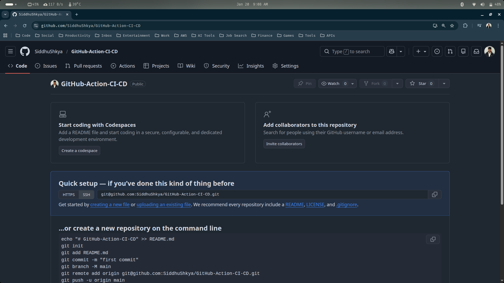
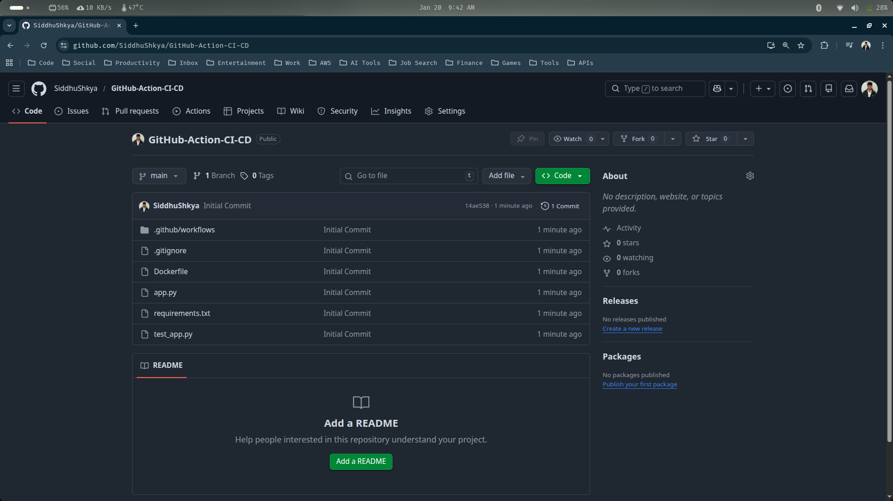
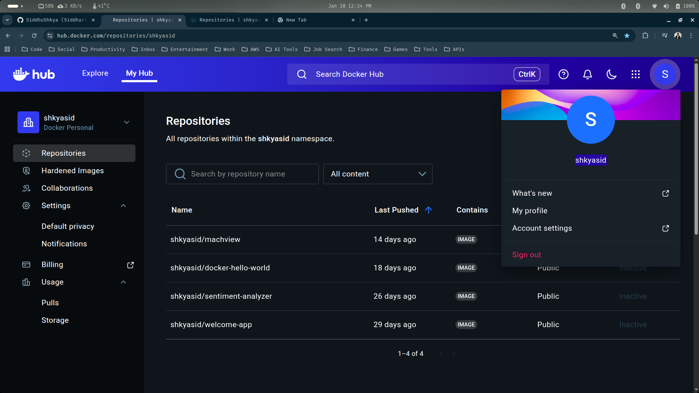
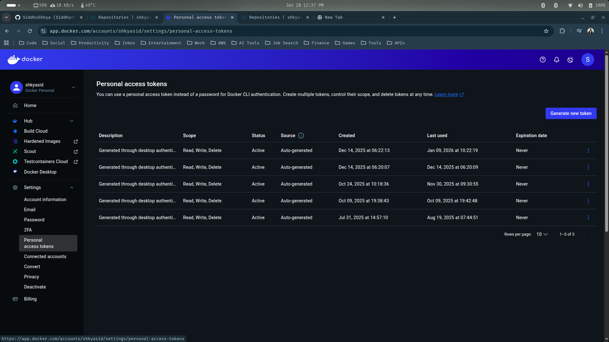
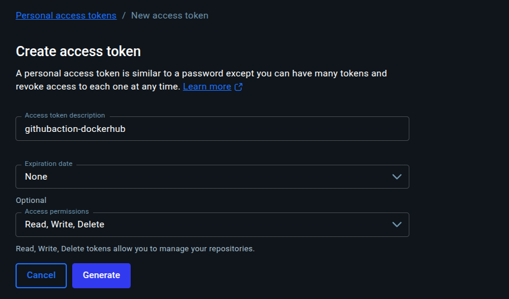
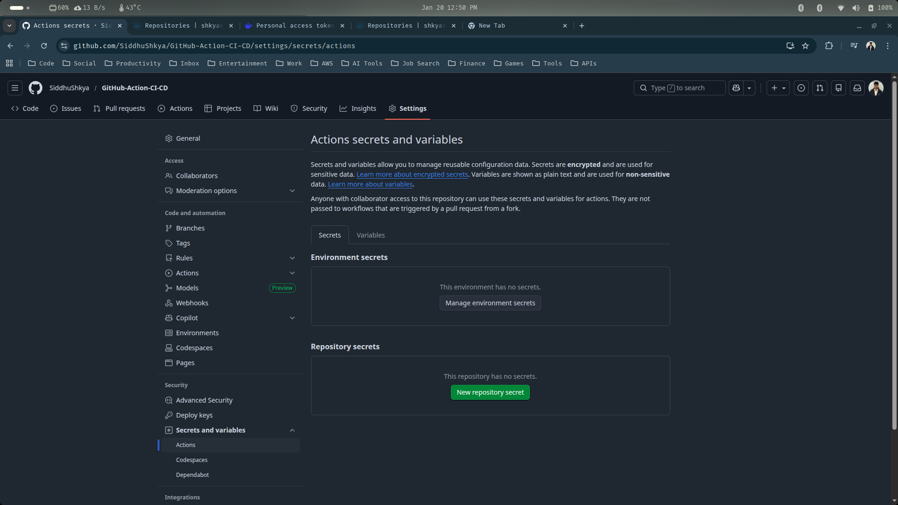
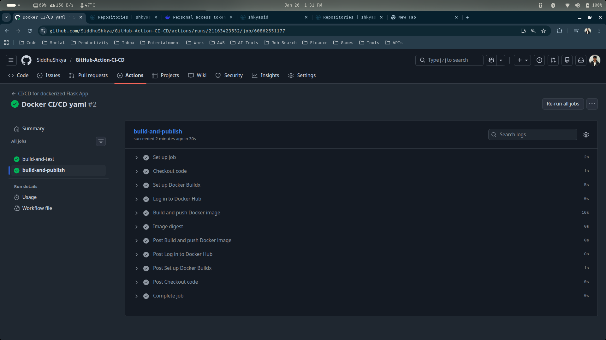
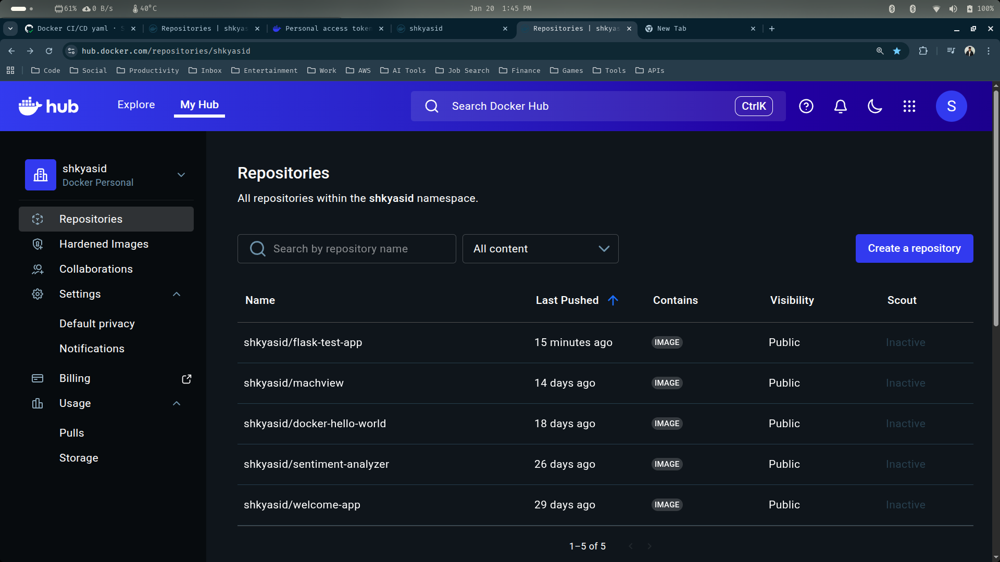
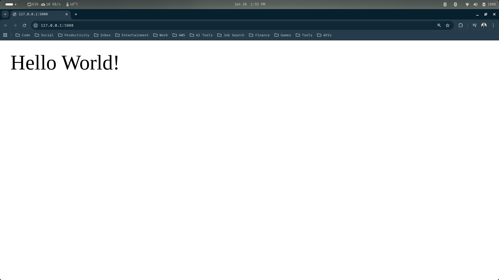

## GitHub Action Workflow (CI/CD Pipeline)

This guide walks through building an end-to-end Flask application with a fully automated CI/CD pipeline using GitHub Actions. The goal is to streamline development by automating testing, containerization, and deployment. We will develop a Flask app along with unit tests that are automatically executed whenever code is pushed or merged into the main branch. This forms our Continuous Integration (CI) process, ensuring that every change is validated through build and test stages. Once the tests pass, the pipeline proceeds to containerize the application by building a Docker image. This image is then pushed to Docker Hub, serving as a centralized and publicly accessible image repository.Finally, the Continuous Deployment (CD) phase automates the deployment process using the newly built Docker image. This ensures that only tested and verified versions of the application are deployed, resulting in a reliable and repeatable release workflow.

Below are the tools  we are going to use for this project:

- `git` -> For version control, allowing us to track code changes and collaborate effectively
- `GitHub` -> To host the remote repository and manage code integration using GitHub Actions for CI/CD
- `Docker` -> To containerize the Flask application, ensuring consistent builds and deployments across environments
- `Pytest` -> For writing and running unit tests to validate application functionality during the CI phase
- `Flask` -> To develop the web application that will be built, tested, containerized, and deployed

Now, Let's go ahead and build this amazing project

--- 

### 1. Setting Project Structure With GitHub Repo

In this section, we are going to create our github project repo and initialize our python virtual environment alongside the required packages

1.1 Go to to your GitHub Dashboard and create your new empty repository for this project (Name it whatever you want). Once you create the repo, clone it onto your local machine



> Clone the newly created repo to your local machine, and from inside the cloned repo, open up your vs-code.

```sh
siddhu@ubuntu:~/Desktop$ git clone git@github.com:SiddhuShkya/GitHub-Action-CI-CD.git
siddhu@ubuntu:~/Desktop$ cd GitHub-Action-CI-CD/
siddhu@ubuntu:~/Desktop/GitHub-Action-CI-CD$ code .
```

1.2 Create requirements.txt file from the vs-code, inside your project directory and compy paste the below dependencies to it

```python
## GitHub-Action-CI-CD/requirements.txt

Flask
pytest
```

1.3 Additionally, create some new folder and files from your vs-code, after which our project structure would look something like this:

```text
.
├── app.py
├── Dockerfile
├── .git
├── .github
│   └── workflows
│       └── cicd.yml
├── .gitignore
├── requirements.txt
└── test_app.py
```

> The test_app.py is our unit test file, for testing our application.

---

📌 *Important Note: Any File or Folder, that beigns with test is automatically considered as a unit testing files.*

---

1.4 Now, let's create our python vritual environment and activate it to install our dependencies thgrough the requirements.txt

```sh
siddhu@ubuntu:~/Desktop/GitHub-Action-CI-CD$ python -m venv venv
siddhu@ubuntu:~/Desktop/GitHub-Action-CI-CD$ source venv/bin/activate
(venv) siddhu@ubuntu:~/Desktop/GitHub-Action-CI-CD$ pip install -r requirements.txt 
```

> Also we dont need to track our virtual environment using the git, so copy paste the below to .gitignore file

```python
## .gitignore

/venv
```

> The final project structure will look something like this:

```text
.
├── app.py
├── Dockerfile
├── .git
├── .github
│   └── workflows
│       └── cicd.yml
├── .gitignore
├── requirements.txt
├── test_app.py
└── venv
```

1.5 Finally, lets commit all the changes to our github repository

```sh
(venv) siddhu@ubuntu:~/Desktop/GitHub-Action-CI-CD$ git add .
(venv) siddhu@ubuntu:~/Desktop/GitHub-Action-CI-CD$ git commit -m 'Initial Commit'
(venv) siddhu@ubuntu:~/Desktop/GitHub-Action-CI-CD$ git push origin main
```

> Verify the commit


---

### 2. Implementing Project With Flask & Dockers

In this section, we are going to develop our flask application project. We are going to write our Dockerfile, app.py, test_app.py and also design our YAML structure for github action workflow and commit it to our github repository.

2.1 Write/Copy the application code for our flask project. Copy paste the below code to app.py

```python
## app.py

from flask import Flask

app = Flask(__name__)


@app.route("/")
def home():
    return "Hello World!"


if __name__ == "__main__":
    app.run(host="0.0.0.0", port=5000)
```

> This Flask application creates a simple web server that listens on port 5000 and returns “Hello World!” when the root URL (/) is accessed.

2.2 Write/Copy teh unit test case for the above app. Copy paste the below code to test_app.py

```python
## test_app.py

from app import app

def test_home():
    # Create a test client for the Flask app
    tester = app.test_client()
    # Send a GET request to the home ("/") route
    response = tester.get("/")
    # Check that the HTTP response status code is 200 (OK)
    assert response.status_code == 200
    # Check that the response body matches the expected output
    assert response.data == b"Hello World!"
```

> This unit test uses Flask’s test client to send a request to the home route (/) and verifies that the response is successful and returns “Hello World!” ✅.

2.3 Write/copy the Dockerfile needed to containerize our app. Copy paste the below to Dockerfile

```Dockerfile
# Use the officlal Python image from the docker hub
FROM python:3.9-slim

# Set the working directory
WORKDIR /app

# Copy the current directory contents into the container at /app
COPY . /app

# Install necessary dependencies for the app
RUN pip install -r requirements.txt --no-cache-dir

# Make port 5000 available to the world outside this container
EXPOSE 5000

# Run app.py when the container launches
CMD ["python", "app.py"]
```

--- 

### 3. Building the YAML file for Dockers

Finally, in this section we are going to build our YAML file (cicd.yml) to create a (CI/CD) workflow that will have 2 jobs :

- `build-and-test (CI Pipeline)` -> To help build and test our entire application. 

- `build-and-publish (CD Pipline)` -> To deploy our entire application in the form of docker image and push it into the dockerhub.

3.1 Before jumping into our YAML configuration, we need to first get our dockerhub username and also create a token from the dockerhub

> Go and log in to your [dockerhub](https://hub.docker.com/) account, your dockerhub username is the same username as your dockehub account username. 

In my case, the dockerhub username is: `shkyasid`



> For the dockerhub password, go to Account settings, and from there click on 'Personal access token' 



> Click on 'Generate new token' and create a new token with the below informations



> You should be able to see and copy your generated personal access token. The token will start with 'dckr_'. Copy the generated token, and go to your github repository's settings tab


> In the settings tab, you should see something called as secret and variables under Security. From there click on actions and create 2 new repository secret by the names of DOCKER_USERNAME & DOCKER_PASSWORD



- `DOCKER_USERNAME` -> 'Your Dockerhub Account Username (shkyasid)'
- `DOCKER_PASSWORD` -> 'Your Generated Personal Access Token (dckr_)'

> After adding your new secrets, you should be able to see something like this:


*This step is very important as the github actions require these secrets to be able to access our dockerhub account*

3.2 Now that we have setup our docker secrets from our github, Lets go ahead and create our YAML configuration file

> Copy paste the below YAML configuration to cicd.yml file

```yaml
# Name of the GitHub Actions workflow (visible in the Actions tab)
name: CI/CD for dockerized Flask App

# Events that trigger this workflow
on:
    # Run the workflow on push events to the main branch
    push:
        branches: [ main ]
    # Run the workflow on pull requests targeting the main branch
    pull_request:
        branches: [ main ]

# Define all jobs in the workflow
jobs:
    # ---------------- CI JOB ----------------
    # This job builds the app and runs unit tests
    build-and-test: 
        # Use the latest Ubuntu runner
        runs-on: ubuntu-latest

        steps:
        # Step 1: Checkout the repository code
        - name: Checkout code
          uses: actions/checkout@v3

        # Step 2: Set up the Python environment
        - name: Set up Python
          uses: actions/setup-python@v4
          with:
              python-version: '3.10'

        # Step 3: Install project dependencies
        - name: Install dependencies
          run: |
              python -m pip install --upgrade pip
              pip install -r requirements.txt

        # Step 4: Run unit tests using pytest
        - name: Run tests
          run: |
              pytest

    # ---------------- CD JOB ----------------
    # This job builds and pushes the Docker image to Docker Hub
    build-and-publish:
        # Run this job only if build-and-test succeeds
        needs: build-and-test
        runs-on: ubuntu-latest

        steps:
        # Step 1: Checkout the repository code
        - name: Checkout code
          uses: actions/checkout@v3

        # Step 2: Set up Docker Buildx for advanced Docker builds
        - name: Set up Docker Buildx
          uses: docker/setup-buildx-action@v2

        # Step 3: Authenticate with Docker Hub using GitHub Secrets
        - name: Log in to Docker Hub
          uses: docker/login-action@v2
          with:
              username: ${{ secrets.DOCKER_USERNAME }}
              password: ${{ secrets.DOCKER_PASSWORD }}

        # Step 4: Build the Docker image and push it to Docker Hub
        - name: Build and push Docker image
          uses: docker/build-push-action@v4
          with:
              context: .
              file: ./Dockerfile
              push: true
              tags: ${{ secrets.DOCKER_USERNAME }}/flask-test-app:latest
        
        # Step 5: Output the image digest for verification/debugging
        - name: Image digest
          run: echo ${{ steps.build-and-publish.outputs.digest }}
```

> We have completed all our codes, YAML configuration and docker setup for this project

--- 

### 4. Trigger the GitHub Action Workflow

In this section, we are going to trigger one of the events which triggers our github action workflow, the push event. Basically we are going to commit all our changes to github which will also trigger our github actions.

4.1 Commit all changes to github

```sh
siddhu@ubuntu:~/Desktop/GitHub-Action-CI-CD$ git add .
siddhu@ubuntu:~/Desktop/GitHub-Action-CI-CD$ git commit -m 'Docker CI/CD yaml'
siddhu@ubuntu:~/Desktop/GitHub-Action-CI-CD$ git push origin main
```

> Go to github repo's Actions tab, to see whether the workflow (jobs) has been successfully executed or not



> In my case, both jobs (CI/CD Pipline) has been successfully triggered as well as executed. Which means:

- ✅ The application was containerized by building a Docker image from the repository source.

- ✅ GitHub Actions authenticated with Docker Hub using the stored secrets.

- ✅ The Docker image was successfully pushed to Docker Hub with the latest tag.

- ✅ This confirms that the CI/CD pipeline is working correctly, automatically testing and publishing the application on every valid commit to main.

4.2 Verify if the docker image has been successfully been pushed to your dockerhub account

> Go to your [Dockerhub](https://hub.docker.com/) Account's Repositories page



> Our docker image (shkyasid/flask-test-app) has been successfully been pushed to our dockerhub account

4.3 Lets also pull the image and run it as a container from our local machine

> Pull the image from dockerhub

```sh
docker pull shkyasid/flask-test-app
```

> Run the image as container

```sh
docker run -p 5000:5000 shkyasid/flask-test-app:latest
```

> Verify if the app is running or not

```text
http://127.0.0.1:5000/
```
