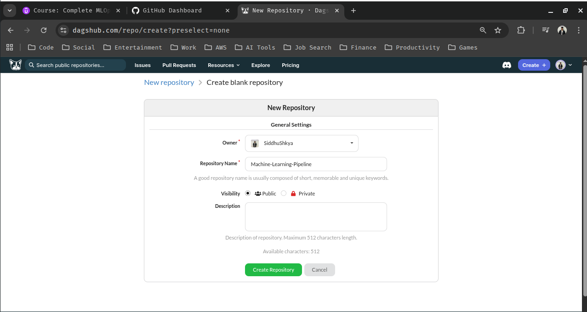
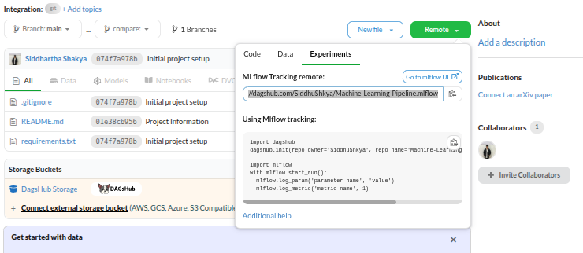
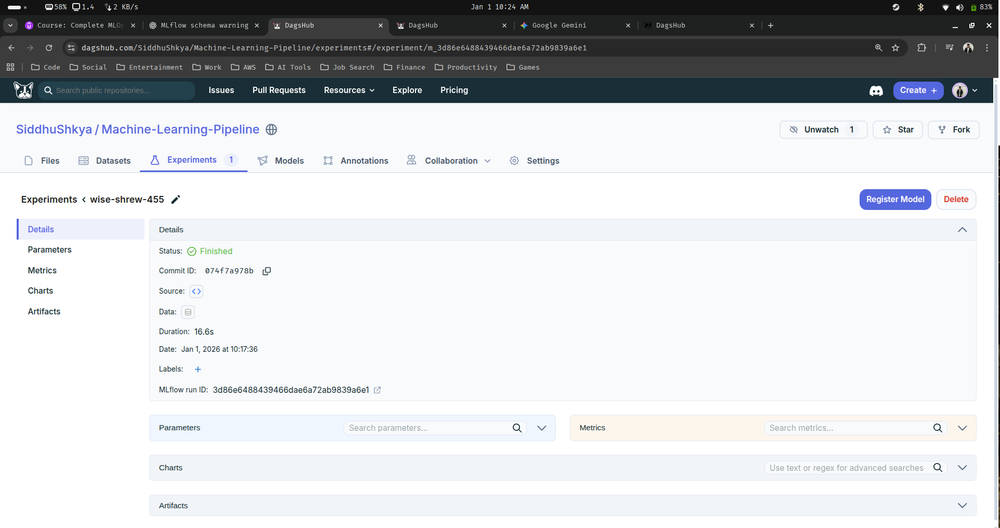
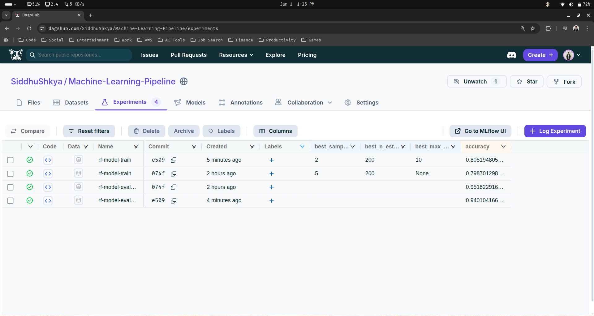
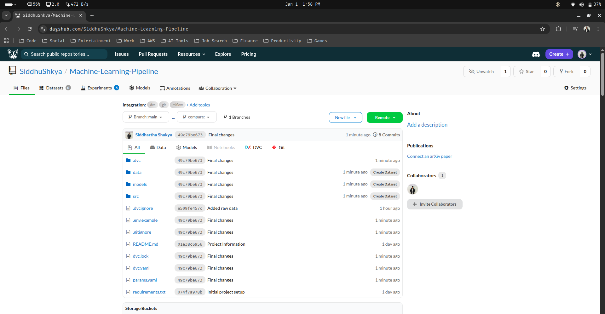
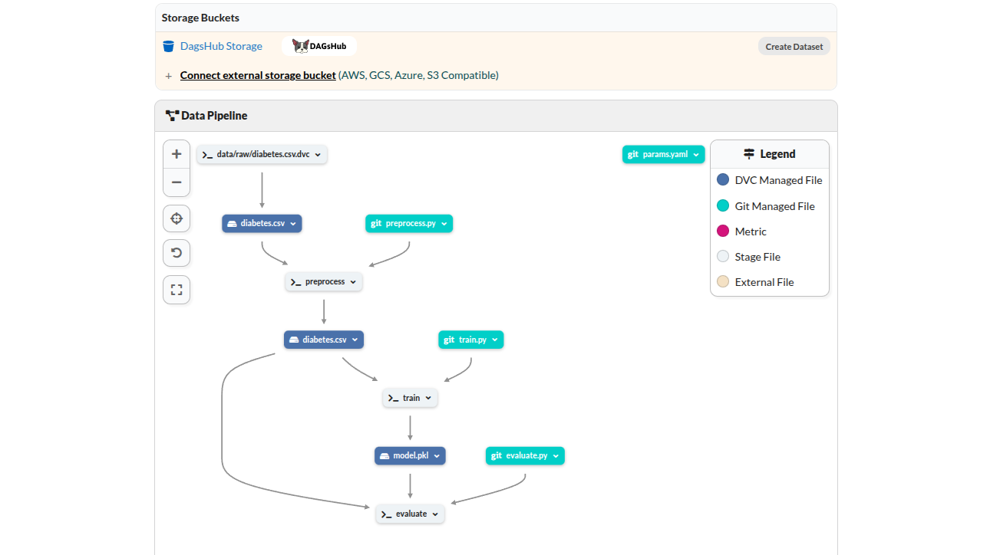

## Machine Learning Pipeline

In this guide we will be implementing our first end to end machine learning pipeline using DVC for data version control and model versioning as well as MLflow for experiment tracking.

---

### 1. Initial Project Structure

1.1 Let's create a new blank repository using dagshub for our project



> We are using dagshub for our project repo instead of github, because in dagshub there is a feature called data pipeline which actually a complete data version pipeline.

1.2 Lets initialize our new repo to our local machine

```bash
siddhu@ubuntu:~/Desktop$ git clone https://dagshub.com/SiddhuShkya/Machine-Learning-Pipeline.git
Cloning into 'Machine-Learning-Pipeline'...
warning: You appear to have cloned an empty repository.
siddhu@ubuntu:~/Desktop$ cd Machine-Learning-Pipeline
siddhu@ubuntu:~/Desktop/Machine-Learning-Pipeline$ echo "# Machine-Learning-Pipeline" >> README.md
siddhu@ubuntu:~/Desktop/Machine-Learning-Pipeline$ git add README.md
siddhu@ubuntu:~/Desktop/Machine-Learning-Pipeline$ git commit -m "first commit"
[main (root-commit) 7ffa041] first commit
 1 file changed, 1 insertion(+)
 create mode 100644 README.md
siddhu@ubuntu:~/Desktop/Machine-Learning-Pipeline$ git branch -M main
siddhu@ubuntu:~/Desktop/Machine-Learning-Pipeline$ git push -u origin main
Enumerating objects: 3, done.
Counting objects: 100% (3/3), done.
Writing objects: 100% (3/3), 246 bytes | 246.00 KiB/s, done.
Total 3 (delta 0), reused 0 (delta 0), pack-reused 0
To https://dagshub.com/SiddhuShkya/Machine-Learning-Pipeline.git
 * [new branch]      main -> main
branch 'main' set up to track 'origin/main'.
```

1.3 Let's start our project. Open up your VS-Code

```bash
siddhu@ubuntu:~/Desktop/Machine-Learning-Pipeline$ code .
```

> Write some information about the project in README.md and commit to your repo

```bash
siddhu@ubuntu:~/Desktop/Machine-Learning-Pipeline$ git status
On branch main
Your branch is up to date with 'origin/main'.

Changes not staged for commit:
  (use "git add <file>..." to update what will be committed)
  (use "git restore <file>..." to discard changes in working directory)
        modified:   README.md

no changes added to commit (use "git add" and/or "git commit -a")
siddhu@ubuntu:~/Desktop/Machine-Learning-Pipeline$ git add .
siddhu@ubuntu:~/Desktop/Machine-Learning-Pipeline$ git commit -m 'Project Information'
[main 01e38c6] Project Information
 1 file changed, 96 insertions(+), 1 deletion(-)
siddhu@ubuntu:~/Desktop/Machine-Learning-Pipeline$ git push origin main
```
1.4 Create our new project environment and also the requirements.txt file 

```bash
siddhu@ubuntu:~/Desktop/Machine-Learning-Pipeline$ conda create -p venv python==3.10 -y
```

> Add the below dependencies in you requirements.txt

```text
dvc
dvc-s3
dagshub
mlflow
scikit-learn
```

> Now actviate your conda environment and install the above mentioned dependencies

```bash
siddhu@ubuntu:~/Desktop/Machine-Learning-Pipeline$ conda activate venv/
(/home/siddhu/Desktop/Machine-Learning-Pipeline/venv) siddhu@ubuntu:~/Desktop/Machine-Learning-Pipeline$ pip install -r ./requirements.txt
```

1.5 Lets create another file .gitignore and ignore our virtual environment (venv) folder

```python
## .gitignore file
venv/
```

> Add, commit and push the changes

```bash
(/home/siddhu/Desktop/Machine-Learning-Pipeline/venv) siddhu@ubuntu:~/Desktop/Machine-Learning-Pipeline$ git add .
(/home/siddhu/Desktop/Machine-Learning-Pipeline/venv) siddhu@ubuntu:~/Desktop/Machine-Learning-Pipeline$ git commit -m 'Initial project setup'
[main 074f7a9] Initial project setup
 2 files changed, 6 insertions(+)
 create mode 100644 .gitignore
 create mode 100644 requirements.txt
(/home/siddhu/Desktop/Machine-Learning-Pipeline/venv) siddhu@ubuntu:~/Desktop/Machine-Learning-Pipeline$ git push origin main
```

1.6 Let's upload our dataset [diabetes.csv](https://github.com/SiddhuShkya/Machine-Learning-Operations/blob/main/data/diabetes.csv) into our project

> Create data folder and create 2 sub folders (raw & processed) inside it. Upload you initial/raw diabetes.csv to the raw folder. Based on this particular dataset we are going to create this entire pipeline. The pipline will be created for data pre-processing , model-training and then model-evaluation.

> Also add additional files (src/__init__.py", src/preprocess.py, src/train.py, src/evaluate.py & params.yaml) to complete the basic structure of our project

```text
.
├── data
│   ├── processed                  # Folder for cleaned/processed datasets
│   └── raw                        # Folder for raw/unprocessed datasets
│        └── diabetes.csv -------> # Original dataset
├── .git                           # Git repository folder (auto-created)
├── .gitignore                     # Specifies files/folders for Git to ignore
├── params.yaml -----------------> # YAML file for storing hyperparameters/configs
├── README.md                      # Project overview, instructions, and documentation
├── requirements.txt               # Python dependencies for the project
├── src                            # Source code folder
│   ├── evaluate.py -------------> # Code for model evaluation (metrics, reports)
│   ├── __init__.py -------------> # Makes `src` a Python package
│   ├── preprocess.py -----------> # Data cleaning, preprocessing, feature engineering
│   └── train.py ----------------> # Model training code (fit and save models)
└── venv                           # Python virtual environment

```
---

### 2. Set our normal/basic parameters (params.yaml)

A params.yaml file is a configuration file used to store project settings, hyperparameters, and paths in a structured, human-readable format (YAML). It is commonly used in machine learning projects to separate code from configuration, making experiments easier to manage and reproduce.

> Copy paste the below inside yor params.yaml file step by step.

2.1 parameters for preprocess.py

```text
preprocess:
  input: data/raw/diabetes.csv
  output: data/processed/diabetes.csv
```

2.2 parameters for train.py

```text
train:
  input: data/processed/diabetes.csv
  target: Outcome
  model: models/model.pkl
  random_state: 12
  experiment: RF-Model-Training
  run_name: rf-model-train
  param_grid:
    n_estimators: [100, 200]
    max_depth: [5, 10, null]       
    min_samples_split: [2, 5]
    min_samples_leaf: [1, 2]
```

2.3 parameters for evaluate.py

```text
evaluate:
  data_path: data/processed/diabetes.csv
  target: Outcome
  experiment: RF-Model-Evaluation
  run_name: rf-model-evaluate
  model_path: models/model.pkl
```

> Your final params.yaml file will look like this : 

```text
preprocess:
  input: data/raw/diabetes.csv
  output: data/processed/diabetes.csv

train:
  input: data/processed/diabetes.csv
  target: Outcome
  model: models/model.pkl
  random_state: 12
  experiment: RF-Model-Training
  run_name: rf-model-train
  param_grid:
    n_estimators: [100, 200]
    max_depth: [5, 10, null]       
    min_samples_split: [2, 5]
    min_samples_leaf: [1, 2]

evaluate:
  data_path: data/processed/diabetes.csv
  target: Outcome
  experiment: RF-Model-Evaluation
  run_name: rf-model-evaluate
  model_path: models/model.pkl
```

---

### 3.Preprocessing pipeline

```python
# src/preprocess.py

import os
import pandas as pd
import yaml

## Load parameters from params.yaml
with open("params.yaml", "r") as f:
    params = yaml.safe_load(f)

input_path = params["preprocess"]["input"]
output_path = params["preprocess"]["output"]


## Your main preocessing function
def preprocess_data(input_path, output_path):
    # Load the raw data
    data = pd.read_csv(input_path)
    # preprocessing steps
    data.dropna(inplace=True)
    data.drop_duplicates(inplace=True)
    # Save the processed data
    os.makedirs(os.path.dirname(output_path), exist_ok=True)
    data.to_csv(output_path, index=False)
    print(f"Processed data saved to {output_path}")


if __name__ == "__main__":
    preprocess_data(input_path, output_path)
```

---

### 4. Training Pipeline

> Before jumping into coding for train.py, we need to first setup some necessary environment variables for using mlflow in our remote server

> Create .env file and add the below neccesary variables

```text
MLFLOW_TRACKING_URI=
MLFLOW_TRACKING_USERNAME=
MLFLOW_TRACKING_PASSWORD=
```

> Tracking uri : 



> Tracking username : Your dagshub username (SiddhuShkya)

> Tracking password : secret_access_key under "Setup Credentials"


Once all the environment variables are set we can jump into coding part of train.py :

```python
# src/train.py

import os
import pickle
import mlflow
import yaml
import pandas as pd
from dotenv import load_dotenv
from mlflow.models import infer_signature
from sklearn.ensemble import RandomForestClassifier
from sklearn.model_selection import train_test_split, GridSearchCV
from sklearn.metrics import accuracy_score, confusion_matrix, classification_report

## Load environment variables from .env file
load_dotenv()

## Define MLflow remote server credentials
mlflow_tracking_uri = os.environ.get("MLFLOW_TRACKING_URI")
mlflow_tracking_password = os.environ.get("MLFLOW_TRACKING_PASSWORD")

## Load training parameters from params.yaml
with open("params.yaml", "r") as f:
    params = yaml.safe_load(f)

## Extract required parameters
input_path = params["train"]["input"]
target = params["train"]["target"]
model_path = params["train"]["model"]
random_state = params["train"]["random_state"]
param_grid = params["train"]["param_grid"]
experiment = params["train"]["experiment"]
run_name = params["train"]["run_name"]


## Function to perform hyperparameter tuning using GridSearchCV
def hyperparameter_tuning(X_train, y_train, param_grid):
    ## Initialize Random Forest model
    rf = RandomForestClassifier()
    ## Setup GridSearch with cross-validation
    grid_search = GridSearchCV(
        estimator=rf, param_grid=param_grid, cv=3, n_jobs=-1, verbose=2
    )
    ## Train models for all parameter combinations
    grid_search.fit(X_train, y_train)
    return grid_search


## Main training function
def train(data_path, target, model_path, random_state, param_grid):
    ## Load dataset
    data = pd.read_csv(data_path)
    ## Separate features and target
    X = data.drop(columns=[target])
    y = data[target]
    ## Split data into training and testing sets
    X_train, X_test, y_train, y_test = train_test_split(
        X, y, test_size=0.20, random_state=random_state
    )
    ## Infer MLflow model signature from training data
    signature = infer_signature(X_train, y_train)
    ## Set MLflow tracking URI
    mlflow.set_tracking_uri(mlflow_tracking_uri)
    ## Set MLflow experiment name
    mlflow.set_experiment(experiment)
    ## Start MLflow experiment run
    with mlflow.start_run(run_name=run_name):
        ## Perform hyperparameter tuning
        grid_search = hyperparameter_tuning(
            X_train=X_train, y_train=y_train, param_grid=param_grid
        )

        ## Retrieve the best model from GridSearch
        best_model = grid_search.best_estimator_
        ## Make predictions on test data
        y_pred = best_model.predict(X_test)
        ## Evaluate model performance
        ac = accuracy_score(y_test, y_pred)
        cm = confusion_matrix(y_test, y_pred)
        cr = classification_report(y_test, y_pred)
        ## Log evaluation metrics to MLflow
        mlflow.log_metric("accuracy", ac)
        ## Log best hyperparameters
        mlflow.log_param("best_n_estimators", grid_search.best_params_["n_estimators"])
        mlflow.log_param("best_max_depth", grid_search.best_params_["max_depth"])
        mlflow.log_param(
            "best_sample_split", grid_search.best_params_["min_samples_split"]
        )
        mlflow.log_param(
            "best_min_samples_leaf", grid_search.best_params_["min_samples_leaf"]
        )
        ## Log confusion matrix and classification report as artifacts
        mlflow.log_text(str(cm), "confusion_matrix.txt")
        mlflow.log_text(cr, "classification_report.txt")
        ## Log model and its artifacts
        mlflow.sklearn.log_model(sk_model=best_model, name="model", signature=signature)
        ## Create directory to save the trained model locally
        os.makedirs(os.path.dirname(model_path), exist_ok=True)
        ## Save the best model using pickle
        pickle.dump(best_model, open(model_path, "wb"))
        print(f"Best Model saved to : {model_path}")


## Entry point of the script
if __name__ == "__main__":
    train(
        data_path=input_path,
        target=target,
        model_path=model_path,
        random_state=random_state,
        param_grid=param_grid,
    )
```

> As you can see from the above we have used mlflow for tracking our experiment and to log metrics and params as well. We are also using dagshub remote repository as mlflow remote tracking server instead of doing it locally.

> Try running the src/train.py code

```bash
(/home/siddhu/Desktop/Machine-Learning-Pipeline/venv) siddhu@ubuntu:~/Desktop/Machine-Learning-Pipeline$ python src/train.py 
```

> After successfully execution of the above code we can see our experiments from our dagshub repository and see our experiments as well as logged params, metrics and model artifacts.



---

### 4. Evaluation Pipeline

> For the evaluation we will be using the same dataset we used for training. However it is not recommended to do this in real life projects

```bash
# src/evaluate.py

import os
import yaml
import mlflow
import pickle
import pandas as pd
from sklearn.metrics import accuracy_score
from dotenv import load_dotenv

## Load environment variables from .env file
load_dotenv()

## Define MLflow remote server credentials
mlflow_tracking_uri = os.environ.get("MLFLOW_TRACKING_URI")
mlflow_tracking_password = os.environ.get("MLFLOW_TRACKING_PASSWORD")

## Load evaluation parameters from params.yaml
params = yaml.safe_load(open("params.yaml"))["evaluate"]

## Extract parameters
data_path = params["data_path"]  # Path to evaluation dataset
model_path = params["model_path"]  # Path to trained model pickle
target = params["target"]  # Target column name
experiment = params["experiment"]  # MLflow experiment name
run_name = params["run_name"]


def evaluate(data_path, model_path):
    ## Load evaluation data
    data = pd.read_csv(data_path)
    ## Separate features (X) and target (y)
    X = data.drop(columns=[target])
    y = data[target]
    ## Set MLflow tracking URI (remote server or local)
    mlflow.set_tracking_uri(mlflow_tracking_uri)
    ## Set the experiment in MLflow
    ## If experiment does not exist, MLflow will create it automatically
    mlflow.set_experiment(experiment)
    ## Start an MLflow run context to log metrics
    with mlflow.start_run(run_name=run_name):
        ## Load the trained model from disk (pickle)
        model = pickle.load(open(model_path, "rb"))
        ## Generate predictions on evaluation data
        predictions = model.predict(X)
        ## Compute evaluation metric (accuracy)
        ac = accuracy_score(y, predictions)
        print("Model Accuracy:", ac)
        ## Log the metric to MLflow
        mlflow.log_metric("accuracy", ac)


## Entry point of the script
if __name__ == "__main__":
    evaluate(data_path=data_path, model_path=model_path)
```

> Run the above code independently and you will see in mlflow ui a new experiment has been created that is solely used for evaluating our model


---

### 5. Run the complete pipeline with DVC stage and repro

Right now all our codes (preprocess.py, train.py and evaluate.py) are independent code. In this section we are going to connect all these 3 independent code components in the form of a pipline. For this we are going to use DVC to track multiple parameters (params.yaml, data, & model versioning)

5.1 Lets first initialize our dvc inside our project repo

```bash
(/home/siddhu/Desktop/Machine-Learning-Pipeline/venv) siddhu@ubuntu:~/Desktop/Machine-Learning-Pipeline$ dvc init
Initialized DVC repository.

You can now commit the changes to git.

+---------------------------------------------------------------------+
|                                                                     |
|        DVC has enabled anonymous aggregate usage analytics.         |
|     Read the analytics documentation (and how to opt-out) here:     |
|             <https://dvc.org/doc/user-guide/analytics>              |
|                                                                     |
+---------------------------------------------------------------------+

What's next?
------------
- Check out the documentation: <https://dvc.org/doc>
- Get help and share ideas: <https://dvc.org/chat>
- Star us on GitHub: <https://github.com/treeverse/dvc>
```

> Additinaly, also delete files (data/processed/diabetes.csv & models/model.pkl) file that were created by running our codes independently

5.2 Add our raw data using dvc to make sure that it doesn't get tracked using git

```bash
(/home/siddhu/Desktop/Machine-Learning-Pipeline/venv) siddhu@ubuntu:~/Desktop/Machine-Learning-Pipeline$ dvc add data/raw/diabetes.csv
100% Adding...|██████████████████████████████████████████████████████████████████████████████████████|1/1 [00:00, 25.00file/s]
                                                                                                                              
To track the changes with git, run:

        git add data/raw/diabetes.csv.dvc data/raw/.gitignore

To enable auto staging, run:

        dvc config core.autostage true
```

> Now the actual data will be tracked with dvc, however we need to track the .gitignore and data.csv.dvc file using git that were created when we added data.csv.

```bash
(/home/siddhu/Desktop/Machine-Learning-Pipeline/venv) siddhu@ubuntu:~/Desktop/Machine-Learning-Pipeline$ git add data/raw/.gitignore
(/home/siddhu/Desktop/Machine-Learning-Pipeline/venv) siddhu@ubuntu:~/Desktop/Machine-Learning-Pipeline$ git add data/raw/diabetes.csv.dvc
```

> Also commit the changes to git

```bash
(/home/siddhu/Desktop/Machine-Learning-Pipeline/venv) siddhu@ubuntu:~/Desktop/Machine-Learning-Pipeline$ git commit -m 'Added raw data'
[main e509fe4] Added raw data
 5 files changed, 12 insertions(+)
 create mode 100644 .dvc/.gitignore
 create mode 100644 .dvc/config
 create mode 100644 .dvcignore
 create mode 100644 data/raw/.gitignore
 create mode 100644 data/raw/diabetes.csv.dvc
```

5.3 Lets connect our components (preprocess, train & evaluate) using dvc stage.

> DVC stage is an amazing functionality provided by dvc, which lets us define how our corresponding step of machine learning workflow needs to be exectuted. All this entire thing will be tracked using a single file which is dvc.yaml

> Our ml workflow for this project is : preprocessing >> training >> evaluating

- Lets create our first stage (preprocessing stage) : 

```bash
dvc stage add -n preprocess \
  -p preprocess.input,preprocess.output \
  -d src/preprocess.py \
  -d data/raw/diabetes.csv \
  -o data/processed/diabetes.csv \
  python src/preprocess.py
```

> Command explanation:

  `dvc stage add -n preprocess` : Create new stage with name 'preprocess'

  `-p preprocess.input, preprocess.output` : -p tracks the parameters from the params.yaml file

  `-d src/preprocess.py -d data/raw/diabetes.csv` : -d specifies dependencies for the stage

  `-o data/processed/diabetes.csv` : -o specifies the output of the stage

  `python src/preprocess.py` : command to execute this stage

> After executing the command, since this is our first stage it will create dvc.yaml file

Expected output : 

```bash
(/home/siddhu/Desktop/Machine-Learning-Pipeline/venv) siddhu@ubuntu:~/Desktop/Machine-Learning-Pipeline$ dvc stage add -n preprocess \
  -p preprocess.input,preprocess.output \
  -d src/preprocess.py \
  -d data/raw/diabetes.csv \
  -o data/processed/diabetes.csv \
  python src/preprocess.py
Added stage 'preprocess' in 'dvc.yaml'                                                          

To track the changes with git, run:

        git add dvc.yaml

To enable auto staging, run:

        dvc config core.autostage true
```

> Our first stage (preprocessing) has been successfully created.

- Lets create our second stage (training stage) : 

```bash
dvc stage add -n train \
  -p train.input,train.target,train.model,train.random_state,train.experiment,train.param_grid \
  -d src/train.py \
  -d data/processed/diabetes.csv \
  -o models/model.pkl \
  python src/train.py
```

> Execute the command to create the second stage (training)

- Lets create our third/final stage (evaluation stage) : 

```bash
dvc stage add -n evaluate \
  -p evaluate.data_path,evaluate.target,evaluate.experiment,evaluate.model_path \
  -d src/evaluate.py \
  -d data/processed/diabetes.csv \
  -d models/model.pkl \
  python src/evaluate.py
```

> After executing all the above 3 stage commands, our dvc.yaml file should look something like this:

```text
stages:
  preprocess:
    cmd: python src/preprocess.py
    deps:
    - data/raw/diabetes.csv
    - src/preprocess.py
    params:
    - preprocess.input
    - preprocess.output
    outs:
    - data/processed/diabetes.csv
  train:
    cmd: python src/train.py
    deps:
    - data/processed/diabetes.csv
    - src/train.py
    params:
    - train.experiment
    - train.input
    - train.model
    - train.param_grid
    - train.random_state
    - train.target
    outs:
    - models/model.pkl
  evaluate:
    cmd: python src/evaluate.py
    deps:
    - data/processed/diabetes.csv
    - models/model.pkl
    - src/evaluate.py
    params:
    - evaluate.data_path
    - evaluate.experiment
    - evaluate.model_path
    - evaluate.target
```

- Now that we have created and define our pipline in the form of dvc stages in dvc.yaml, lets run our entire pipeline using repro which is another dvc command which helps to run all the dvc stages in the form of a pipeline

```bash
(/home/siddhu/Desktop/Machine-Learning-Pipeline/venv) siddhu@ubuntu:~/Desktop/Machine-Learning-Pipeline$ dvc repro
```

> To check if the pipeline has run successfully, go to your experiments tab from your dagshub repository and relaod the page. You should see two new experiments that were created recently




5.4 Finally lets now add and commit all our changes to dvc and git repository.

> Lets setup our dagshub dvc remote and also setup credentials. Copy paste it from the dagshub repo page


> copy paste and execute them :

```bash
(/home/siddhu/Desktop/Machine-Learning-Pipeline/venv) siddhu@ubuntu:~/Desktop/Machine-Learning-Pipeline$ dvc remote add origin s3://dvc
(/home/siddhu/Desktop/Machine-Learning-Pipeline/venv) siddhu@ubuntu:~/Desktop/Machine-Learning-Pipeline$ dvc remote modify origin endpointurl https://dagshub.com/SiddhuShkya/Machine-Learning-Pipeline.s3
(/home/siddhu/Desktop/Machine-Learning-Pipeline/venv) siddhu@ubuntu:~/Desktop/Machine-Learning-Pipeline$ dvc remote modify origin --local 'your_token'
(/home/siddhu/Desktop/Machine-Learning-Pipeline/venv) siddhu@ubuntu:~/Desktop/Machine-Learning-Pipeline$ dvc remote modify origin --local secret_access_key 'your_token'
```

> Lets pull to check if everything is upto date

```bash
(/home/siddhu/Desktop/Machine-Learning-Pipeline/venv) siddhu@ubuntu:~/Desktop/Machine-Learning-Pipeline$ dvc pull -r origin
Collecting                                                                                            |0.00 [00:00,    ?entry/s]
Fetching
Building workspace index                                                                              |5.00 [00:00,  636entry/s]
Comparing indexes                                                                                    |6.00 [00:00, 1.02kentry/s]
Applying changes                                                                                      |0.00 [00:00,     ?file/s]
Everything is up to date.
```

> Now lets push the files that are tarcked by the dvc

```bash
(/home/siddhu/Desktop/Machine-Learning-Pipeline/venv) siddhu@ubuntu:~/Desktop/Machine-Learning-Pipeline$ dvc push -r origin
Collecting                                                                                            |2.00 [00:00,  207entry/s]
Pushing
2 files pushed        
```

> Lets commit all the rest files using git

```bash
(/home/siddhu/Desktop/Machine-Learning-Pipeline/venv) siddhu@ubuntu:~/Desktop/Machine-Learning-Pipeline$ git add .
(/home/siddhu/Desktop/Machine-Learning-Pipeline/venv) siddhu@ubuntu:~/Desktop/Machine-Learning-Pipeline$ git commit -m 'Final changes'
(/home/siddhu/Desktop/Machine-Learning-Pipeline/venv) siddhu@ubuntu:~/Desktop/Machine-Learning-Pipeline$ git push origin main
```

> You should be able to see all your commited files in your dagshub repo



> Additionally you should also be able to see your data pipeline you created throughout this project in the form of a beautiful graph in the same dagshub repo



---

# <div align="center">Thank You for Going Through This Guide! 🙏✨</div>