## MLflow

MLFlow  is  an  open-source  MLOps  platform  designed  to  manage  the  complete 
machine  learning  lifecycle  from  experimentation  to  deployment.  It  provides  a 
comprehensive  set  of  tools  and  frameworks  to  manage  and  track the end-to-end ML 
development  process,  including  experimentation,  reproducibility,  deployment,  and 
collaboration.  MLflow  enables  data scientists and ML engineers to focus on building 
and deploying models while maintaining visibility, control, and reproducibility. Three main characteristics of mlflow are : 

- Open Source : Integrate with any ML library and platform
- Comprehensive : Manage end-to-end ML and GenAI workflows, from development to production.
- Unified : Unified platform for both traditional ML and GenAI applications.

---

### 1. Creating MLflow Environment

1.1 Create a new directory (mlflow-starter)

```bash
siddhu@ubuntu:~/Desktop$ mkdir mlflow-starter
```

1.2 Go inside your newly created diretory and create a new python environment

```bash
siddhu@ubuntu:~/Desktop$ cd mlflow-starter
siddhu@ubuntu:~/Desktop/mlflow-starter$ conda create -p venv python==3.10
siddhu@ubuntu:~/Desktop/mlflow-starter$ ls
venv
```

1.3 Open your VS-Code from the current working directory

```bash
siddhu@ubuntu:~/Desktop/mlflow-starter$ code .
```

1.4 Create requirements.txt file and add mlflow library. Then activate your previously created conda environment (venv) and install your dependencies using requirements.txt

```bash
siddhu@ubuntu:~/Desktop/mlflow-starter$ conda activate /home/siddhu/Desktop/mlflow-starter/venv
(/home/siddhu/Desktop/mlflow-starter/venv) siddhu@ubuntu:~/Desktop/mlflow-starter$ pip install -r requirements.txt
```

1.5 Your mlflow environment setup is complete

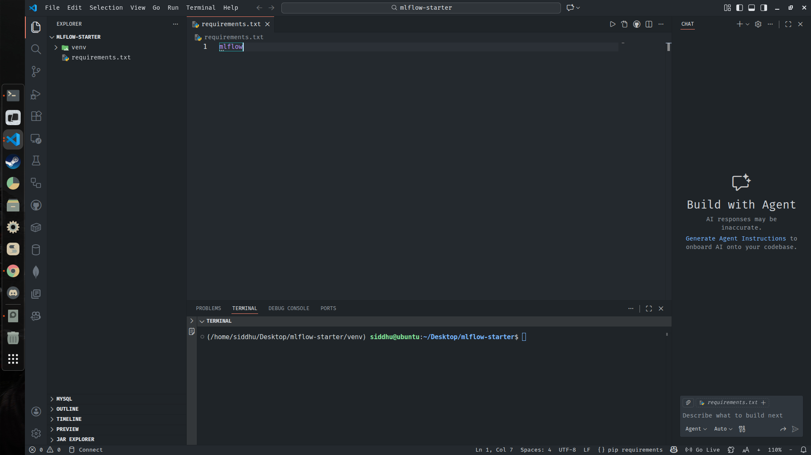

---

### 2. Setting MLflow Tracking Server

Whenever we create our end-to-end data science project it is very important that we track each and every experiments. For tracking these experiments we need to create a server which has mlflow functionalities. By tracking our experiments using mlflow tracking server we will be able to see all those experiments and compare them in the form of visualization.

2.1 Firstly, we need to install ipykernel to use jupyter notebook in our VS-Code.

```bash
(/home/siddhu/Desktop/mlflow-starter/venv) siddhu@ubuntu:~/Desktop/mlflow-starter$ pip install ipykernel
```

2.2 Since we have already installed mlflow library in our environment, we access the mlflow server by using the following command

```bash
(/home/siddhu/Desktop/mlflow-starter/venv) siddhu@ubuntu:~/Desktop/mlflow-starter$ mlflow ui
```

> Note : The server will run on our localhost in 5000 port. This server is resposible for keeping track of all the experiments

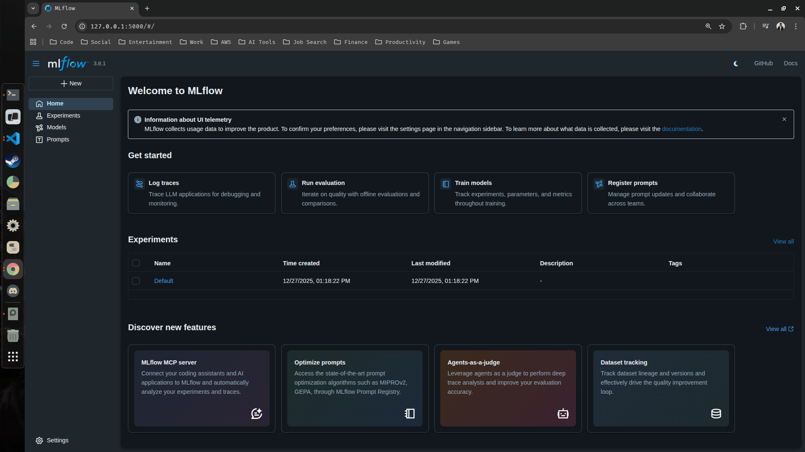

> Additionally you should also see that after starting the mlflow server, mlflow has automatically created a local SQLite file to keep track of our structured data. This database stores :

- Experiment Metadata: Names of experiments, IDs, and creation times.
- Run Information: Start/end times, status (Finished/Failed), and parent run IDs.
- Parameters: The hyperparameters you logged (e.g., learning_rate: 0.01).
- Metrics: The numbers you tracked over time (e.g., accuracy or loss per epoch).
- Tags and Notes: Any custom labels or descriptions you added to your runs.

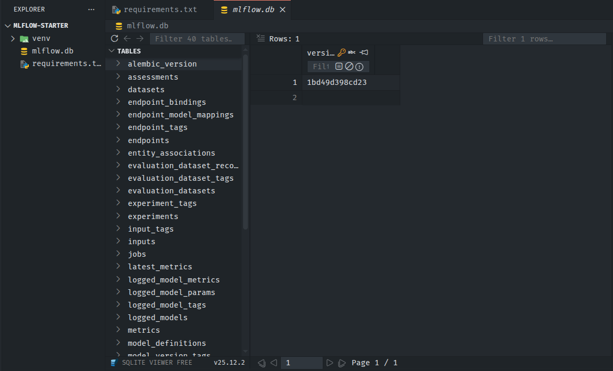


#### Important Note : 

> MLflow splits its data into two disctinct categories:

| Data Type       | Stored In             | Examples                                 |
|-----------------|---------------------|-----------------------------------------|
| Structured Data | Backend Store (mlflow.db) | Parameters, Metrics, Tags, Run metadata |
| Unstructured Data | Artifact Store (./mlruns folder) | Trained models (.pkl, .h5), Images, CSVs, Text files |

> Since we haven't logged any models, images or CSVs, we can't see a folder for artifacts (mlruns).

2.3 Create a python file (get-started.py) within your previously created directory (mlflow-starter) to test the mlflow server. After creating the python copy and paste the below code inside it

```python
import mlflow  # Import the MLflow library for experiment tracking

mlflow.set_tracking_uri("http://localhost:5000")  # Set the MLflow tracking server URI

mlflow.set_experiment(
    "my_experiment"
)  # Specify or create an experiment named "my_experiment"

with mlflow.start_run():  # Start a new MLflow run (context manager ensures it ends properly)
    mlflow.log_param("param1", 5)  # Log a parameter named "param1" with value 5
    mlflow.log_metric("metric1", 0.85)  # Log a metric named "metric1" with value 0.85
```

> Code Explanation (Line-by-line) : 

- `import mlflow` → Loads MLflow library for logging experiments, parameters, metrics, and artifacts.
- `mlflow.set_tracking_uri("http://localhost:5000")` → Points MLflow to the tracking server (local or remote).
- `mlflow.set_experiment("my_experiment")` → Creates a new experiment if it doesn’t exist or sets the current experiment.
- `with mlflow.start_run():` → Starts a new run, automatically closes it when the block ends.
- `mlflow.log_param("param1", 5)` → Saves a parameter (param1) to the current run.
- `mlflow.log_metric("metric1", 0.85)` → Saves a metric (metric1) to the current run for tracking performance.

2.4 Run the python code and view your experiment from the specified link

```bash
(/home/siddhu/Desktop/mlflow-starter/venv) siddhu@ubuntu:~/Desktop/mlflow-starter$ python ./get-started.py
2025/12/27 13:54:32 INFO mlflow.tracking.fluent: Experiment with name 'my_experiment' does not exist. Creating a new experiment.
🏃 View run vaunted-chimp-687 at: http://localhost:5000/#/experiments/1/runs/81832b7fb2f14774adbd8fd4d88cb5d5
🧪 View experiment at: http://localhost:5000/#/experiments/1
```

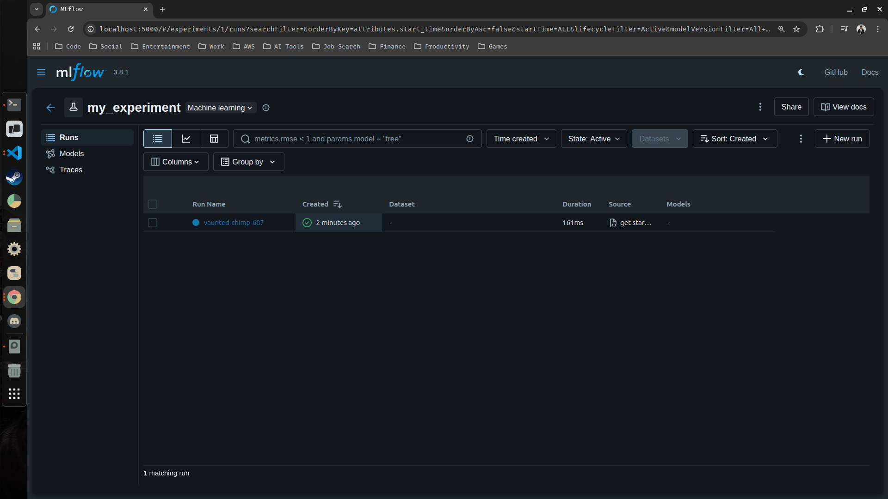

> Click on the shown experiment (my_experiment) and you will be able to view your logged params and metrics.

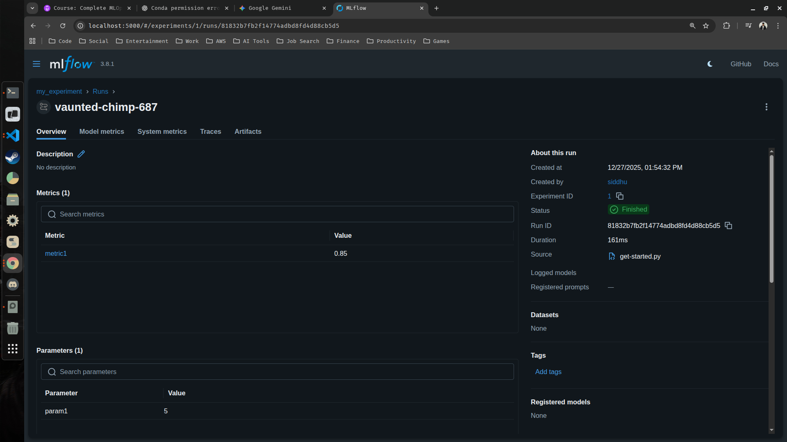

> Note : The mlflow server ui is actually fetching this information from your local SQLite database which mlflow created when you first ran the mlflow server. You can check this from your VS-Code by using SQLite Viewer extension.

<table>
  <tr>
    <td>
      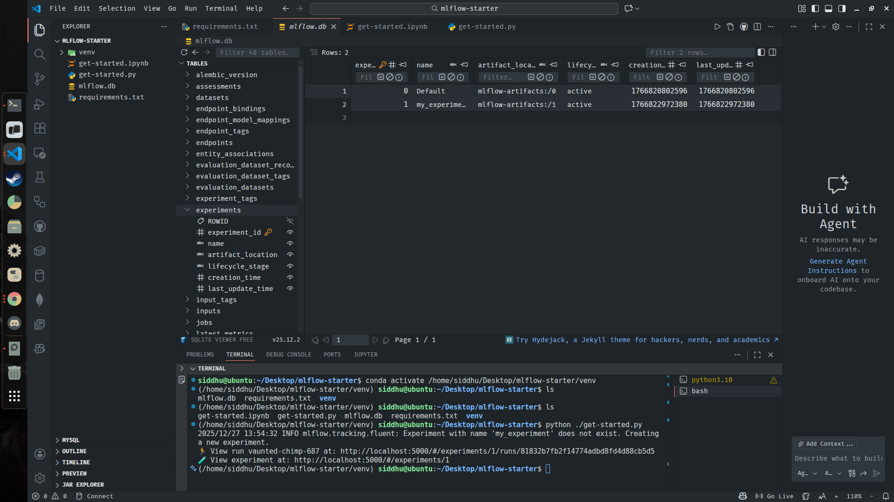
    </td>
    <td>
      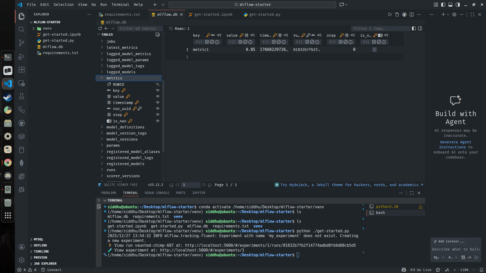
    </td>
  </tr>
</table>

---

### 3. ML Project With MLflow

In this step we are going to take some dataset, train our model and when we are training our model we will also be making sure that we are keeping track of multiple information. Technically, we will be integrating MLflow as an MLOps to track/log various parameters and metrics.

3.1 Install some additional libraries for the ML Project

- Update your requirements.txt and add the below libraries : 

```bash
scikit-learn
pandas 
numpy
```

- Install all the dependencies from the requirements.txt

```bash
(/home/siddhu/Desktop/mlflow-starter/venv) siddhu@ubuntu:~/Desktop/mlflow-starter$ pip install -r ./requirements.txt
```

3.2 Create a jupyter notebook file (ml-project.ipynb) inside the previously created project diretory (mlflow-starter) and copy paste the below codes cell by cell

```python
## Importing Necessary Dependencies
import mlflow
from mlflow.models import infer_signature

import pandas as pd
from sklearn import datasets
from sklearn.linear_model import LogisticRegression
from sklearn.model_selection import train_test_split
from sklearn.metrics import accuracy_score
```

```python
## Load the dataset
X, y = datasets.load_iris(return_X_y=True)
## Split the data into training and testing set
X_train, X_test, y_train, y_test = train_test_split(X, y, test_size=0.2, random_state=42)
```

```python
## Define the model hyperparameters
params = {"penalty": "l2", "solver": "lbfgs", "max_iter": 1000, "random_state": 42}
## Training our model
lr = LogisticRegression(**params)
lr.fit(X_train, y_train)
```

```python
## Prediction on the test set
y_pred = lr.predict(X_test)
_as = accuracy_score(y_test, y_pred)
print('Accuracy score : ', _as)
```

```python
### MLflow Tracking
# This section shows how MLflow is used to track an ML experiment 📊

## Set the tracking uri
mlflow.set_tracking_uri(uri="http://127.0.0.1:5000/")
# Tells MLflow where the tracking server is running (local MLflow UI)

## Create a new MLflow experiment
mlflow.set_experiment("Iris Classification Experiment")
# Creates or selects an experiment to group related runs together

## Start an MLflow run
with mlflow.start_run(run_name="Logistic Regression Model"):
    # Starts a new run to track this specific model training

    ## Log the model hyperparameters
    mlflow.log_params(params)
    # Saves all hyperparameter values used by the model

    ## Log the accuracy metric
    mlflow.log_metric("accuracy", _as)
    # Records the model’s accuracy score

    ## Set a tag for the run
    mlflow.set_tag("model", "Basic LR Model")
    # Adds a label (tag) to describe the run

    ## Infer the model signature and log the model
    signature = infer_signature(X_train, lr.predict(X_train))
    # Automatically detects model input and output format

    model_info = mlflow.sklearn.log_model(
        sk_model=lr,
        artifact_path="logistic-regression-model",
        signature=signature,
        input_example=X_train[:5],
        registered_model_name="tracking-iris-lr",
    )
    # Saves the trained Logistic Regression model, its signature,
    # a sample input, and registers it in the MLflow Model Registry 🚀
```

3.3 After successfully running all the above block of codes, you should be able to see your new experiment along with the logged metrics, parameters and as well as the model artifacts.

<table>
  <tr>
    <td>
      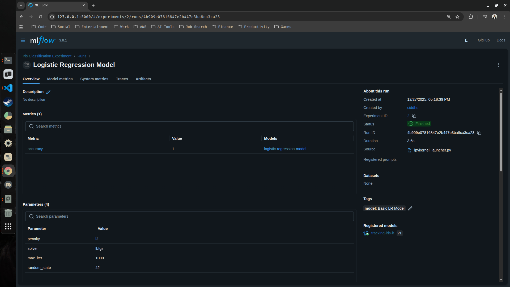
    </td>
    <td>
      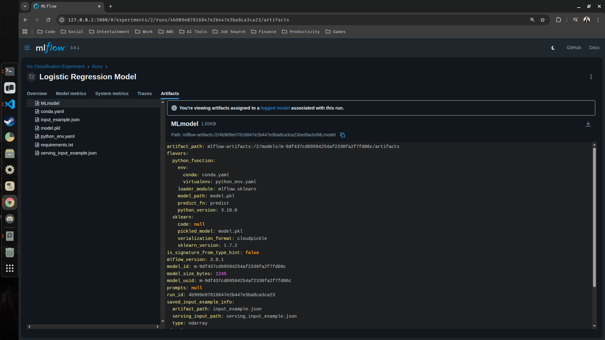
    </td>
  </tr>
</table>

3.4 Additionally, you can also do multiple runs under the same experiment using different parameters, metrics or even model artifacts. To see this add the below block of codes cell by cell in the same jupyter notebook file (ml-project.ipynb)

```python
## Define the updated model hyperparameters
params = {"solver": "newton-cg", "max_iter": 800, "random_state": 12}
## Training our model with the newly hyperparameters
lr = LogisticRegression(**params)
lr.fit(X_train, y_train)
```

```python
## New predictions on the test set
y_pred = lr.predict(X_test)
_as = accuracy_score(y_test, y_pred)
print("Accuracy score : ", _as)
```

```python
## Start a new run under the same experiment 'Iris Classification Experiment'
with mlflow.start_run(run_name="Logistic Regression Model"):

    mlflow.log_params(params)
    mlflow.log_metric("accuracy", _as)

    mlflow.set_tag("model", "Basic LR Model")
    signature = infer_signature(X_train, lr.predict(X_train))

    model_info = mlflow.sklearn.log_model(
        sk_model=lr,
        artifact_path="logistic-regression-model",
        signature=signature,
        input_example=X_train[:5],
        registered_model_name="tracking-iris-lr",
    )
```

3.5 After running the above new block of codes, you should be able to see the new run in the same experiment (Iris Classification Experiment)


3.6 Finally you can also compare all the runs within the same experiment to decide which model is better

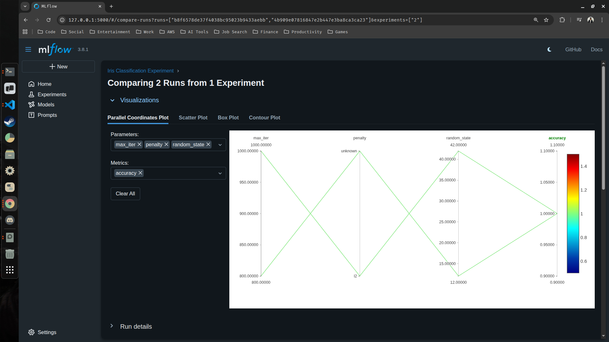

---

### 4. Inferencing Model Artifacts

Artifacts are the files or folder that were produced and stored during an ML run. These files can be stored, tracked and reuse later. They are mainly used for :

- Reproducing experiments
- Inspecting Results
- Deploying or sharing models
- comparing different runs

4.1 Copy the relative path from one of the previous runs 

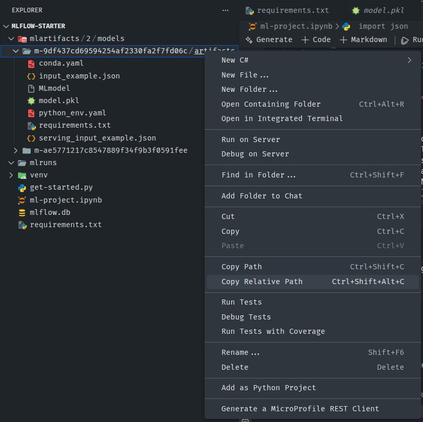

> The copied path should look something like this :

```bash
mlartifacts/2/models/m-ae5771217c8547889f34f9b3f0591fee/artifacts
```

4.2 Create a new python file (model_inferencing.py) inside the mlflow-starter directory and copy paste the below code

```python
import json
import pandas as pd
import mlflow.pyfunc

# Model artifacts path
model_path = "Your Copied Path Here"

# Load model
model = mlflow.pyfunc.load_model(model_path)

# Load input example from mlartifacts
with open(f"{model_path}/input_example.json", "r") as f:
    input_example = json.load(f)

# Convert to DataFrame (MLflow expects pandas input)
X = pd.DataFrame(input_example)

# Run inference
predictions = model.predict(X)
print(predictions)
```

> After pasting the artifact path and running the above you should be able to see the predictions.

```python
[0 0 1 0 0]
```

---

### 5. Model Registry

The MLflow Model Registry component is a centralized model store, set of APIs, and UI, to collaboratively manage full lifecycle of an MLflow Model. It provides model lineage (which MLflow experiment and run produced the model), model versioning, model aliasing, model tagging and annotations.

> In the models tab, you can see that both the previous models have already been registered.

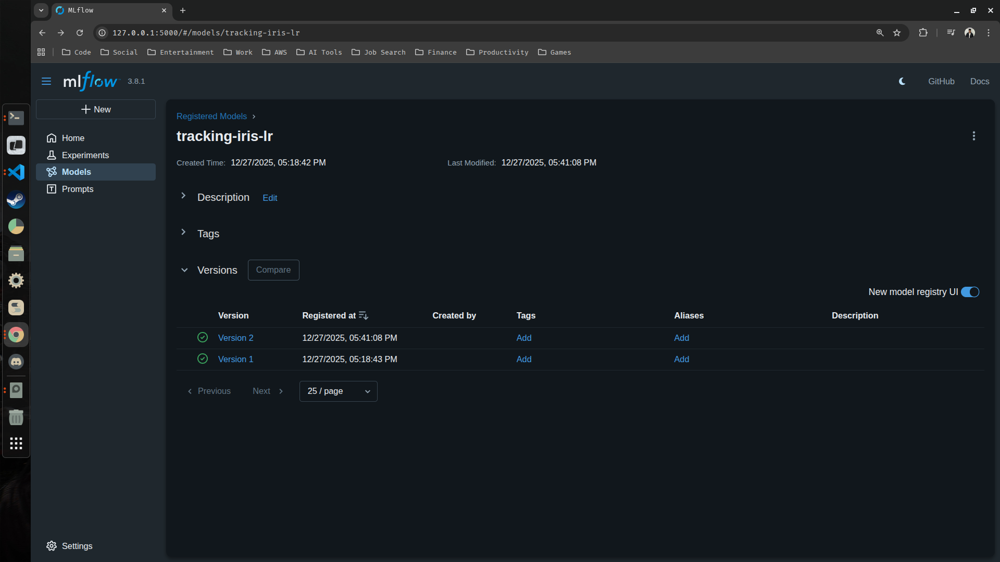

> In our previous code, we registered our models into the model registry directly through the run using the 'registered_model_name' parameter. Initially, you should never do this directly, because firstly we need to validate whether the model is the best model or not. Let's see how we can do this

1. In the same notebook file (ml-project.ipynb) add the below block of codes

```python
## Start an MLflow run
with mlflow.start_run(run_name="Logistic Regression Model"):
    mlflow.log_params(params)
    mlflow.log_metric("accuracy", _as)

    mlflow.set_tag("model", "Basic LR Model")
    signature = infer_signature(X_train, lr.predict(X_train))

    mlflow_info = mlflow.sklearn.log_model(
        sk_model=lr,
        artifact_path="logistic-regression-model",
        signature=signature,
        input_example=X_train
    )
```

> Notice that for this run i have removed the 'registered_model_name' parameter.

2. Run the code and view your run from the mlflow ui then compare the results with the previous 2 runs

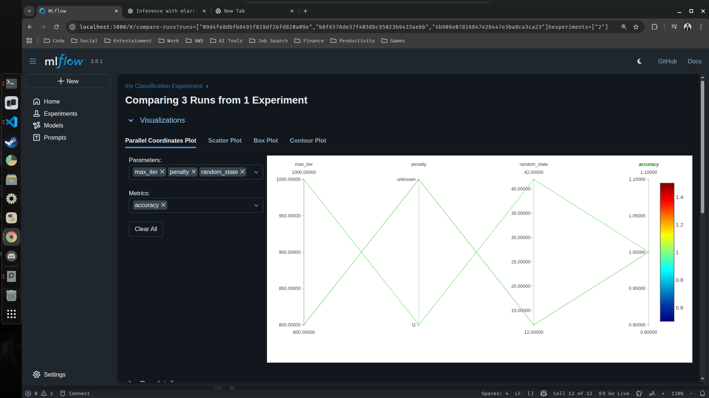

> From the above screen shot we can see that all 3 models have an accuracy of 1.0. Assuming the previous two models had accuracy of 0.8 and the model created from the last run (3rd model) had an accuracy of 0.9, we have to register the third model as it is the best one among the 3. 

3. In the runs tab inside your experiment, click the link of your best model under the Models column.

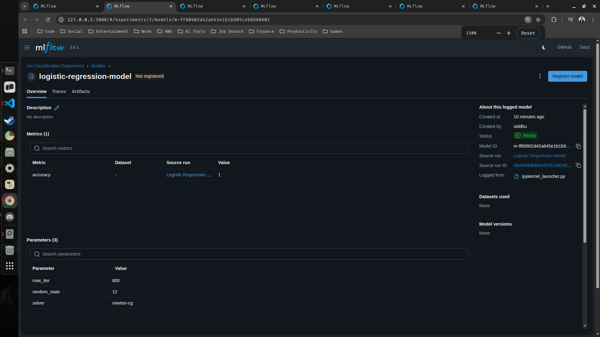

> In the top right, you can see the button to register the model. CLick it and register the model using the previous registered model name (tracking-iris-lr).

4. Check if the model has been registered or not from the models tab.

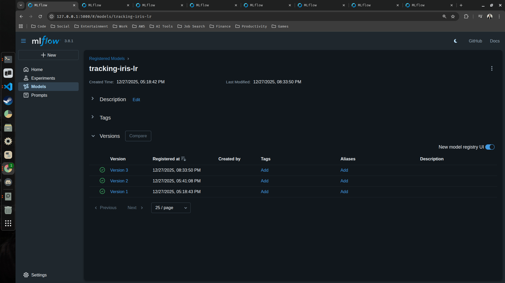

> Since we had already registered 2 models using that name, the model we registered just now should be the latest (Version 3) model.

5. (Optional) You can also add tags and aliases to your registered models to verify the models in later stages

<table>
  <tr>
    <td>
      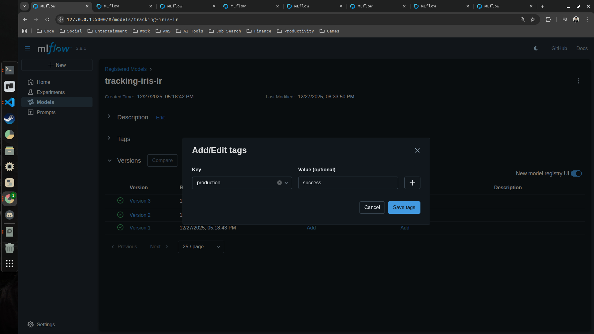
    </td>
    <td>
      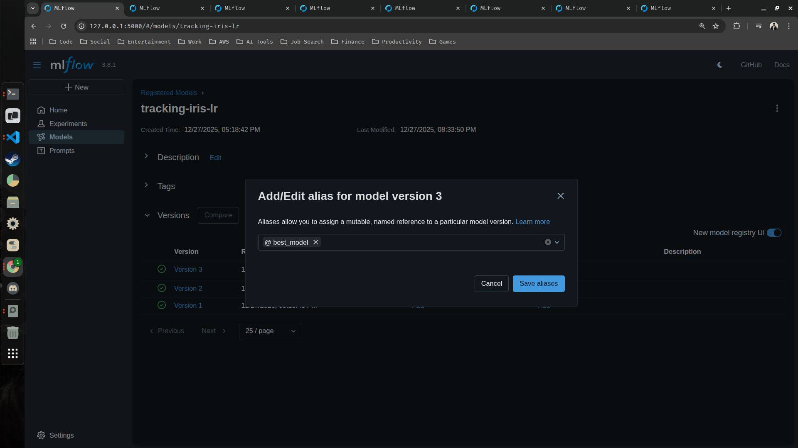
    </td>
  </tr>
</table>

6. Your best model has been registered as well as tagged and has also been given a proper alias

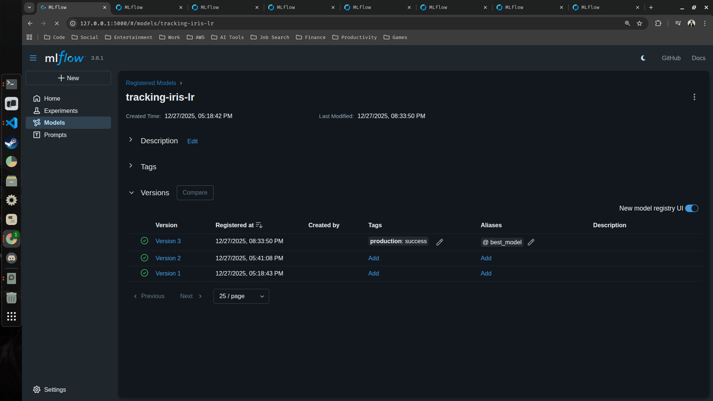

---

# <div align="center">Thank You for Going Through This Guide! 🙏✨</div>
