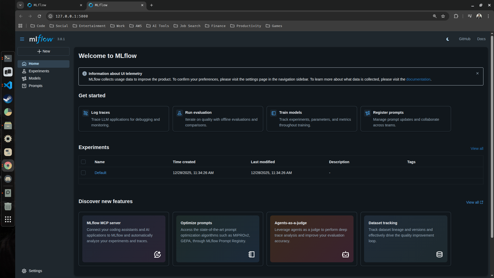
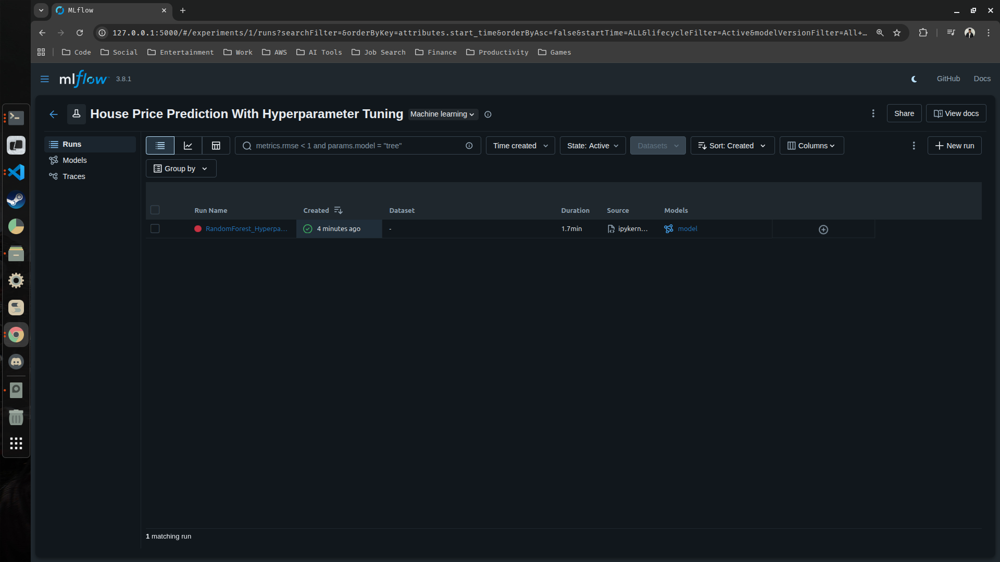
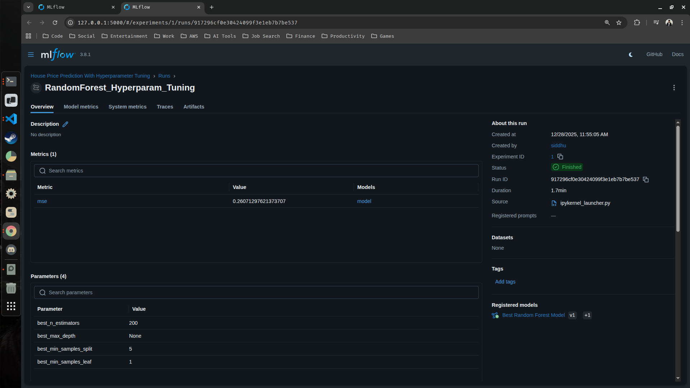

## House Price Prediction With MLflow

In this guide we are goig to :

- Run hyperparameter tuning while training a model.
- Log every hyperparameter and metrics in the MLflow UI.
- Compare the results of the various runs in the Mlflow UI.
- Choose the best run and register the model to your model registry.

--- 

1. Create a new project folder (ML-Project-With-MLflow) and inside it create a new jupyter notebook (house-price-prediction.ipynb).

> Your project structure should look something like this :

```text
.
├── get-started.py 📄
├── mlartifacts 📁
│   └── 2 📁
├── mlflow.db 📄
├── ml-project.ipynb 📄
├── ML-Project-With-MLflow 📁
│   └── house-price-prediction.ipynb 📄 <-------------- # Your newly created notebook file
├── mlruns 📁
├── requirements.txt 📄
└── venv 📁
```

> We are creating a new project folder as to start a new mlflow server that doesn't have any experiments. Basically the data (mlflow.db and mlruns) will be brand new for this project and it also be created inside this foldder (ML-Project-With-MLflow)

2. Go inside your new project folder through the shell and start your mlflow server from there

> Note : Do not forget to activate your conda environment before starting the mlflow server before running the below commands

```bash
(/home/siddhu/Desktop/mlflow-starter/venv) siddhu@ubuntu:~/Desktop/mlflow-starter$ cd ./ML-Project-With-MLflow/
(/home/siddhu/Desktop/mlflow-starter/venv) siddhu@ubuntu:~/Desktop/mlflow-starter/ML-Project-With-MLflow$ mlflow ui 
```

> You should be able to see that the SQLite file (mlflow.db) is created isnide the folder (ML-Project-With-MLflow) and your newly created mlflow server haas started at the below port

```bash
http://127.0.0.1:5000/
```


> As you can see from the above screen shot, no experiment has been tracked using this server.
 
3. Go back to your VS-Code and open up your newly created jupyter notebook file (house-price-prediction.ipynb), select your kernel (venv) and start adding and running the below codes cell-by-cell.

```python
# Import some necessary dependencies
import pandas as pd
import mlflow
import mlflow.sklearn
from sklearn.ensemble import RandomForestRegressor
from sklearn.model_selection import train_test_split, GridSearchCV
from sklearn.metrics import mean_squared_error
from sklearn.datasets import fetch_california_housing
```

4. Prepare your dataset

```python
housing = fetch_california_housing()                              # Fetch your housing data
data = pd.DataFrame(housing.data, columns=housing.feature_names)  # Load the fetched data into pandas dataframe
data['Price'] = housing.target                                    # Add target variable to dataframe
data.head()
```
Output : 

| | MedInc | HouseAge | AveRooms | AveBedrms | Population | AveOccup | Latitude | Longitude | Price |
|-------|--------|----------|----------|-----------|------------|----------|----------|-----------|-------|
| 0     | 8.3252 | 41.0     | 6.984127 | 1.023810  | 322.0      | 2.555556 | 37.88    | -122.23   | 4.526 |
| 1     | 8.3014 | 21.0     | 6.238137 | 0.971880  | 2401.0     | 2.109842 | 37.86    | -122.22   | 3.585 |
| 2     | 7.2574 | 52.0     | 8.288136 | 1.073446  | 496.0      | 2.802260 | 37.85    | -122.24   | 3.521 |
| 3     | 5.6431 | 52.0     | 5.817352 | 1.073059  | 558.0      | 2.547945 | 37.85    | -122.25   | 3.413 |
| 4     | 3.8462 | 52.0     | 6.281853 | 1.081081  | 565.0      | 2.181467 | 37.85    | -122.25   | 3.422 |

>  Now that the data has been prepared, let's shift our focus to splitting the data into train and test set, hyperparameter tuning and mlflow experiments. But before jumping into them let's import some additional important dependencies

5. Create a new cell and import the additional necessary dependencies

```python
from urllib.parse import urlparse
from mlflow.models import infer_signature
```

6. Divide the data into Independet (features) and Dependent (target) variables

```python
X = data.drop(columns=['Price'])
y = data['Price']
```

7. Split the data into training and testing sets. Also set your schema with respect to our model's input and output
 
```python
X_train, X_test, y_train, y_test = train_test_split(X, y, test_size=0.20)
signature = infer_signature(X_train, y_train)
```

8. Define your hyperparameter grid

> The below are all the parameters that can be used to fine tune our model along with their default values

```python
RandomForestRegressor(
    n_estimators=100,
    criterion="squared_error",
    max_depth=None,
    min_samples_split=2,
    min_samples_leaf=1,
    min_weight_fraction_leaf=0.0,
    max_features=1.0,
    max_leaf_nodes=None,
    min_impurity_decrease=0.0,
    bootstrap=True,
    oob_score=False,
    n_jobs=None,
    random_state=None,
    verbose=0,
    warm_start=False,
    ccp_alpha=0.0,
    max_samples=None,
    monotonic_cst=None
)
```

source : [Random Forest Regressor](https://scikit-learn.org/stable/modules/generated/sklearn.ensemble.RandomForestRegressor.html)

For our project we wont be using all the hyperparameters only some of them. 

```python
param_grid = {
    'n_estimators': [100, 200],
    'max_depth': [5, 10, None],
    'min_samples_split': [2, 5],
    'min_samples_leaf': [1, 2]
}
```

> Notice how we are passing multiple values for each parameter, this is because we are going to train multiple models instead of just one. Basically speaking, the param_grid is designed in such a way that it can do hyperparameter search (e.g., GridSearchCV 🔍). This is used when searching for the best model automatically using validation data.

> Note : Total models we are gonna train = 2 x 3 x 2 x 2 = 24 models

9. Define a function that will do our hyperparameter tuning using the GridSearchCV

```python
def hyperparameter_tuning(X_train, y_train, param_grid):
    rf = RandomForestRegressor()
    grid_search = GridSearchCV(
        estimator=rf,                     # model to be tuned
        param_grid=param_grid,            # hyperparameter values to try
        cv=3,                             # number of cross-validation folds
        n_jobs=-1,                        # use all CPU cores for parallel processing
        verbose=1,                        # display training progress
        scoring='neg_mean_squared_error'  # metric used to evaluate model performance
    )
    grid_search.fit(X_train, y_train)
    return grid_search
```

10. Set your mlflow tracking uri and start your new experiment

```python
mlflow.set_tracking_uri(uri="http://127.0.0.1:5000/")
mlflow.set_experiment("House Price Prediction With Hyperparameter Tuning")
```

11. Start your run

```python
with mlflow.start_run(run_name="RandomForest_Hyperparam_Tuning"):
    ## Perform Hyperparameter Tuning
    grid_search = hyperparameter_tuning(X_train, y_train, param_grid)
    ## Get the best model
    best_model = grid_search.best_estimator_
    ## Evaluate the best model
    y_pred = best_model.predict(X_test)
    mse = mean_squared_error(y_test, y_pred)
    ## Log the best model
    mlflow.log_param("best_n_estimators", grid_search.best_params_["n_estimators"])
    mlflow.log_param("best_max_depth", grid_search.best_params_["max_depth"])
    mlflow.log_param("best_min_samples_split", grid_search.best_params_["min_samples_split"])
    mlflow.log_param("best_min_samples_leaf", grid_search.best_params_["min_samples_leaf"])
    mlflow.log_metric("mse", mse)

    ## Check if the tracking uri has been set or not
    tracking_url_type_store = urlparse(mlflow.get_tracking_uri()).scheme
    if tracking_url_type_store != "file":
        mlflow.sklearn.log_model(
            best_model, name="model", registered_model_name="Best Random Forest Model"
        )
    else:
        mlflow.sklearn.log_model(best_model, name="model", signature=signature)

    print("Best Model Parameters:", grid_search.best_params_)
    print("Best Model MSE:", mse)

```

Expected Output : 
```bash
Fitting 3 folds for each of 24 candidates, totalling 72 fits.
Successfully registered model 'Best Random Forest Model'.
2025/12/28 11:56:47 INFO mlflow.store.model_registry.abstract_store: Waiting up to 300 seconds for model version to finish creation. Model name: Best Random Forest Model, version 1
Created version '1' of model 'Best Random Forest Model'.
Best Model Parameters: {'max_depth': None, 'min_samples_leaf': 1, 'min_samples_split': 5, 'n_estimators': 200}
Best Model MSE: 0.26071297621373707
🏃 View run RandomForest_Hyperparam_Tuning at: http://127.0.0.1:5000/#/experiments/1/runs/917296cf0e30424099f3e1eb7b7be537
🧪 View experiment at: http://127.0.0.1:5000/#/experiments/1
```

> You can now view your newly created experiment along with the logs using the above two links 

<table>
  <tr>
    <td>
      
    </td>
    <td>
      
    </td>
  </tr>
</table>

---

# <div align="center">Thank You for Going Through This Guide! 🙏✨</div>